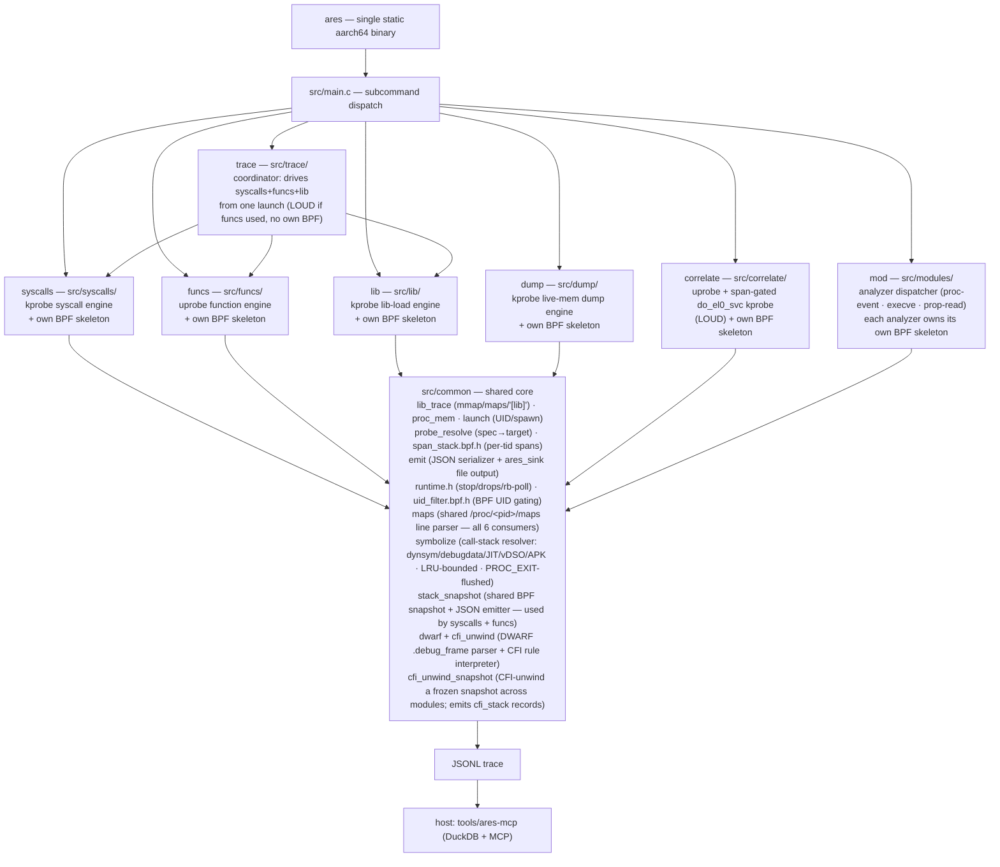

# ares — technical documentation

Maintainer-facing notes on how ares is put together, how each engine works, the
trace schema, the MCP server, and the roadmap for consolidating duplicated code.
For user-facing build/usage instructions see [README.md](README.md).

ares is the merger of two previously separate tools — a kprobe syscall tracer
(formerly *heimdall*) and a uprobe function tracer (formerly *ares-tracer*) — into
one binary with a shared build, a type-discriminated trace schema, and one MCP
server. The syscalls engine now uses `ARES_*` naming and `syscalls.*` source files
(rename completed).

---

## 1. Architecture



- **One binary, seven subcommands, selected by `argv[1]`.** `main()` calls the
  matching entry (`cmd_syscalls` / `cmd_funcs` / `cmd_lib` / `cmd_dump` /
  `cmd_correlate` / `cmd_trace` / `cmd_mod`), passing the remaining argv so each
  keeps its own argument parser unchanged. Five are single-BPF engines (each owns
  one BPF object); `mod` dispatches to per-analyzer BPF objects (each analyzer owns
  its own skeleton — see §6.6); `trace` owns no BPF object — it is a coordinator
  that drives the `syscalls` and `funcs` engines together from one app launch
  (see §6.5).
- **Each engine loads only its own BPF object.** The stealthy syscall engine can
  run without the detectable uprobe engine ever touching the target. The engines
  are *not* fused into a single always-on pass (see §9).
- **The kernel-side gate filter is shared, not duplicated.** `src/common/uid_filter.bpf.h`
  defines the `target_uids` BPF HASH-set map and `uid_matches()`. The parallel
  `src/common/pid_filter.bpf.h` defines the `target_pids` map (keyed by TGID) and
  `pid_matches()`. Every engine gates on `uid_matches() || pid_matches()`, so a UID-launch
  or a PID-attach run is a pure map-population choice with no BPF recompile. The HASH-set
  shape accommodates multi-UID gating (needed by `funcs`, which can trace several PIDs with
  distinct UIDs) at no extra cost for single-UID callers; the detectability firewall (§9) is
  preserved because each engine still compiles its own BPF object. See [Attach modes](#attach-modes-launch--p-vs-pid--p).
- **Library-load tracing is shared, not duplicated.** The mmap/munmap capture,
  `/proc/<pid>/maps` full-path resolution, and the `[lib]` text/JSONL emitter live
  once in `src/common/lib_trace.*` and are used by all five engines. The BPF probe
  is *source*-shared (`#include`d into each engine's own skeleton, preserving the
  per-engine-BPF firewall); the userspace half is linked once as `common.part.o`,
  exporting only its `ares_libtrace_*` API. See §9.
- **Engine-runtime plumbing is shared, not duplicated.** `src/common/runtime.{c,h}`
  provides `ares_install_stop_handler` (2-stage SIGINT/SIGTERM → flag/`_exit(130)`),
  `ares_drops_report` (unified teardown tally), `ares_round_pow2` (BPF ring sizing),
  and the BPF-dependent inline helpers `ares_libbpf_quiet` / `ares_drops_read` /
  `ares_rb_poll_until` / `ares_rb_poll_until_cb` (all gated on `__LIBBPF_LIBBPF_H` so
  the header is host-testable without libbpf). `ares_rb_poll_until_cb` is the shared
  ring-buffer poll loop used by all five engines: it accepts an optional per-iteration
  tick callback for periodic work (e.g. the `syscalls` drops report) and returns the
  final poll error. `ares_rb_poll_until` is the no-callback wrapper used by the three
  simple engines (`lib`/`dump`/`correlate`).
- **The decoupled drain queue is shared, not duplicated.** `src/common/evqueue.{c,h}`
  provides `struct ares_evq` — a SPSC byte ring with `[4-byte len][payload]` framing,
  cond-var handoff, and a `dropped` counter. Both the `syscalls` and `funcs` engines
  use it to decouple the ring-buffer drain thread from the heavy per-event work
  (symbolization, JSON emit). The kernel ring stays empty; bursts are absorbed in RAM.
- **The call-stack symbolizer is shared, not duplicated.** `src/common/symbolize.{c,h}`
  implements `sym_resolve(pid, addr, out, sz)` and `sym_flush_pid(pid)`, used by
  both `syscalls` (backtrace JSON) and `funcs` (console stack frames). Resolution
  sources: `.dynsym` / `.symtab` / `.gnu_debugdata` (LZMA mini-debug-info, covers
  most Android system libraries and `dex2oat`-compiled app code); ART/JIT method
  names via `__jit_debug_descriptor` over `/proc/<pid>/mem`; vDSO `.dynsym`; and
  APK-embedded stored `.so` display names (ZIP central-dir parse). Per-pid
  Per-pid `/proc/<pid>/maps` snapshots are cached with binary search and a throttled
  refresh; the cache is **bounded** at `PM_MAX_PIDS=128` entries with LRU eviction
  (prevents unbounded growth on fork-heavy traces); the LRU bound is the always-on
  eviction backstop. For prompt per-exit flushing via `sym_flush_pid`, run
  `ares mod proc-event` alongside. The symbol result hash
  is bounded at `SC_MAX_CAP=256k` entries (clears and rebuilds at the ceiling).
  The line parser is shared: `src/common/maps.{c,h}` exposes `ares_parse_maps_line`
  and is used by all six `/proc/<pid>/maps` consumers across the codebase.
  `funcs` previously had a simpler local resolver (`lookup_caller`) that only
  produced module+offset with no symbol names; the merge gives `funcs` real function
  names, JIT/vDSO resolution, and `.gnu_debugdata` for free, while `syscalls` gains
  APK-embedded `.so` naming.
- **The argument-parsing contract is shared, not duplicated.** All six engines use
  GNU argp (auto `--help`/`--usage`/`--version`). `src/common/engine_args.h` provides
  `struct common_args`, `COMMON_ARGS_INIT`, `COMMON_ARGP_OPTIONS`, and
  `parse_common_arg()`. `syscalls` and `funcs` embed `struct common_args` and use the
  full six-flag contract (`-o -v -q -J -b -Q`). `lib`, `dump`, and `correlate` use
  argp directly but advertise only the flags they have behavior for — the dead-flag
  trap is intentionally avoided (see BACKLOG "Won't do"). `syscalls` and `funcs`
  pre-fill the package name from `rc->pkg` before calling `argp_parse`, so the
  coordinator never injects `-P` into either engine's argv section. The other engines
  take `-P` directly.
- **The device/launch layer is shared, not duplicated.** `sh_exec` (run an Android
  shell command), `resolve_uid` (app UID from its data dir), `resolve_component`
  (launchable activity), and `ares_launch_app` (the canonical clean relaunch:
  force-stop → wait-for-stop → `am start -S -n <component>`; optionally writes
  the launched PID into a `pid_t *out_pid` out-param) live once in
  `src/common/launch.*` as `ares_*` and are used by all five engines. They are
  linked once into `common.part.o`, exporting only the `ares_*` API (see
  `COMMON_API` in the Makefile).
- **All five tracing engines are split into setup/run/teardown phases.**
  Each engine's `cmd_<engine>` entry is a thin wrapper over
  `<engine>_setup(argc, argv, rc)` (parse + open/load/attach + arm UID, stopping
  *before* the app launch), `<engine>_run(stop)` (the ring-buffer poll loop, exits
  when the shared `volatile sig_atomic_t *stop` is set), and
  `<engine>_teardown()`. The launch is owned by the caller (the wrapper standalone,
  or a combined runner) via `ares_launch_app`, and `struct ares_run_ctx`
  (`src/common/launch.h`) carries a pre-resolved UID + package name into each
  `*_setup`. Standalone behavior is unchanged; the split exists so engines can be
  armed, launched once, and polled together. The `trace` runner drives
  `syscalls` + `funcs` + `lib` + `dump` concurrently from one launch, or one
  PID-attach via top-level `-p` (Phase 3d: `trace` injects `-p <csv>` into each
  requested engine's own argv and skips the launch — each engine already arms
  `target_pids` itself from `-p`, so no `ares_run_ctx`/`launch.h` change was
  needed). `correlate` is now wired into `trace` too (GA2 complete): unlike the
  other four, its uprobe attach needs the launched PID, only known post-launch,
  so `correlate_setup` no longer launches internally — it now honors `rc->pkg`
  pre-fill like the others and arms everything PID-independent, and a 5th public
  function, `correlate_attach(pid)`, does the post-launch uprobe attach. Both
  `cmd_correlate` (standalone) and `trace`'s coordinator call
  `ares_launch_app(..., &pid)` themselves and then `correlate_attach(pid)` right
  after — `correlate_attach` is a no-op in `-p` attach mode, where PIDs are
  already known at setup time and attached there instead.
  The driver contract itself (`<engine>_setup`/`_run`/`_teardown` signatures) is
  now declared once in `src/common/engine_driver.h`, included by both `trace.c`
  and every engine's `.c` — a signature change is a compile error instead of the
  silent coordinator-boundary UB the two hand-maintained lists used to allow
  (AA3; see BACKLOG.md).
- **The firewall-aware capability registry is the single audit point.** `src/common/capabilities.*`
  holds the static table of every BPF object and whether it writes into the target's
  userspace memory (the detectability firewall bit). Uprobe-bearing capabilities set
  `writes_target_memory = true`: `funcs`, `correlate`, and `mod:prop-read` (libc
  uprobes); all kprobe/tracepoint capabilities (`syscalls`, `lib`, `dump`,
  `mod:proc-event`, `mod:execve`) are `false`.
  Each subcommand loads exactly one object of known, documented loudness, so there
  is no implicit composition layer for a loud object to leak through. The registry
  is the single audit point + regression guard, and it is now build-enforced: the
  `capdump` tool (`tools/capdump.c`) compiles this table to `name<TAB>0|1` rows, and
  `scripts/check-firewall.sh` (`make check-firewall`, run in CI) checks each quiet
  `.bpf.o` for uprobe/uretprobe sections and each engine object for
  `bpf_program__attach_uprobe` refs against it, so the table can no longer drift
  from the objects it describes. See §9.

### Why partial-link + symbol localization

The two engines were independent programs that each assumed they owned the global
namespace (e.g. both define `verbose`; the funcs engine exposes
bare globals like `skel`, `out_print`). Naively linking their
objects together fails with `multiple definition` errors.

The Makefile solves this without rewriting either engine: it compiles each
engine's objects, **partial-links** them into one relocatable object
(`ld -r`), then **localizes every symbol except the single `cmd_*` entry point**
with `objcopy --keep-global-symbol=cmd_<engine>`. After that, each engine's
internals are file-local and cannot collide; only `cmd_syscalls` / `cmd_funcs`
remain visible to `main()`. The only source change required was renaming each
former `main()` to its `cmd_*` name.

### Build pipeline (Makefile)

1. **libbpf** — vendored at `third_party/libbpf`, cross-built static.
2. **BPF objects + skeletons** — built with host clang (BPF is arch-neutral; CO-RE
   relocates against the device kernel at load). One skeleton per engine (five):
   - `build/syscalls.skel.h` (name `syscalls`)
   - `build/lib.skel.h` (name `ares_lib`)
   - `build/correlate.skel.h` (name `ares_correlate`)
   - `build/dump.skel.h` (name `ares_dump`)
   - `build/funcs.skel.h` (name `funcs_bpf`) — `funcs.c` includes it via
     `"funcs.skel.h"` (resolved by `-I$(BUILD)`). (`funcs.bpf.c` `#include`s the
     module `.bpf.c` files, so it is a single BPF compilation unit.)
3. **syscall name table** — `build/syscalls_gen.h`, generated by preprocessing
   `<sys/syscall.h>` with the cross compiler (arm64 generic ABI).
4. **userspace objects → per-engine partial-link + localize → final static link**
   with `-lelf -lz -lzstd -llzma` (superset across all engines; lzma decodes
   `.gnu_debugdata` mini-debug-info in the symbolizer).

`vmlinux.h` (committed) is the build input shared by all BPF objects; it is
regenerated manually from kernel BTF only on a kernel change — see
[Regenerating `vmlinux.h`](#regenerating-vmlinuxh-kernel-btf). The 6 MB `vmlinux.btf`
blob is no longer committed. The container build (`misc/Dockerfile` + `scripts/build.sh`) just
runs this same Makefile inside a pinned image, so there is a single source of
build truth.

#### Regenerating `vmlinux.h` (kernel BTF)

`vmlinux.h` is generated from a kernel's BTF. Regenerate it only when targeting a
kernel whose types differ from the committed header.

**Requirement:** a kernel built with `CONFIG_DEBUG_INFO_BTF=y`, which exposes BTF at
`/sys/kernel/btf/vmlinux`, plus `bpftool`.

**Which kernels have BTF:** Android **GKI** kernels (Android 12+ / kernel 5.10+, and
5.4 GKI) ship BTF by default. Vendor, older, or heavily customized kernels frequently
do not. Check on the device:

    adb shell ls -l /sys/kernel/btf/vmlinux

**From the target device (recommended — types match the kernel ARES runs on):**

    adb pull /sys/kernel/btf/vmlinux vmlinux-device.btf
    make regen-vmlinux ARES_VMLINUX_BTF=vmlinux-device.btf

**From the host kernel** (most modern distros — Ubuntu 20.10+, Debian 11+, Fedora —
expose `/sys/kernel/btf/vmlinux`):

    make regen-vmlinux

**Fallback (kernel lacks embedded BTF):** encode BTF from a `vmlinux` ELF that carries
DWARF, using `pahole` (Debian/Ubuntu `dwarves` package), then point the override at it:

    pahole --btf_encode_detached vmlinux.btf vmlinux
    make regen-vmlinux ARES_VMLINUX_BTF=vmlinux.btf

**CO-RE note:** prefer the device kernel's BTF. CO-RE relocations tolerate a
host/target type mismatch as long as every field the BPF code reads exists in the BTF
used, but generating from the target kernel avoids surprises.

### Testing tiers

A test pyramid mirroring the cost of each check; the cheap tiers gate the
expensive one:

1. **Host unit tests** (`tests/`, `make test`) — pure, host-compilable logic with
   no device and no cross-toolchain. `tests/test_probe_spec.c` links the real
   `src/common/probe_resolve.c` (host `cc` + `-lelf`) and asserts the custom
   probe-spec grammar (`MOD!FUNC(S,V,F,A)>V` — `A` = sockaddr, gated BPF capture +
   `decode_sockaddr` at display time, so a probe on e.g. `connect` renders
   `ip:port` instead of a raw pointer), `@offset` (a file offset, not a readelf/nm
   vaddr), lowercase types, return-only
   vs paired, arg clamp, and rejection of malformed input). Milliseconds; the first
   thing to extend when adding pure logic (escaping, decoders, maps parsing).
2. **CI** (`.github/workflows/ci.yml`) — two jobs on every PR/push: `make test`, and
   the containerized `scripts/build.sh` cross-build so the binary can't silently
   stop compiling. The device tier is deliberately *not* in CI (no physical device).
3. **Device acceptance** (`scripts/device-test.sh`, `make device-test`) — the only
   tier that exercises real attach + CO-RE relocation against the live kernel.
   Pushes the fresh binary (md5-skip when the on-device copy matches, so a flaky
   adb link doesn't stall the run) and per capability asserts it attaches and emits
   real output: `lib` → `[lib]` lines including bionic `libc.so`; `syscalls` → the
   attach banner or live `[syscall] > [CALL]`/`[RET]` events (SYM1, was `==>`/`<==`).
   Knobs: `ARES_TEST_PKG`,
   `ARES_TEST_TIMEOUT`. Three non-obvious device facts are baked in (and documented
   in the `testing-ares-on-device` skill): run ares in its **own** `su -c` (chaining
   `am force-stop; ares` drops it into a reduced context → BPF `-EPERM`); ares handles
   both **SIGINT and SIGTERM** via the shared 2-stage stop handler (`runtime.c`);
   `device-test.sh` sends `-s INT` to match the interactive Ctrl-C path (`-k 3` keeps
   the SIGKILL backstop); and grep the captured output with here-strings (an `echo |
   grep -q` pipe SIGPIPEs under `pipefail` on large output).
4. **Realistic app-driven verification** (`scripts/burstapp/`, manual, not part of
   `make device-test`) — for capabilities where a synthetic trigger's fidelity to
   the real threat model is itself in question (`mod ransomware-burst`: does a
   real app's file mutation, not a purpose-built binary, actually get seen?).
   `scripts/burstapp/build.sh install` builds and installs `dev.ares.burstapp`, a
   minimal code-free APK (`android:hasCode="false"`, references the stock
   `android.app.Activity` by name — no dex compiler needed, see the script's
   header for why one isn't available in this toolchain), grants it
   `MANAGE_EXTERNAL_STORAGE`, and prints its UID. Attach with
   `ares mod ransomware-burst -P dev.ares.burstapp -o <file>`, then trigger file
   activity as that exact UID with `su <uid> -c scripts/ares_burst_gen
   <target-dir>` (root allows arbitrary-UID exec directly — no `run-as` dance).
   This is also how the MediaStore-trash blind spot noted in §6.6 was found:
   real file managers routing "delete" through `IS_TRASHED` never reached
   this at all.

### Attach modes: launch (`-P`) vs PID (`-p`)

Every standalone engine supports two mutually exclusive attach modes, unified via
`src/common/engine_args.h` (`struct target_args`, `TARGET_ARGP_OPTIONS`, `parse_target_arg`):

- **`-P PACKAGE`** (launch mode, default): resolves the package UID, arms `target_uids`
  (or `target_pids` if `-p` accompanies), then calls `ares_launch_app` to force-stop and
  relaunch the app. Every event from the first thread is captured.
- **`-p PID[,PID...]`** (PID mode): arms `target_pids` (key = TGID, value = 1) for each
  listed PID. No app launch. The BPF gate is `uid_matches() || pid_matches()`, so running
  processes are traced precisely by TGID without touching UIDs. `-p` and `-P` are mutually
  exclusive; exactly one is required.
- **`--siblings`** (opt-in widen): when used with `-p`, also resolves each PID's UID and
  arms `target_uids`, so processes sharing the same app UID are included. Implemented in
  userspace (the `||` gate makes it a map-fill choice).
- **Follow-fork** (`src/common/follow_fork.bpf.h`): in PID mode an `ares_follow_fork`
  program on `sched/sched_process_fork` inserts a child's TGID into `target_pids` when its
  parent is tracked. On by default; `--no-follow-fork` disables it. Zero cost when
  `target_pids` is empty (launch/UID mode).

---

## 2. The `syscalls` engine (kprobe, injectionless)

- Hooks the arm64 64-bit syscall dispatcher (`kprobe/do_el0_svc`) for entry,
  curated per-function `kretprobe/__arm64_sys_*` for return values, and
  mmap/munmap uprobes to track library load ranges. A best-effort
  `kprobe/do_el0_svc_compat` also covers 32-bit/AArch32 app code (CR2):
  entry-only, no return values, and rendered with numeric names
  (`compat_syscall_<nr>`) since the EABI syscall-number namespace has no name
  table here; attach is non-fatal (kernels without `CONFIG_COMPAT` simply don't
  get 32-bit coverage). vDSO calls issue no `svc` at all, so they're invisible
  to `syscalls` by construction, on either ABI.
- **In-kernel stack-origin filter is an "issued by" heuristic, not "present on
  the stack":** gates on the app UID (installed *before* launch, so every
  thread is traced from its first syscall), then — unless in capture-all mode —
  cheaply rejects a syscall if the target library has no range armed yet (see
  the pre-arm-window caveat below), otherwise keeps the event only if the
  trap-PC frame (`stack[0]`, frame-pointer-independent) or its immediate caller
  (`stack[1]`, one FP hop) lands inside the target library's executable range.
  Earlier versions matched *any* frame on the walked stack, which over-attributed
  transitively (e.g. `targetlib → malloc → mmap` counted as a target-lib
  syscall even though libc's `malloc` issued it, CR2) — deeper frames are no
  longer checked. The tradeoff: this depends on `stack[1]` being walkable, so a
  frame-pointer-omitted target library degrades to `stack[0]`-only attribution
  (still catches hand-asm inline-`svc` code, since that needs no frame pointer).
- **Pre-arm window.** Arming a range is asynchronous to the kernel-side mmap —
  the mapping event has to travel kernel ringbuf → drain thread → BPF map write
  before the filter can match it. A syscall the library issues in that window
  is dropped, not mis-filtered, counted by the `prearm_drops` coverage field.
  The window is minimized (armed on the drain thread, ahead of the processing
  queue) but not eliminated.
- Output: structured per-event JSONL (see §7) **and** stdout simultaneously —
  `-o` no longer implies `-q` (SYM1 dual-channel-always); `-q` is the sole,
  independent stdout silencer. Live events print via the shared
  `common/human_out.c` grammar (`ts_print`/`human_detail`: timestamp prefix,
  own `[syscall]` tag, indented `args[N]`/backtrace continuation lines). The
  same mmap/munmap probes that feed the stack-origin filter also emit
  `{"type":"lib",...}` / `{"type":"unlib",...}` records for every executable
  load/unload **to the `-o` sink** (via the shared `ares_libtrace_emit_lib/unlib`);
  the `-v` `map`/`unmap` trace lines are the stdout echo, now on the same
  timestamped grammar (`[syscall] > [MAP] ...`). At teardown, a
  `syscalls_summary` record (per-syscall-name call counts) prints to stdout
  and, if `-o` is active, to the sink — see §7.
- **`--snapshot` captures a frozen user-stack window.** Available in both library-filter
  and capture-all (`-a`) mode (W6-A, 2026-06-29); with `-a` and no `-s`/`-x` syscall filter a
  one-line firehose warning is printed (a 32 KB snapshot per distinct stack across all
  syscalls). The BPF program captures up to
  `ARES_SNAP_MAX` bytes from `sp` upward in **`ARES_SNAP_CHUNK` (4 KB) page-sized chunks**,
  stopping at the first faulting (unmapped) chunk so the full contiguous stack prefix from
  `sp` is kept instead of an all-or-nothing read (W3-window, 2026-06-29). Also captures the
  **full GP register file** (x0..x30, `regs[31]`), pc/sp/fp/lr (legacy mirror), and a
  `truncated` flag — **redefined**: `1` means `snap_len == ARES_SNAP_MAX` (the window filled
  without faulting, so the stack may extend beyond what was captured = genuinely incomplete);
  `0` means a chunk faulted, i.e. capture reached `stack_base` = all mapped stack captured =
  complete. `snap_len` is now any multiple of 4 KB (on-device: a 4096→32768 spread), not the
  old bimodal 8192/32768. These are emitted as a sidecar `{"type":"stack",...}` record
  (see §7). The register file is the CFI initial state for the DWARF-based software
  unwinder (`src/common/dwarf.c` + `cfi_unwind.c`; see [BACKLOG W1](BACKLOG.md)).
  The snapshot struct and BPF helpers live in `src/common/stack_snapshot.{h,bpf.h}` and
  are shared with the `funcs` engine.
- Supports both attach modes (see [Attach modes](#attach-modes-launch--p-vs-pid--p)): `-P PACKAGE` (fresh launch) or `-p PID[,PID...]` (attach to running; skips launch). `--siblings` widens to same-UID in `-p` mode; `--no-follow-fork` disables child-following.

### §2.1 CFI-unwind layer (`cfi_unwind_snapshot`)

Immediately after writing the raw `{"type":"stack"}` sidecar record, `json_emit_stack`
calls `emit_cfi_backtrace`, which CFI-unwinds the frozen snapshot and emits a companion
`{"type":"cfi_stack"}` record to the same sidecar file. The two records are correlated
by `stack_id`.

```mermaid
flowchart LR
    snap["struct ares_stack_snapshot\n(regs + snap[] window)"]
    unwind["cfi_unwind_snapshot(pid, snap)\nsrc/common/symbolize.c"]
    step["cfi_step(sec, module_pc, regs, &sp, &pc,\n  snap->snap, snap->sp, snap->snap_len)\ncfi_unwind.c — reads only the frozen window"]
    sym["sym_resolve(pid, pc, sym)\nsymbolize.c"]
    emit["emit_cfi_backtrace\nsyscalls.c"]
    out["{\"type\":\"cfi_stack\",\n\"cfi_backtrace\":[{frame,addr,symbol,kind},...]}"]

    snap --> unwind
    unwind --> step
    step -->|"caller pc"| unwind
    unwind -->|"out_pcs[]"| emit
    emit --> sym
    sym --> out
```

**Algorithm (`cfi_unwind_snapshot`):**
1. `unwind_regs_from_snapshot(snap, &r)` — seed `regs[0..30]`, `sp`, `pc` from the frozen register file.
2. Per iteration (cap 256): record `pc` → `out_pcs[n++]`; look up the mapping via `pm_get` + `find_mapping_refresh` (with a one-shot forced
`/proc/<pid>/maps` re-read on a miss — a capture-all snapshot is often symbolized while the
pid's cached maps still predate the libraries the stack runs through); compute `load_base` via `module_base`; call `cfi_get(path, elf_off, load_base, ...)` to get the cached `cfi_section`; call `cfi_step` with the **frozen `snap->snap` window** (bounds-checked, never live target memory); stop when `cfi_step` returns 0 (no FDE, RA undefined, pc==0, or OOB stack).
3. The `cfi_get` pointer is **consumed by `cfi_step` in the same iteration** before the next call — it points into a realloc'able cache and must not be held across iterations.

**Frame classification (`kind` field):**
- `"native"` — default; a C/C++ frame in any native `.so`.
- `"jni-trampoline"` — symbol contains `art_jni_trampoline`; the ART bridge from native into managed code.
- `"managed"` — symbol comes from a `.oat`, `.odex`, or `.vdex` file (ahead-of-time compiled Java).
- `"interp"` — symbol is an ART interpreter entrypoint (see `is_interp_frame`); the managed method lives in a ShadowFrame and cannot be named by CFI alone. The snapshot-scan locator (`nterp_name`) corroborates an `ArtMethod*` candidate against a live dex_pc in the frame window (via `dex_lookup_range`), rejects stale spills, and names the method with a `+0x<dexpc>` bytecode-offset suffix on corroborated hits; uncorroborated frames fall back to a bare best-effort name.

**Firewall:** `cfi_step` reads stack bytes exclusively from the `snap->snap[]` window captured in-kernel at trap time. It never calls `proc_mem_read` or touches live target memory. No uprobe is added. The firewall is clean.

**Native-frame unwinding (RA default).** The CFI return-address register defaults to
*same-value* — until a function spills its link register the return address is still live in
x30. Leaf frames (every libc syscall stub such as `__openat`, and the `art_jni_trampoline`
stub itself) emit no RA rule, so without this default they read as top-of-stack and the
unwind stops at frame 0. With it, native unwinding walks the full chain (verified on-device:
1 → 18 frames). Any explicit CIE/FDE rule overrides the default.

**PAC-signed return addresses (`DW_CFA_AARCH64_negate_ra_state`).** PAC-built AArch64
libs — the ART apex set (`libart`, `libjavacore`, `libnativeloader`, `libartbase`,
`libdexfile`) — emit `DW_CFA_AARCH64_negate_ra_state` (opcode `0x2d`) to toggle the
`ra_signed` column in the CFI row state; `remember`/`restore` correctly preserves
`ra_signed` across nested CIE state. `cfi_step` calls `ares_pac_strip` to mask PAC bits
from the recovered RA before use. Without this, these libs produced a terminal
`CFI_RUN_FAIL` (dominant failure on a real RASP-protected target app: 167/201 stacks, 83%).
Fixed in commits `c905f78`, `e2e026a`, `655314f`.

**Raw vs CFI backtrace.** The syscall event's own `backtrace` is the cheap kernel
frame-pointer walk (`bpf_get_stack`). The FP chain cannot cross `art_jni_trampoline` — the
managed caller above it keeps no AAPCS `[fp,lr]` frame — so that backtrace **stops at the
trampoline**, tagging the frame `"fp_unwind_end":"jni-trampoline (managed caller in
cfi_stack)"` rather than emitting a misread ART quick-frame value (a garbage
`[unmapped]`/non-canonical address). The companion `cfi_stack` record is the path that
actually crosses the trampoline. Interpreter bridges are left intact (the interpreter is
native C++ and keeps a valid FP chain through it). The same frame-pointer dependency
applies to the in-kernel attribution filter (§2): a target library built
`-fomit-frame-pointer` or with hand-written asm can make `stack[1]` unwalkable
garbage — precisely the RASP/anti-tamper `.so` case this tool is meant for.
Attribution then falls back to `stack[0]` (the trap PC itself, which needs no
frame pointer) rather than reporting a false miss.

**Current status & remaining walls.** Native unwinding works on-device and the real
`boot.oat` trampoline FDE is verified to recover the managed caller. All major blockers
to a live jni-trampoline→managed cross are resolved: **W6** (capture-all snapshots, done
2026-06-29), maps-cache staleness (`find_mapping_refresh`), **W3-window** (chunked capture,
done 2026-06-29), **CFI-misstep** (module_base gapped walk-back, done 2026-06-30 — commits
`73a9ceb`, `e8fd9e2`), and **PAC `negate_ra_state`** (done 2026-06-30 — commits `c905f78`,
`e2e026a`, `655314f`, `63f1570`). On a real RASP-protected target app:
`CFI_RUN_FAIL` **167/201 → 0**; `art_jni_trampoline` crossings **59 → 131**;
reached-managed-frame **21 → 74**. Full re-measure:
`docs/superpowers/research/2026-06-30-cfi-pac-fix-remeasure-findings.md`.

The **nterp interpreter-frame naming wall is resolved**: the snapshot-scan
locator (`nterp_name`, `src/common/art_nterp.c`) corroborates each `ArtMethod*` candidate
against a live dex_pc in the frame window (via `dex_lookup_range`), rejecting stale spills,
and emits the method name with a `+0x<dexpc>` bytecode-offset suffix on corroborated hits.
The **full interpreted call chain** is named (2026-07-02) by `nterp_chain`: from the nterp
terminal it keeps scanning the frozen snapshot upward, emitting *every* dex_pc-corroborated
frame (innermost-first) as consecutive `"kind":"interp"` cfi_stack frames — not just the
terminal (`nterp_name` remains the single-frame fallback when the chain is empty, so naming
never regresses). Precision-over-recall: uncorroborated candidates are dropped.
**TBI fix (2026-07-02):** `art_method_chase` now strips the Android top-byte tag from the
native `DexCache.dex_file_` / `DexFile.begin_` pointers before deref — without this the
chase aborts (`/proc/mem` rejects tagged addresses) and nterp naming silently resolves
nothing on tagged-DexFile targets. Device-verified on a real target: the interpreted chain
reaches 13+ frames deep. See BACKLOG Resolved/Done for full detail. **W5** (JIT `[anon]` code-cache mini-ELF CFI) is technically
reachable but ≈0 payoff on measured workloads (9/201 stacks); not the immediate priority.

**Diagnostic flag (`ARES_CFI_DEBUG=1`).** When set, `emit_cfi_backtrace` enriches each
`cfi_stack` frame with per-step CFI internals (`module_pc`, `load_base`, `elf_off`, `fde_found`,
`fde_pc_lo/hi`, `cfa`, `ra_slot`, `ra_value`, and a `stop_reason` — `CFI_OK`/`NO_FDE`/
`RA_READFAULT`/…/`SNAP_NO_MAPPING`/`SNAP_CFI_GET_NULL`). Off by default → the sidecar schema is
byte-identical; reads only the frozen snapshot (firewall unaffected). It is the tool that
located the module-base bug and stays available for future CFI diagnosis.

**Limits:**
- **Managed (Java) naming is experimental / best-effort**, not a guaranteed capability —
  the largest and most version-fragile surface in the tool, for a feature outside its
  core stealthy-syscall focus. A silent BuildID miss (untracked ART build or vendor
  rebuild) disables it entirely for that run with no per-record marker: treat an absent
  `java_stack`/managed frame as "not verified this run," never as "app used no Java."
  See the CFI/managed-frame-naming and CR4 items in BACKLOG for the full caveat.
- Works only for **compiled-JNI** paths where the Java method was compiled to native (`.oat`/`.odex`/`.vdex`) and its frame appears in the CFI-unwound chain.
- Interpreter frames are detected by `is_interp_frame` and tagged `"kind":"interp"`. `nterp_chain` names the full interpreted chain from the terminal (each frame dex_pc-corroborated via `dex_lookup_range`, `+0x<dexpc>` suffix, innermost-first); uncorroborated frames are dropped (precision over recall). `nterp_name` is the single-frame fallback. Recall is bounded by the snapshot window (a chain deeper than the captured window truncates), and adjacent frames of the *same* `ArtMethod*` are deduped — so a directly-recursive `A→A` collapses to one entry (`A→B→A` is unaffected). The switch-interpreter `Thread→ManagedStack→ShadowFrame` walk (`art_shadow.c`, shipped and wired into both the compact `managed[]` chain and the full `cfi_stack` JSON) is the authoritative alternative at its own (`ExecuteSwitchImpl`) terminal — it reads a different `ManagedStack` field than nterp and cannot substitute for it at nterp's terminal; nterp's stack-slot guess-path stays primary there (tracked as CR4 "Path Y" in BACKLOG).
- **Onboarding a new ART build (managed-frame naming).** The version-coupled offsets are
  keyed on the target's `libart.so` BuildID: `art_buildid_offsets` (`src/common/art_buildid.c`)
  reads the target BuildID and returns the matching `k_table` row (both the ShadowFrame and
  nterp offset families in one `struct art_offsets`); an unrecognized build is a clean
  default-off no-op. To add a device/ART build without recompiling per iteration, set
  `ARES_ART_OFFSETS=<file>` to a `key=value` row (`buildid=` + the 13 offsets, `#` comments and
  whitespace tolerated); it overrides `k_table` **only when its BuildID matches** the running
  libart (else it is ignored and `k_table` is used — fail-closed). Workflow: pin the offsets
  from AOSP `platform/art` + `platform/bionic` at the matching release → write the row →
  run ares with `ARES_ART_OFFSETS` **and** the `scripts/nterp-oracle/` Frida/ART oracle →
  iterate the offsets until the oracle confirms the names → bake the confirmed row into
  `k_table`. Reads-only (own-process file); no target write.
  - **Known builds / source-bound offsets.** `k_table` carries two rows for the same
    POCO C85 (Android 15) device: `1f156fc6...` and `cecb684d...`, the latter an OTA libart
    rebuild (same Android 15, new binary, new BuildID). Their 13 offsets are **identical**,
    empirical evidence the offset layout is bound to the AOSP source release
    (`android15-release`), not the compiled binary. So an OTA that only rebuilds libart within
    the same release needs a fresh row keyed on the new BuildID but **reuses** the offsets; a
    genuine ART version bump is what shifts them. The `cecb684d...` row was Frida-oracle-verified
    on 2026-07-08 (95.6% of emitted interp names were real app methods the ART-native oracle
    also observed).
- Inlining defeats CFI attribution: an inlined callee has no FDE and cannot be named.
- Cross-thread offloaded syscalls are not attributed (CFI is per-tid).
- All capture behavior is flag-driven via GNU argp (`-P`/`-p`/`-l`/`-A`/`-a`/`-q`/`-v`/`-J`/`-o`/`-b`/`-Q`/`--snapshot`/`--siblings`/`--no-follow-fork`);
  option ordering does not matter; `--help` is auto-generated; `--version` prints
  `ares syscalls`. The library selector is `-l <selector>` (was a positional argument).
  The sole runtime env var is `ARES_DEBUG=1`, which surfaces libbpf's verbose
  load/relocation logging (otherwise suppressed) — the first thing to check on a BPF
  load `-EPERM` or CO-RE/relocation error.

## 3. The `funcs` engine (uprobe, spec-driven)

- Attaches uprobes/uretprobes to functions selected by **probe specs**
  (`specs/*.spec`, format `[KIND:]TARGET[(ARGTYPES)][>RETTYPE]` — `funcs:`/omitted
  (default) is `MODULE!FUNC[@OFFSET]`, each side exact/glob(`*?[`)/`/regex/`;
  `syscall:`/`lib:`/`mod:` select targets for the other engines from the same file)
  or by module+function regex. Captures typed arguments (string/value/fd), return
  values, call→return timing, and a call stack. The old `-I`/`-i`/`-r` regex flags
  have been removed; `-e SPEC`/`-F FILE` now bulk-match both the module and
  function sides via `/regex/`-delimited targets (e.g. `-e 'libc.so!/^encrypt/'`
  attaches to every matching symbol; a bare `>RETTYPE` suffix with no `()` makes
  it return-only, matching the old `-r`'s semantics; `()` plus `>RETTYPE` makes it
  a paired call+return probe).
- **Configurable ring buffer size** (`-b/--bufsize MB`): sets the BPF ring buffer
  (`events_rb`) to `MB` MiB (rounded up to the next power of two). Default: 4 MiB.
  The ring holds raw kernel events before userspace drains them; a larger ring
  absorbs bursts without dropping events at the BPF side.
- **Decoupled drain:** MAP/UNMAP/module events are handled inline on the poll
  thread (they attach uprobes and must race the just-mmap'd library). CALL and
  RETURN events are pushed into a configurable `struct ares_evq` userspace queue
  (default 256 MiB, `-Q MB`) and
  processed on a dedicated worker thread, so the kernel ring stays drained
  regardless of symbolization/JSON latency. Synchronized with three mutexes:
  `g_targets_lock` guards `probe_targets[]` between the MAP attach path and the
  worker's `find_target_by_entry_addr` lookup; `g_out_lock` serializes stdout/stderr
  lines between the two threads; `g_sink_lock` serializes `g_sink` writes between
  the drain thread (lib/unlib records) and the worker thread (call/return records).
- Output: human-readable text to stdout unless `-q` is given (`-q` suppresses console
  output). When `-o FILE` is passed, structured records for CALL and RETURN events are
  written via the shared `ares_sink` (see §3.1 and §7) **in addition to** console
  output — `-o` and stdout are independent channels (SYM1 dual-channel-always,
  consistent with all other engines); pass `-q` alongside `-o` for file-only output.
  Output is always JSONL (one record per line, no enclosing `[...]`) — SYM1
  Phase 5a made this the uniform default across every engine; `-J`/`--jsonl`
  is accepted but a no-op. At teardown, a `funcs_summary` record (per-symbol
  call counts, keyed by `module!func`) prints to stdout and, if `-o` is
  active, to the sink — see §7.
- **Attach modes:** `-P PACKAGE` launches fresh under UID-filter; `-p PID[,PID...]` attaches
  to a running process (precise, TGID-gated, follow-fork on by default). `--siblings` widens
  to the target's UID; `--no-follow-fork` disables child-following. See [Attach modes](#attach-modes-launch--p-vs-pid--p).
- **Quiet mode** (`-q`): suppresses all per-event console output in
  `process_call_return` (the `ts_print`/`out_print` CALL/RETURN/stack blocks).
- **Stack snapshot** (`--snapshot`, requires `-o`): mirrors the `syscalls` `--snapshot`
  feature. At each CALL entry the BPF program captures the full GP register file
  (x0..x30) and a frozen stack window (up to `ARES_SNAP_MAX` bytes), deduped by an
  FNV-1a hash of `call_stack[]`. Deduplicated `{"type":"stack",...}` records are written
  to `<output>.stacks` (a sidecar JSONL file, identical schema to `syscalls` — see §7).
  Each CALL record in the main `.jsonl` carries `"stack_id"` linking it to the sidecar.
  The sidecar is written by the drain thread only (no lock needed).

### 3.1 Structured JSONL output (`-o`)

`-o FILE` opens a shared `ares_sink` (8 MB buffered, JSONL) and emits one
structured record per CALL or RETURN event. Human-readable stdout text is
unchanged; no legacy `{ts,stream,tag,message}` wrapper is written to the file.

Record shapes (from `src/funcs/funcs_emit.c`, built on the shared `emit.h` +
`trace_schema.h`):

```json
{"type":"call",   "id":42,"pid":N,"tid":N,"ppid":N,"module":"libc.so","symbol":"open",
                  "entry_addr":"0xABCDEF","offset":"0x1234","args":["0x1","0x2","0x0","0x0","0x0","0x0","0x0","0x0"],
                  "backtrace":[{"frame":0,"addr":"0x...","symbol":"libc.so\`caller+0x10"},{"frame":1,"addr":"0x..."}]}

{"type":"return", "id":42,"pid":N,"tid":N,"module":"libc.so","symbol":"open","offset":"0x1234",
                  "retval":7,"elapsed_ns":4096,
                  "backtrace":[{"frame":0,"addr":"0x...","symbol":"libc.so\`caller+0x10"}]}
```

`id` is a monotonic per-call span id (parity with the `syscalls` engine's `id`): a
CALL and its matching RETURN carry the **same** `id`, so the two records pair up
and the stream is ordered by call entry. It is the funcs frame's `span_id`
(`span_stack.bpf.h`), surfaced from the per-tid span stack — so it is
recursion-correct where the old single-slot entry map was not. `id` is `0` on the
rare CALL that hit the `MAX_SPAN_DEPTH` (32) nesting cap at entry: that call is
untracked, its RETURN isn't paired, and `0` is the honest "unpaired" sentinel
(the `syscalls` `id` is always ≥ 1; funcs reuses `0` for this one degraded case).

`backtrace` is present on both CALL and RETURN records (as long as `bpf_get_stack`
returned frames), built from `e->call_stack`/`e->stack_depth` — orthogonal to
`--snapshot`. Per-frame `symbol` is resolved by the caller (`funcs.c`, via
`sym_resolve` — the same resolver the console already uses) and passed into
`funcs_emit_call`/`funcs_emit_return` as a parallel array; `funcs_emit.c` itself
stays pure and host-testable without the symbolizer (a `NULL`/omitted symbol
just drops the `"symbol"` key for that frame — see `tests/test_funcs_emit.c`).
`ppid` and `offset` (module-relative, decimal) mirror the fields the console
already prints (`PPID:%d ... @ 0x%lx`); `offset` is omitted when the target
couldn't be resolved.

The `module` field is the library basename (no path). `args` always has `NUM_ARGS`
(8) elements in hex. `elapsed_ns` is 0 if the uretprobe was not attached. These
records share the same `type` discriminator as `ares syscalls` / `ares lib` output
(see §7), making them directly compatible with downstream ares-mcp ingest.

**Implementation notes:**
- Builders live in `src/funcs/funcs_emit.c` (pure file, no libbpf/skeleton deps)
  so the host unit test (`tests/test_funcs_emit.c`) can link them without
  cross-toolchain.
- Builders are declared in `src/funcs/funcs-priv.h` and called from
  `process_call_return` in `src/funcs/funcs.c`, which runs on the worker
  thread. Emit builds directly into `g_sink.jb` then calls `ares_sink_emit`.
  `g_sink` is multi-writer: the drain thread emits lib/unlib records and the worker
  thread emits call/return records; all writes are serialized by `g_sink_lock`.
  MAP/UNLIB records (library load/unload) are **done** — emitted as
  `{"type":"lib",...}` / `{"type":"unlib",...}` via `ares_libtrace_emit_lib/unlib`.
  SPAWN/PROC_EXIT/EXECVE/PROP structured records are a follow-on.

## 4. The `lib` engine (kprobe, library-load only)

- Launches the target package fresh under a UID filter installed *before* launch
  via `ares_launch_app` (force-stop → wait-for-stop → `am start -S`), so every
  executable, file-backed mapping is seen from the process's first thread, including
  forked app processes.
- The thinnest engine: it adds only a ring buffer, the target-UID map, and
  `uid_matches()`; the mmap/munmap capture, `/proc/<pid>/maps` full-path resolution,
  and the emitter are the shared `src/common/lib_trace` module (§1). No syscall hook
  and no uprobes — nothing is written into the target, so it sits on the stealthy
  side of the detectability firewall (§9).
- **CLI:** `ares lib {-P PACKAGE | PACKAGE | -p PID[,PID...]} [-A ACTIVITY] [-o FILE] [-v] [-q] [--siblings] [--no-follow-fork]`.
  `-p` attaches to a running process (skips launch); `-P` or a positional PACKAGE launches fresh.
  Package and activity can also be given as positional arguments (back-compat). `--help`, `--usage`,
  and `--version` (`ares lib`) are auto-generated by argp. See [Attach modes](#attach-modes-launch--p-vs-pid--p).
- Output: the unified, timestamp-prefixed `HH:MM:SS [lib] pid <N> <fullpath>
  [start,end) off=.. inode=.. ppid=..` line (via the shared `ares_libtrace_emit_lib`,
  `common/lib_trace.c` — also used by `funcs`/`correlate` for their own `[lib]`/
  `[unlib]` lines, SYM1 Phase 4b), plus structured JSONL via `-o`
  (`{"type":"lib",...}` / `{"type":"unlib",...}`; see §7) **simultaneously** —
  `-o` no longer implies `-q` (SYM1 dual-channel-always). `[unlib]` unmap lines
  are suppressed on stdout unless `-v` is passed; the JSONL (`-o`) always
  records both. Unlike `syscalls`/`funcs`/`correlate`/`mod`, `lib` has no
  drop map or snapshot path to report on — its `[coverage]` line is an
  explicit `{"exempt":true,"reason":"..."}` record (SYM1 Phase 5b, §7),
  not silence.

## 5. The `dump` engine (kprobe, live-memory dump)

- **Stealthy fresh launch**, same approach as `ares lib`: installs a UID filter
  *before* launch, then calls `ares_launch_app` (force-stop → wait-for-stop →
  `am start -S`), using the shared `src/common/lib_trace` probe (mmap/munmap capture +
  `/proc/<pid>/maps` resolver) to track every library mapping. No uprobes — nothing
  written into the target.
- **CLI:** `ares dump {-P PACKAGE | PACKAGE | -p PID[,PID...]} PATTERN [-F FILE] [-A ACTIVITY] [-d DIR] [-o FILE] [--on-map] [--raw] [-q] [--siblings] [--no-follow-fork]`.
  `-F FILE` loads probe specs from a file; a `lib:` line supplies PATTERN when none is
  given positionally (first `lib:` line wins if the file has several — `dump` matches
  against exactly one pattern, not a list).
  `-p` attaches to a running process (skips launch); `-P` or a positional PACKAGE launches fresh.
  Package and activity also accept positional arguments (back-compat). `--help`, `--usage`, and
  `--version` (`ares dump`) are auto-generated by argp. See [Attach modes](#attach-modes-launch--p-vs-pid--p).
- **Machine-readable manifest** (`-o FILE`, SYM1 Phase 3 — `dump` previously had
  no `-o`/JSON output of any kind). Hand-rolled, not `COMMON_ARGP_OPTIONS`
  (`dump` already owns `-q`/`-d`, and has no `-v`/`-b`/`-Q` concept); always
  JSONL, no `-J`. One `{"type":"dump","module":..,"path":..,"base":"0x..",
  "pid":..,"raw":bool}` record per module actually written (`dump_emit.c`,
  emitted right after `write_file()` succeeds in `rebuild.c`), printed to
  console **and** the sink simultaneously — same dual-channel-always rule as
  every other engine. This is also what makes `ares trace -o <prefix>
  --dump ...`'s `<prefix>.dump.jsonl` real; before Phase 3 that injected flag
  was dead code (`dump` had no `-o` to receive it). `dump` has no drop map
  or run-long coverage surface either (single-shot read) — its `[coverage]`
  line is an explicit `{"exempt":true,"reason":"..."}` record (Phase 5b, §7).
- **Two dump triggers:**
  - Default (on-exit): after the app terminates, rescans `/proc/<pid>/maps` for all
    mappings that match the user-supplied glob and dumps each one.
  - `--on-map`: dumps a library the instant it maps, using `(pid, start)` dedup to
    avoid re-dumping the same mapping. Useful for randomized-name or early-unmap
    libraries.
- **Rebuild pipeline** (`src/dump/rebuild.c`): reads the raw in-memory image via
  `/proc/<pid>/mem`, fixes program-header `p_offset` fields, captures inter-segment
  gaps, un-applies `DT_RELR` and `RELATIVE` relocations, de-rebases `.dynamic`
  (restores load-time-added base address), and reconstructs a full section-header
  table. `--raw` skips the rebuild and writes the phdr-fixed image directly.
  **aarch64/ELF64 only.** Output filename: `<name>.<pid>.<base>.so`.
- **Shared `/proc/<pid>/mem` reader** (`src/common/proc_mem.c`, exported in
  `COMMON_API`): the generic `proc_mem_open` / `proc_mem_read` helpers used by both
  the dump engine's rebuild pipeline and the syscalls engine's stack symbolizer
  (which walks ART's in-process JIT debug descriptor).

### 2.1 Stack symbolizer — shared (`common/symbolize.c` + `sym_*.c`)

The symbolizer is split across cohesive files behind the private
`common/symbolize_internal.h` contract: `symbolize.c` (orchestrator + addr→sym
cache + `cfi_unwind_snapshot`), `sym_procmaps.c` (`/proc/<pid>/maps` cache),
`sym_elf.c` (`.dynsym`/`.symtab`/`.gnu_debugdata` + per-module CFI cache + ELF
file I/O), `sym_jit.c` (ART GDB-JIT walk), `sym_vdso.c` (`[vdso]`), and
`sym_apk.c` (APK-embedded `.so` names). Only the 5 `COMMON_API` symbols are
exported; everything else is localized at link.

Both `syscalls` and `funcs` resolve backtrace addresses using the shared
`sym_resolve` call. For each frame address the symbolizer:

1. Looks up the mapping in the tracked library table (`/proc/<pid>/maps` snapshot).
2. If the mapping has a file path and the file opens as a valid ELF, resolves via
   the ELF symbol table (`.dynsym` / `.symtab`, with `.gnu_debugdata` mini-debug-info
   if present).
3. **JIT fallback — fires for *any* executable mapping with no openable ELF**, whether
   the mapping is anonymous (empty name) or carries a kernel-assigned bracket name
   such as `[anon_shmem:dalvik-jit-code-cache]`. In both cases the symbolizer calls
   `jit_resolve`, which walks ART's in-process `__jit_debug_descriptor` linked list
   via `/proc/<pid>/mem` to find a JIT-compiled method covering the frame address.
   A successful lookup emits the frame as `[JIT]!<method>+0x<offset>`.
4. **JIT miss on an executable bracket-name region is intentionally left uncached.**
   If `jit_resolve` finds no entry (ART has not yet published the method), the frame
   is emitted as `<mapping>+0x<offset>` without caching the negative result. This
   allows the frame to resolve correctly on a subsequent event once ART registers the
   compiled method — the descriptor is re-walked each time rather than locking in a
   miss.

AOT-compiled frames backed by OAT/ODEX/VDEX files (e.g. `base.vdex+0x..`, app
`.odex`) are shown as `file+offset`; managed-method resolution for those formats
is deferred (see [BACKLOG.md](BACKLOG.md)).

#### vDSO frames

`[vdso]` frames are named from the vDSO's `.dynsym`, read out of the target's
live memory (the vDSO is a complete, immutable ELF the kernel maps with no
backing file). A frame renders as `[vdso]!__kernel_clock_gettime+0x..`. The
parse reuses the on-disk symbol machinery (`ingest_fd_section` → `add_symbols`
→ `sym_lookup`) via `pread` on `/proc/<pid>/mem`; it writes nothing into the
target (firewall-clean) and is built once per pid.

This naming is a **backtrace-display** capability only. `syscalls` attribution
(§2) is a different matter: vDSO calls (`clock_gettime`, `gettimeofday`, ...)
resolve entirely in userspace against the mapped vDSO page and never execute
`svc`, so they never reach `do_el0_svc`/`do_el0_svc_compat` at all — invisible
to `syscalls` by construction, on either ABI, regardless of attribution rule.

#### Backtrace frame classification (what resolves, what does not)

| Region | What it is | Resolution |
|---|---|---|
| `<lib>.so!sym+off` | on-disk ELF | `.dynsym` / `.symtab` / `.gnu_debugdata` |
| `base.odex!Class.method+off` | AOT-compiled app code | **already named** via `.gnu_debugdata` mini-debug-info embedded by `dex2oat` |
| `[JIT]!method+off` | ART JIT code cache | GDB JIT descriptor walk (live memory) |
| `[vdso]!__kernel_*+off` | kernel vDSO | vDSO `.dynsym` (live memory) |
| `<lib>.so+off` (no `!`) | stripped / past-symbol-end native | no symbol exists — bare offset is the ceiling |
| `[anon:dalvik-main space]+off` | GC object heap | **not a method** — a return address here is frame-pointer-unwind noise |
| `[anon:dalvik-DEX data]+off` | dex bytecode (nterp) | **deferred** — needs the dex method resolver (Phase 2) |
| `base.vdex+off` | interpreter / quickened dex | **deferred** — dex resolver + PC-meaning research (Phase 2) |

#### DEX offset→method resolver (`src/common/dex`, Phase 2a — parser only)

The version-stable core both deferred rows above bottom out in: a pure parser
that maps a byte offset into a standard DEX image (`dex\n0NN`) to the Java method
whose `code_item.insns` covers it, returning `pkg.Class.method`. Interface:
`dex_map_build(img, len)` → `dex_map_lookup(map, off, out, outsz)` →
`dex_map_free(map)`. The map retains a private copy of the image (it never aliases
the caller's bytes) plus a sorted array of method bytecode ranges; lookup
binary-searches the ranges, then resolves names through the
`method_ids`/`type_ids`/`string_ids` tables. The DEX is target-controlled, so
every read is bounds-checked and every table index validated — a malformed entry
is skipped, a malformed header (or an allocation failure mid-build) fails the
build (`NULL`), overlapping method ranges from a crafted DEX are pruned so the
binary search stays deterministic, and no input can fault.
It has **no libbpf / `/proc` / ELF dependency and no detectability surface** (pure
parsing of bytes the caller already holds), and is host-tested against a committed
`.dex` fixture (`tests/test_dex.c`, `tests/fixtures/sample.dex`).

**Not yet wired into any capability** — the resolver has no caller, so it is
compiled only by `make test` and is absent from `build/ares`. The
vdex-container locate, anonymous-region wiring, and `symbolize.c` integration
(emitting `base.vdex!pkg.Class.method+0x..`) land in Phases 2c/2d; CompactDex
(`cdex001`) is deferred to the code-item-decode seam. See
[BACKLOG.md](BACKLOG.md).

## 6. The `correlate` engine (uprobe + span-gated kprobe, loud)

Function→syscall correlation on a live run. One BPF object
(`src/correlate/correlate.bpf.c`) carries **both** an entry uprobe and a syscall
kprobe, sharing the per-tid span stack from `src/common/span_stack.bpf.h`:

- **Entry uprobe** (attached by the loader at each spec'd function offset via the
  shared `src/common/probe_resolve` resolver, and — as of Tier 5 — each `-I`/`-i`
  regex-resolved offset too): pushes a frame onto the per-tid span stack, assigns a
  monotonic `span_id`, records `parent_span` (the enclosing open frame), and emits a
  `func` event.
- **Span close — two paths.** Default (quiet): SP-based reconciliation, inferring
  "returned" from user stack-pointer movement (`current_sp > entry_sp`) at the next
  instrumented event — no stack tampering, but wrong on coroutines/fibers/
  stack-switching, cross-thread offload, tail calls, and same-SP recursion (CR3,
  see [BACKLOG.md](BACKLOG.md)). Opt-in accuracy path: `-R`/`--returns` attaches a
  second uretprobe (`corr_uretprobe_ret`, mirrors `funcs`' `uretprobe_open`) per
  target that fires at the real return instruction and authoritatively pops the
  span — immune to all of the above, at the cost of a second uprobe trampoline
  (bigger LOUD surface). Emits a `return` event (`span`, `entry_addr`, `retval`,
  `elapsed_ns`).
- **Span-gated `kprobe/do_el0_svc`**: reads the innermost open `span_id` for the
  tid (`span_stack_top_id`); drops the syscall if none, else emits it tagged with
  that span (number + raw `args[0..5]` + captured string/sockaddr bytes, name
  resolved host-side from the arm64 syscall table).
- **Loader** (`src/correlate/correlate.c`): reuses `src/common/launch` and
  `src/common/probe_resolve`; installs the target UID(s), attaches the entry uprobe
  (+ return uretprobe under `-R`) per resolved `(path,offset)` plus the one shared
  kprobe, then drains the ring. Uses GNU argp (`--help`/`--usage`/`--version` —
  prints `ares correlate`); flags: `-p PID[,…]` (precise, follow-fork by default;
  `--siblings` to widen to same-UID), `-P PACKAGE`, `--siblings`, `--no-follow-fork`,
  `-e SPEC`, `-F FILE`, `-R`/`--returns`,
  `-o FILE`, `-q`. See [Attach modes](#attach-modes-launch--p-vs-pid--p). `-P`
  attach timing: `wait_for_target_mapped()` polls `/proc/<pid>/maps` (10 ms interval,
  2 s cap) for a spec'd/regex-matched library instead of a blind `sleep(1)`, attaching
  as soon as the target appears (falls through to today's behavior on timeout).
- **Output**: flat, type-discriminated JSONL via the shared serializer
  (`src/correlate/corr_emit.c`, mirrors `funcs_emit.c`) **and** a timestamped
  stdout line simultaneously — `-o` no longer implies `-q` (SYM1
  dual-channel-always); `func`/`syscall`/`return` console lines are on the
  shared `common/human_out.c` grammar (`ts_print`, own `[func]`/`[syscall]`/
  `[return]` tags — Phase 4d), and `syscalls_summary`-style teardown output
  exists here too as `correlate_summary` (spans opened / syscalls captured /
  returns captured — see §7). `-o FILE` opens the shared `ares_sink` (8 MB
  buffered, periodic flush, `wrote N event(s)` report at teardown), matching
  `syscalls`/`funcs` — no per-event `fflush`. `func` records:
  `{"type":"func","span":N,"parent_span":M,"pid":...,"tid":...,"entry_addr":"0x...","args":["0x...",...]}`
  — args as hex strings. `return` records (only with `-R`):
  `{"type":"return","span":N,"pid":...,"tid":...,"entry_addr":"0x...","retval":"0x...","elapsed_ns":...}`.
  `syscall` records additionally carry a parallel `"decoded"` array: each element is
  string (captured path/etc.) → fd path (`render_fd`) → sockaddr (`ip:port`) →
  flag/enum expansion (`flags_decode_arg`), first that applies, `""` otherwise — same
  precedence as `syscalls`' `render_arg`. One row per event, joinable on `span`;
  syscalls are never nested inside a func record. **This same decoded data now
  also prints live** as indented `args[N] ...` lines under the console
  `[syscall]` header (`corr_decode_arg`, shared by both channels — SYM1
  Phase 2; previously the console line showed only the syscall name, the
  decoded paths/fds/sockaddrs/flags existed file-only).
- **Library-load records**: the same object also carries the shared
  `src/common/lib_trace.bpf.h` kprobes (uprobe_mmap/uprobe_munmap, PID-gated to
  mirror the engine's filter), emitting `{"type":"lib",...}` / `{"type":"unlib",...}`
  for every executable load/unload — to the `-o` sink, plus a timestamped
  `[lib]`/`[unlib]` console line unless `-q` (via the same shared
  `ares_libtrace_emit_lib/unlib` `lib`/`funcs` use — SYM1 Phase 4b). These are
  kprobes only, so the loud/quiet firewall class is unchanged.
- **Robustness**: each uprobe `bpf_link` (entry and return) is tracked and
  `bpf_link__destroy`'d on teardown (not leaked to process exit). The fixed input
  caps — `-p` (64 PIDs), `-e`/`-F` (64 specs), per-pid
  attach dedup (256) — now emit a warning when hit instead of silently truncating, so
  a wide package or large `-F` file is not quietly under-instrumented.
- **Detectability**: this object carries the uprobe, so it is the **loud** path; the
  quiet engines never load it (see §9). `--returns` adds a second uprobe trampoline
  per target (bigger surface than entry-only). Correlation is per-tid & synchronous
  (cross-thread offloaded syscalls aren't attributed); CFF-resistant; defeated by
  inlining and VM/virtualization.
- **Scope**: custom specs (`-e`/`-F`) targeting, `-p` (full)
  or `-P` (poll-timed post-launch), SP-based close by default with `-R`/`--returns`
  as the opt-in accuracy path, full syscall-arg decode (string/fd/sockaddr/flags).

### 6.1 `--returns`: return value + exact span timing (opt-in, LOUD)

Off by default; SP-based reconcile (above) is the only span-close mechanism
unless `--returns` is passed. When passed, the loader attaches a *second* BPF
program at each spec'd function's offset: a uretprobe (`corr_uretprobe_ret`,
`SEC("uretprobe")` in `src/correlate/correlate.bpf.c`), alongside the existing
entry uprobe.

- **Record**: `CORR_EV_RETURN` / `struct corr_return_event {span, entry_addr,
  retval, elapsed_ns}` (`src/correlate/correlate.h`). JSON (`corr_emit_return`,
  `src/correlate/corr_emit.c`), reusing the shared `"return"` type name
  (`TRACE_RETURN`):
  `{"type":"return","span":N,"pid":...,"tid":...,"entry_addr":"0x...","retval":"0x...","elapsed_ns":N}`.
- **Semantics - authoritative pop, SP-reconcile as backstop**: on a real
  return, `corr_uretprobe_ret` reads the top span frame, emits `retval` (raw
  `PT_REGS_RC` / x0) and `elapsed_ns` (return `bpf_ktime_get_ns()` minus the
  saved entry timestamp), then deletes the frame and pops the depth counter
  itself - this is the exact close, not an estimate. The pre-existing
  `span_stack_reconcile` SP check (used unconditionally without `--returns`)
  stays wired in as a backstop for a span whose uretprobe never fires (e.g. the
  thread exits mid-call); it still runs even with `--returns` on.
- **Scope**: `retval` is the raw return register only - no fd/string/errno
  decode. That interpretation stays parked with the other decode work above.
- **Loudness - second detection surface**: `correlate` is already loud (entry
  `BRK`). `--returns` adds a uretprobe trampoline pushed onto the *target's own
  stack* to catch the return - a second, independent thing an anti-tampering
  check on the target process could notice, beyond the entry `BRK`. Passing
  `--returns` prints a one-line stderr notice disclosing this at attach time;
  the firewall gate (`make check-firewall`, §CR1) is unaffected because
  `correlate` was already classified loud - no `capabilities.c` change.
- **Attach**: one uretprobe per resolved `(path,offset)`, attached right after
  its paired entry uprobe in `attach_uprobes_for_pid`; a failed uretprobe attach
  logs `RET FAILED` and does not fail the run (the entry uprobe for that offset
  stays attached, span-open/syscall correlation for it still works - only that
  offset's return record is missing).

## 6.5 The `trace` runner (combined kprobe + uprobe, loud)

`ares trace` runs the `syscalls` (kprobe), `funcs` (uprobe), `lib` (kprobe),
`dump` (kprobe), and `correlate` (uprobe) engines together from a **single app
launch** (or a single PID attach via `-p`), emitting each engine's full output
as an independent stream (`syscalls`/`funcs` are not cross-correlated with each
other by `trace` itself — running `correlate` alongside them gets you that
correlation for its own spec'd functions, but as a 5th independent stream, not
a merge of the others). It owns no BPF object of its own: it is a thin
coordinator (`src/trace/trace.c`) over the engines' setup/run/teardown phases (§1).

- **Why a coordinator (not a fused probe):** each real engine keeps all its
  features (return values, typed args, modules, sockaddr/fd decode, stack-origin
  filter, snapshots). The blocker to running them as multiple processes was the
  launch race — each force-stops + relaunches the app and arms its UID filter
  before launch. `trace` resolves the UID once (or skips resolution entirely in
  `-p` PID-attach mode), calls each requested engine's `*_setup` (arms
  probes/UID but **does not** launch), then `ares_launch_app` **once** (skipped
  in `-p` mode — the target is already running), then drains all ring buffers
  on one pthread per engine against a shared `volatile sig_atomic_t` stop flag,
  and tears all of them down.
- **Coordinator mode plumbing:** `struct ares_run_ctx` (`src/common/launch.h`)
  carries the pre-resolved UID + package into each `*_setup`; the engines pre-fill
  their package name from `rc->pkg` before calling `argp_parse`, so no `-P` flag
  appears in any engine's argv section in launch mode. In `-p` attach mode `rc`
  stays zeroed and `trace` instead injects `-p <csv>` into each requested
  engine's own argv (`dump`/`correlate` need this explicitly — unlike `syscalls`/
  `funcs`/`lib`, their `argp` parsers error without a `-P`/`-p` of their own).
  `correlate` is the one engine `trace` can't just launch-then-run: its uprobe
  attach needs the launched PID, so after `ares_launch_app` succeeds `trace`
  calls the 5th driver function, `correlate_attach(pid)`, before starting its
  drain thread (no-op in `-p` mode, where `correlate_setup` already attached
  using the known PIDs). The driver symbols (`<engine>_setup`/`_run`/`_teardown`
  for all five engines, plus `correlate_attach`) are declared once in
  `src/common/engine_driver.h` (AA3) and kept global through the partial-link so
  `trace.part.o` can call them (see the `*_DRIVER` `--keep-global-symbol` lists
  in the Makefile).
- **CLI:** `ares trace (-P <pkg> | -p <pid[,pid…]>) [-o <prefix>] [--syscalls <args…>] [--funcs <args…>] [--lib] [--dump <args…>] [--correlate <args…>]`.
  With `-o`, each engine writes its own file (`<prefix>.syscalls.jsonl` /
  `<prefix>.funcs.jsonl` / `<prefix>.lib.jsonl` / `<prefix>.dump.jsonl` /
  `<prefix>.event.jsonl`) — no shared `FILE*`, and all are ingestable by the
  unified MCP today. Each `--…` section is that engine's normal options; the
  package/PID is not repeated (`rc->pkg`/injected `-p` supplies it). `dump`'s
  output is ELF image files plus an on-exit rescan, not a live stream, so
  combining it with the streaming engines mixes a batch engine into an
  otherwise-live run — wired for lifecycle parity (GA2), not because the
  combination is especially useful. `--correlate` needs its own probe targets
  (`-e`/`-F`), same as standalone `correlate`.
- **Operational notes:** without `-o`, requested engines print to stdout from
  their own threads and the text interleaves — `trace` warns and `-o` is
  recommended. A first Ctrl-C stops cleanly; a second force-quits (`_exit`), matching the
  standalone engines. The `syscalls` ring drain bails on the coordinator's stop
  flag (`g_stop`), so shutdown is prompt even under a syscall flood.
- **Detectability:** loud by construction — it loads the `funcs` uprobe (entry
  `BRK`) alongside the `syscalls` kprobe, so it never sits on the stealthy side of
  the firewall (§9). `capabilities.c` marks `trace` as writing target memory.

## 6.6 The `mod` analyzers (`ares mod`)

`ares mod <name>` runs a lightweight standalone analyzer that owns its own BPF
object — no shared skeleton with `funcs`. Available analyzers:

- **`proc-event`** — fork/exit tracepoints (stealthy: zero uprobes). Wires
  `sym_flush_pid` on `ARES_EVENT_PROC_EXIT` for prompt per-pid symbol-cache eviction.
- **`execve`** — execve kprobes (stealthy: zero uprobes). Captures exec events for
  child-process correlation.
- **`prop-read`** — Android `__system_property_*` libc uprobes (**loud**: writes a
  `BRK` into the target's libc pages).
- **`file-access`** — `openat`/`openat2` kprobes (stealthy: zero uprobes), gated
  in-kernel to 4 fixed path prefixes (external storage, `/data/data`,
  `/data/user`) to keep ring-buffer volume sane. Userspace classifies each hit
  into external-storage / known-media-subdir / credential-shaped-filename /
  foreign-app-private-dir categories (`src/modules/file_access_classify.c`),
  using the launched package name (or a best-effort `/proc/<pid>/cmdline`
  resolve in `-p` PID-attach mode) to tell "own sandbox" from "foreign app
  probe." Known limitation: dirfd-relative opens with a relative pathname
  aren't resolved to an absolute path and are silently dropped (see
  BACKLOG.md).
- **`ransomware-burst`** — `renameat`/`renameat2`/`unlinkat` kprobes (stealthy:
  zero uprobes), gated in-kernel to external storage only. Tracks a per-process
  sliding-window touch counter + bounded path-hash ring; when 20 touches land
  within 10 seconds, userspace estimates how many were distinct files
  (`src/modules/ransomware_burst_classify.c`) and only alerts when most of
  them are genuinely different files (not one file touched repeatedly).
  Also checks and surfaces whether the traced app holds
  `MANAGE_EXTERNAL_STORAGE` ("All files access"), since scoped storage
  (Android 11+) otherwise blocks this signal outright. Known limitations:
  doesn't detect screen-lock/overlay-style extortion, evadable by throttling
  below the threshold, no exact same-file pairing across a rename and a
  later unlink; a UID/PID-gated trace is structurally blind to any app that
  deletes via MediaStore's trash API (`IS_TRASHED`) rather than direct file
  I/O — the real `renameat` runs under MediaProvider's UID, not the calling
  app's (confirmed on-device: Files by Google's "delete" never fires this,
  regardless of `MANAGE_EXTERNAL_STORAGE`, because it soft-deletes via
  MediaStore either way) (see BACKLOG.md).
- **`exfil-burst`** — `openat`/`openat2`/`connect`/`sendto`/`write`/`writev`/
  `close` kprobes (stealthy: zero uprobes). Arms a per-process state on a
  media-subdir- or credential-shaped-filename read (reusing `file_access`'s
  pattern lists, ported into BPF -- see `src/common/path_gate.bpf.h`'s
  `path_has_component`), then accumulates outbound byte volume via a
  per-`(tgid,fd)` "is this fd a tracked non-loopback socket" map armed by
  `connect()`. Crossing 512 KiB within 30 seconds of the arming read emits
  an alert -- byte volume to *any* destination, not distinct-destination
  count, since realistic exfiltration is usually one C2 endpoint receiving
  a large payload rather than many small sends to many hosts. Known
  limitations: contacts/SMS/call-log exfil is invisible (Binder-mediated,
  same structural blind spot as `ransomware-burst`'s MediaStore gap);
  byte counts are requested length at syscall entry, not kretprobe-verified
  delivered length (a failed/blocked send still counts); threshold evadable
  by throttling/chunking (see BACKLOG.md).
- **`a11y-abuse`** — `binder_transaction` tracepoint (stealthy: zero uprobes, first
  `ares` code to touch Binder). Gated to outbound calls (not replies) addressed to
  `system_server`; per-process sliding-window counter flags a burst of 50 calls within
  5 seconds. Userspace checks `settings get secure enabled_accessibility_services` to
  see whether the traced app holds a granted Accessibility Service — the dominant
  technique behind current Android banking trojans (Mamont, Hook, Anatsa, ToxicPanda,
  RatOn, TrickMo), used for overlay-credential harvesting, automated-transfer-system
  fraud, screen reading, and security-prompt bypass. v1 is a coarse volume signal only:
  it does not decode which specific privileged action fired (transaction-code decode is
  parked — see BACKLOG.md), and only gates on `system_server` as the destination
  (misses accessibility routing through OEM-specific separate framework processes).
- **`fileless-exec`** — `kprobe`+`kretprobe` on `do_mmap` (stealthy: zero uprobes;
  fires for every mmap, file-backed or anonymous, correlated entry/exit via a
  per-tid scratch map). An anonymous+executable mapping is recorded as a candidate
  into `pending_map` (keyed by pid+address); a separate `kprobe/__arm64_sys_prctl`
  hook suppresses (deletes) the candidate if ART's own `dalvik-`tagged JIT-cache
  naming call — `prctl(PR_SET_VMA_ANON_NAME, ...)`, a distinct, later syscall from
  the mmap itself — follows shortly after. A userspace background thread polls
  `pending_map` every 100ms and alerts on any candidate that survives a 250ms grace
  window unsuppressed. Detects fileless native code execution — the mechanism behind
  native packers/unpackers and multi-stage droppers that hand off to a second-stage
  payload without ever writing it to disk (e.g. NexusRoute's obfuscated-native-
  library-via-JNI handoff stage) — not `DexClassLoader`/DEX loading, which executes
  through ART's own (carved-out) JIT cache rather than a raw anonymous mapping. v1
  emits every qualifying mapping as its own event (no burst/threshold — a single
  occurrence is already the signal). Known limitation: legitimate non-ART JIT
  engines (WebView/V8, Unity/Mono/IL2CPP, Flutter/Dart) also create untagged
  anonymous executable mappings and will false-positive (see BACKLOG.md).

**Structured output** (`-o FILE`) comes for free — each analyzer feeds `ares_sink_t`
via `mod_emit_*` in `src/modules/mod_emit.c`, using the same shared emit path as the
other engines (see §7).

**Session summary record.** Each analyzer also prints an aggregate tally to
stdout at teardown (per-binary exec counts, RASP-flagged property reads,
file-access categories, per-pid burst stats, fork/exit totals). When `-o` is
active, the same tally is additionally written as one final `*_summary` record
(before the `coverage` footer, via the analyzer's `emit_summary` hook in
`ares_analyzer_t` — `src/common/analyzer.h`), so the console-only table is no
longer lost from the file:
- `{"type":"execve_summary","total_execs":N,"unique_binaries":N,"flagged":N,"binaries":[{"path":..,"count":N,"suspicious":bool},..]}`
- `{"type":"prop_read_summary","total":N,"unique_props":N,"rasp_count":N,"props":[{"name":..,"count":N,"rasp":bool},..]}`
- `{"type":"file_access_summary","total":N,"unique_paths":N,"flagged":N,"paths":[{"path":..,"count":N,"categories":[..]},..]}`
- `{"type":"ransomware_burst_summary","process_count":N,"processes":[{"pid":N,"comm":..,"bursts":N,"max_touch_count":N,"max_distinct":N},..]}`
- `{"type":"exfil_burst_summary","process_count":N,"processes":[{"pid":N,"comm":..,"bursts":N,"max_bytes_sent":N},..]}`
- `{"type":"a11y_abuse_summary","process_count":N,"processes":[{"pid":N,"comm":..,"bursts":N,"max_touch_count":N},..]}`
- `{"type":"fileless_exec_summary","process_count":N,"processes":[{"pid":N,"comm":..,"count":N},..]}`
- `{"type":"proc_event_summary","forks":N,"exits":N,"signal_exits":N}`

Omitted entirely when the analyzer saw no relevant events (mirrors
`print_summary`'s own early-return).

`syscalls`/`funcs`/`correlate` gained their own end-of-run summaries this same
way (SYM1 Phase 5c: `syscalls_summary`/`funcs_summary`/`correlate_summary`,
§7) — same print/emit split, same omit-if-empty rule, plain text (no
box-drawing/ANSI color, unlike the tables above). **One small remaining
asymmetry, noted rather than silently glossed over:** those three call their
summary *after* the coverage report at teardown; `mod` calls it *before*.
Both orderings are harmless (the sink stays open for both calls either way)
but the two are not byte-order-identical.

**Per-analyzer loudness** is single-sourced in `capabilities.c` via the `mod:<name>`
key (see §9). `proc-event`, `execve`, `file-access`, `ransomware-burst`, `exfil-burst`,
`a11y-abuse`, and `fileless-exec` are kprobe/tracepoint — stealthy; `prop-read` is a
libc uprobe — loud.

**Usage:** `ares mod <name> {-P <pkg> | -p PID[,PID...]}` (optionally `-o <file>` for structured JSONL
output; `--siblings`/`--no-follow-fork` apply in `-p` mode). `-p` skips the app launch;
`-P` launches fresh. See [Attach modes](#attach-modes-launch--p-vs-pid--p).

## 7. Unified trace schema

Every record carries a **`type` discriminator** so one consumer can ingest a mixed
stream:

- `ares syscalls` emits **structured** records:
  `{"type":"syscall","id":..,"pid":..,"tid":..,"syscall":..,"args":[..],
  "string_args":{..},"fd_args":{..},"decoded_args":{..},"sock_addr":..,
  "backtrace":[{frame,addr,symbol}..], "java_stack":[...]}`, plus `{"type":"stack",...}` sidecar
  snapshots emitted by `--snapshot`. `java_stack` (optional, `--snapshot` + `-o`): the managed/Java call chain
  (innermost-first, native frames elided) that issued the event, e.g. `["pkg.Inner.method","pkg.Outer.method"]`.
  Experimental/best-effort (see §managed-frame naming limits): AOT frames are reliable; interpreted frames
  inherit the documented precision/hit-rate limits (see BACKLOG). Both interpreter terminals are named
  inline, matching the `.stacks` sidecar: nterp (`nterp_chain`) and the switch interpreter
  (`ExecuteSwitchImpl` -> `shadow_frame_chain`); the latter is what carries app Kotlin, so it must not be
  omitted from the inline chain. The fragment is bounded by `ARES_JCACHE_FRAG` (512 B); a chain that
  overflows is truncated innermost-first with a trailing `"..."` marker (never dropped whole). The
  authoritative full, untruncated native+managed walk stays in the `.stacks` sidecar `cfi_stack` record,
  joinable by `stack_id`. Stack snapshot schema:
  `{"type":"stack","stack_id":..,"pc":"0x..","sp":"0x..","fp":"0x..","lr":"0x..",
  "regs":["0x..",…],"snap_len":N,"truncated":0,"snapshot":"<base64>"}`.
  `regs` is a 31-element array of hex strings (x0..x30) representing the full GP
  register file at the trap point — the CFI initial state. `truncated` is 1 when
  `snap_len == ARES_SNAP_MAX` (the chunked capture filled the whole window without
  faulting, so the stack may extend beyond what was captured = incomplete); 0 when a
  chunk faulted first (capture reached `stack_base` = all mapped stack = complete).
  `snap_len` is any multiple of `ARES_SNAP_CHUNK` (4 KB). This schema is **shared** between `syscalls` (sidecar
  `<output>.stacks`) and `funcs` (`--snapshot`, sidecar `<output>.stacks`); the same
  `cfi_step` runtime driver can consume either.
- `ares funcs` emits **structured** records into the `-o` sink:
  `{"type":"call","id":..,"pid":..,"tid":..,"ppid":..,"module":..,"symbol":..,"entry_addr":..,
  "offset":..,"args":[..],"backtrace":[{"frame":0,"addr":"0x..","symbol":".."},..],
  "java_stack":[...]}` and `{"type":"return","id":..,"pid":..,"tid":..,"module":..,"symbol":..,
  "offset":..,"retval":..,"elapsed_ns":..,"backtrace":[{"frame":0,"addr":"0x..","symbol":".."},..]}`.
  `id` is the per-call span id shared by a CALL and its matching RETURN (parity with
  `syscalls`' `id`; `0` = span-depth cap hit, call untracked/unpaired — see §3.1)
  (see §3.1). Both CALL and RETURN carry a `backtrace` array with resolved `symbol`
  per frame (caller-resolved via `sym_resolve`, same as the console — see §3.1).
  `java_stack` (optional, `--snapshot` + `-o`):
  the managed/Java call chain (innermost-first, native frames elided) that issued the event, e.g.
  `["pkg.Inner.method","pkg.Outer.method"]`. Experimental/best-effort (see §managed-frame naming limits):
  AOT frames are reliable; interpreted (nterp) frames inherit the documented precision/hit-rate limits (see BACKLOG). The authoritative full native+managed walk
  stays in the `.stacks` sidecar `cfi_stack` record, joinable by `stack_id`. `funcs` now also writes
  `{"type":"cfi_stack"}` records to its sidecar (parity with syscalls). The `-o` file receives structured records
  in addition to human-readable console output — `-o` and stdout are independent channels
  (SYM1 dual-channel-always); pass `-q` alongside `-o` for file-only output.
  Output is always JSONL (line-delimited records without a `[…]` wrapper) —
  SYM1 Phase 5a made this the uniform default across every engine; `-J`/`--jsonl`
  is accepted but a no-op.
  MAP/UNLIB records are emitted as `{"type":"lib",...}` / `{"type":"unlib",...}` (see §3.1).
  SPAWN/PROC_EXIT/EXECVE/PROP structured records are a follow-on.
- `ares lib` emits **structured** library-load records via `-o` (from the
  shared emitter, also used by `funcs`/`correlate` for their own MAP/UNMAP
  events):
  `{"type":"lib","pid":..,"tid":..,"ppid":..,"library":..,"start":..,"end":..,
  "pgoff":..,"inode":..}` and `{"type":"unlib","pid":..,"tid":..,"start":..,
  "end":..}`. (`ares dump` uses the same shared `lib_trace` probe internally
  for path resolution, but does not itself emit `lib`/`unlib` JSON records —
  see the `dump` manifest schema below instead. This correction is
  independent of SYM1: the doc previously claimed `dump` also emitted
  `lib`/`unlib` records, which was never true.)
- `ares dump` emits **structured** manifest records via `-o` (SYM1 Phase 3 —
  `dump` previously had no `-o`/JSON output at all): one
  `{"type":"dump","module":..,"path":..,"base":"0x..","pid":..,"raw":bool}`
  record per module actually written to disk (`dump_emit.c`), always JSONL.
- `ares syscalls`/`ares funcs`/`ares correlate` each emit one end-of-run
  **summary** record at teardown (SYM1 Phase 5c, mirrors `mod`'s
  `*_summary` records — §6.6 — but plain text on stdout, no per-name tally
  MCP tool is wired for these yet, see §8):
  `{"type":"syscalls_summary","total_calls":N,"unique_syscalls":N,"syscalls":[{"name":..,"count":N},..]}`,
  `{"type":"funcs_summary","total_calls":N,"unique_symbols":N,"symbols":[{"name":..,"count":N},..]}`
  (`name` is `module!symbol`), and
  `{"type":"correlate_summary","spans_opened":N,"syscalls_captured":N,"returns_captured":N}`
  (counts only, no per-name breakdown — unlike the other two). All three are
  omitted entirely when nothing happened, same rule as `mod`'s summaries.

**Shared output sink (`src/common/emit.h` — `struct ares_sink`):** all file
output for `syscalls` and `funcs` is now routed through `ares_sink_open` /
`ares_sink_emit` / `ares_sink_close` / `ares_sink_report`. The sink owns the
`FILE*`, an 8 MB `_IOFBF` write buffer, the reused `jbuf`, the record count, the
JSONL/array framing, periodic flush, and the "wrote N records to PATH" report.
On any write/flush/close failure the first error is latched in `s->werr`;
`ares_sink_report` prints `WARNING: write error on … output is incomplete` at
teardown if set (GA3).
`syscalls` is single-writer (drain thread only). `funcs` is multi-writer (drain
thread: lib/unlib; worker thread: call/return) — all `g_sink` access serialized by
`g_sink_lock`. SPAWN/PROC_EXIT/EXECVE/PROP structured records and unified MCP
ingest remain; see [BACKLOG.md](BACKLOG.md).

### 7.5 Coverage-health record (CR5)

Every degradation site in the tracer - a truncated stack snapshot, a blind CFI
stop, a ring/queue drop, an unknown ART build (Java naming off), a stack-depth
cap, the CR2 pre-arm window, a raw (undecoded) syscall - used to fail *silently*:
shorter or partial output with no signal that anything was missed. An analyst
reading a trace afterward can't tell "the app made no such call" from "the
tracer missed it"; absence of evidence quietly reads as evidence of absence.

`ares_coverage_report` (`src/common/coverage.h` / `coverage.c`) closes that gap:
at teardown, **every engine** (`syscalls`, `funcs`, `correlate`, `mod`, and —
since SYM1 Phase 5b — `lib`/`dump` too) emits exactly **one** coverage-health
record on **two channels**:

- **stderr banner** (human): `[coverage] <engine>: ...` - a one-line summary of
  every degradation signal, or `full coverage - no truncation, drops, or blind
  spots` on a clean run.
- **sink JSON line** (machine/MCP): a `{"type":"coverage","engine":...}` record
  written to the `-o` file alongside the trace's other structured records (only
  emitted when `-o` is active). This is the machine channel the MCP server is
  expected to ingest (see §8) - a consumer can check this record instead of
  inferring coverage from absence.

A run with no degradation collapses to `{"type":"coverage","engine":"<engine>",
"clean":true}`. A degraded run reports only the fields that fired (zero/false
fields are omitted). A third shape — **exempt** — is for an engine with no
coverage surface at all; see below.

| field | meaning | syscalls | funcs | correlate |
|---|---|---|---|---|
| `snaps.total` / `snaps.truncated` | `--snapshot` stacks captured / truncated at the 32 KB capture window | yes | yes | no (no snapshot) |
| `cfi.walks` / `cfi.stops.<reason>` | CFI-unwind attempts / histogram of blind stop reasons (`no_fde`, `run_fail`, ...) | yes | yes | no |
| `drops.ring` / `drops.queue` | ring-buffer / worker-queue drops (subsumes the old `ares_drops_report`) | yes | yes | ring only (no worker queue) |
| `managed_naming_off` | unknown ART build (no `art_buildid.c` table row) - Java naming disabled | yes | yes | no |
| `prearm_drops` | syscalls dropped in the CR2 pre-arm window before uprobes attach | yes | no | no |
| `depth_capped` | stack-depth clamp (`syscalls`) / span-stack overflow (`funcs`, `correlate`) | yes | yes | yes |
| `decode_partial` | raw syscall args only, no decode table match | no | no | no (Tier 5: full decode wired) |

On `--returns` runs the record also carries `"returns":{"spans":N,"captured":M}` -
`spans` = tracked function frames pushed (uretprobe-poppable), `captured` = return
records the uretprobe emitted. A gap (`captured < spans`) means that many spans
closed via the SP-reconcile backstop with no return record (thread exit mid-call,
missed return) and flips the record to degraded; equal counts stay clean. Omitted
on non-`--returns` runs.

**`lib` and `dump` are exempt** (SYM1 Phase 5b — previously this meant *no
record at all*, silently indistinguishable from "checked, found nothing";
now it's an explicit third record shape): `lib` has no drop map or snapshot
path, and `dump` is a single-shot read (no run-long coverage to accumulate).
`struct ares_coverage` carries `exempt`/`exempt_reason` fields
(`common/coverage.h`); `ares_coverage_report` renders them as a stderr banner
`[coverage] <engine>: not applicable (<reason>)` and, if `-o` is active, a
sink record `{"type":"coverage","engine":"<engine>","exempt":true,
"reason":"<reason>"}` — neither `clean` nor any degraded field, a genuinely
distinct shape from both other cases. `mod` has a minimal (not exempt)
variant: each analyzer (`proc-event`/`execve`/`prop-read`/`file-access`/
`ransomware-burst`/`a11y-abuse`/`fileless-exec`) reports its own `drops.ring`
count the same way, but has no snapshot/CFI/managed-naming/decode surface to
report — every other field always reads clean.

The rationale generalizes the older `ares_drops_report` contract: **silence
never means "didn't check"** - every run states its own coverage explicitly,
whether clean or degraded, so a partial trace is never mistaken for a complete
one.

## 8. MCP server (`tools/ares-mcp`, host-side Python)

- `trace_store.py` — two ingest paths. `load()` loads a `type:"syscall"` trace
  (JSON array or JSONL) into in-memory **DuckDB** via the explicit syscall column
  set (non-syscall records, no `id`, are dropped). `load_structured()` is the
  type-discriminated JSONL path (`funcs -J` / `correlate -o`): buckets records by
  `type` into `calls`/`returns`/`func_spans`/`span_syscalls` tables, a `coverage`
  table flattening `{"type":"coverage",...}` records (see §7) — one row per
  engine, sparse nested fields (`snaps`/`cfi`/`drops`/`returns`) flattened with
  zero/false defaults — and a `TraceStore._summaries` dict (not a DuckDB table)
  keyed by the five mod-analyzer teardown `*_summary` types (`execve_summary`,
  `prop_read_summary`, `file_access_summary`, `ransomware_burst_summary`,
  `proc_event_summary`; see §6), storing each parsed record as-is. **Known
  gap, not yet closed:** SYM1 Phase 5c added three more summary types
  (`syscalls_summary`/`funcs_summary`/`correlate_summary`, §7) that this
  hardcoded key list does not include — those records currently fall through
  ingest unrecognized by `_summaries` (same "retained but unhandled" outcome
  as any unknown `type`, not a crash, just not queryable via the `summaries`
  tool below yet).
- `server.py` — FastMCP tools over the `load()` path: `overview`, `hot_loops`,
  `syscall_histogram`, `files`, `threads`, `sockets`, `errors`,
  `distinct_backtraces`, `query`, `get_event`, `search`, `wx_scan`, `diff_traces`,
  plus on-device `list_libraries` (via `ares lib`) / `dump_library` (via
  `ares dump`). Over the `load_structured()` path: `coverage` (per-engine
  coverage-health rows — "was this trace clean"), `call_histogram` (call counts by
  module/symbol), `call_timing` (count/min/max/avg/p50/p95 of `returns.elapsed_ns`
  by module/symbol), `calls_where` (module/symbol/pid/tid-filtered raw calls),
  `spans`/`span_tree`/`span_syscalls` (call-tree structure and in-span syscalls
  over `func_spans`/`span_syscalls` — parent/child nesting, "what's under span N"),
  `span_timeline` (spans in allocation order with a per-span syscall count),
  `diff_calls` (the `diff_traces` analog for funcs data — new call-sites/in-span
  syscalls in a `compare` trace vs `baseline`), and `summaries` (the ingested
  `*_summary` teardown records, optionally filtered by `kind`).
- `device.py` — drives on-device `ares` subcommands over adb (`ARES_ADB`,
  `ARES_BIN`, `ARES_SHELL_PREFIX`, `ARES_SERIAL`); `list_libraries` → `ares lib`,
  `dump_library` → `ares dump`.

**Long-term:** a single unified `ares-mcp` that treats `ares funcs` structured
output as a first-class trace source alongside syscalls. See [BACKLOG.md](BACKLOG.md).

---

## 9. Detectability analysis

- **Combining engines into one on-disk binary does not increase detectability of
  the stealthy path.** The binary lives at `/data/local/tmp`, not in the target's
  address space.
- Detectability is **per-mechanism, not per-binary**: `syscalls` (kprobe) is
  invisible to in-process RASP (no `TracerPid`, no target-memory modification,
  kernel-side filtering); `funcs` and `correlate` (uprobe) write a `BRK` into the
  target's executable pages and are detectable by prologue/code-integrity checks.
- **`trace` is loud — it deliberately runs both mechanisms at once.** Because it
  loads the `funcs` uprobe alongside the `syscalls` kprobe, the `BRK` is present, so
  its syscall stream is no longer stealthy. Use `trace` only when you want both
  layers in one run and the target is not RASP-sensitive; use bare `syscalls` for a
  clean (uprobe-free) syscall trace.
- **`correlate` is a loud engine by construction.** Its single BPF object carries
  the entry uprobe, so the whole engine is on the detectable side; the quiet
  engines never load it. Its default SP-based span close writes nothing extra to
  the target (only the entry `BRK`); a future `--returns` mode would add a
  uretprobe trampoline on the stack — a *second* detection surface — which is why
  it stays opt-in.
- **The real risk is running the loud (uprobe) engine alongside the quiet (kprobe)
  one.** A RASP that spots the `BRK` knows it is being analyzed and can change
  behavior — poisoning the syscall engine's highest-value use (clean-vs-rooted
  diffing). Hence the subcommand split and the "load only one engine's BPF object"
  rule.
- Secondary tells: both engines need eBPF load privileges (often SELinux
  permissive); a single binary has a distinct on-disk fingerprint/size/process
  name (trivially mitigated by renaming).
- **The "quiet object carries no uprobe" half of the firewall is enforced at build
  time**, not just held by convention. `scripts/check-firewall.sh` (`make
  check-firewall`, run in CI after the cross-build) reads the loudness table
  compiled by `tools/capdump.c` from `src/common/capabilities.c` and runs two
  checks: Check A disassembles each `.bpf.o` with `llvm-objdump` and asserts quiet
  objects have zero prefix-anchored `uprobe`/`uretprobe` program sections while
  loud objects have at least one (bidirectional; prefix-anchoring avoids
  false-positiving the genuinely-quiet `SEC("kprobe/uprobe_mmap")` section); Check B
  scans engine object files with `llvm-nm` and asserts `bpf_program__attach_uprobe`
  is referenced only by loud-owned objects. `scripts/check-firewall.sh --selftest`
  injects a uprobe section and an attach reference into throwaway copies and
  confirms the gate flags both, proving it isn't a vacuous pass.

---

## 10. Future work

Deferred architecture work, the `src/common/` consolidation roadmap, and known
tech debt now live in [BACKLOG.md](BACKLOG.md).
