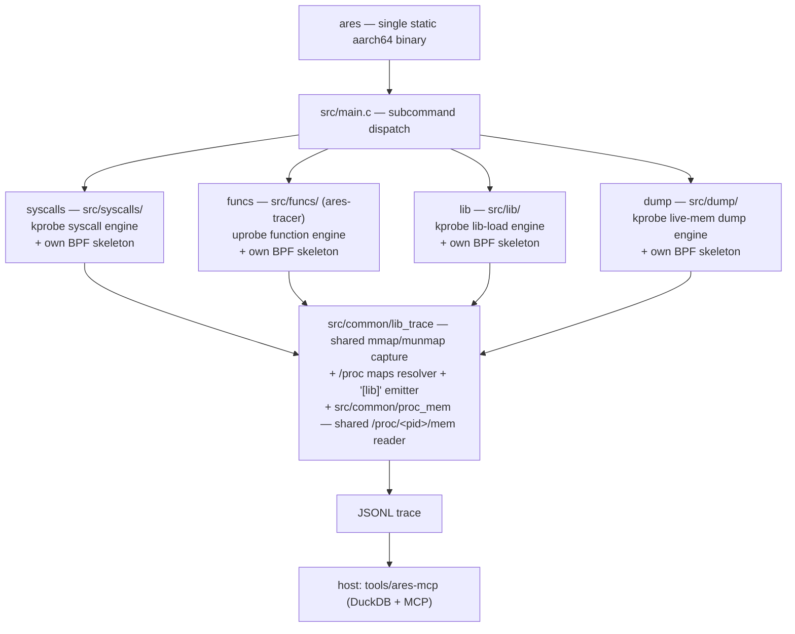

# ares — technical documentation

Maintainer-facing notes on how ares is put together, how each engine works, the
trace schema, the MCP server, and the roadmap for consolidating duplicated code.
For user-facing build/usage instructions see [README.md](README.md).

ares is the merger of two previously separate tools — a kprobe syscall tracer
(formerly *heimdall*) and a uprobe function tracer (formerly *ares-tracer*) — into
one binary with a shared build, a type-discriminated trace schema, and one MCP
server. The internal source still uses the original names where it was not worth
the churn to rename (e.g. the syscalls engine's `HEIMDALL_*` runtime env vars and
`heimdall.*` source files).

---

## 1. Architecture

- **One binary, four engines, selected by subcommand.** `main()` looks at
  `argv[1]` and calls the matching engine entry (`cmd_syscalls` / `cmd_funcs` /
  `cmd_lib` / `cmd_dump`), passing the remaining argv so each engine keeps its own
  argument parser unchanged.
- **Each engine loads only its own BPF object.** The stealthy syscall engine can
  run without the detectable uprobe engine ever touching the target. The engines
  are *not* fused into a single always-on pass (see §8).
- **Library-load tracing is shared, not duplicated.** The mmap/munmap capture,
  `/proc/<pid>/maps` full-path resolution, and the `[lib]` text/JSONL emitter live
  once in `src/common/lib_trace.*` and are used by all four engines. The BPF probe
  is *source*-shared (`#include`d into each engine's own skeleton, preserving the
  per-engine-BPF firewall); the userspace half is linked once as `common.part.o`,
  exporting only its `ares_libtrace_*` API. See §8.

### Why partial-link + symbol localization

The two engines were independent programs that each assumed they owned the global
namespace (e.g. both define `verbose`, `resolve_uid`; the funcs engine exposes
bare globals like `skel`, `out_print`, `lookup_caller`). Naively linking their
objects together fails with `multiple definition` errors.

The Makefile solves this without rewriting either engine: it compiles each
engine's objects, **partial-links** them into one relocatable object
(`ld -r`), then **localizes every symbol except the single `cmd_*` entry point**
with `objcopy --keep-global-symbol=cmd_<engine>`. After that, each engine's
internals are file-local and cannot collide; only `cmd_syscalls` / `cmd_funcs`
remain visible to `main()`. The only source change required was renaming each
former `main()` to its `cmd_*` name.

### Build pipeline (Makefile)

1. **libbpf** — vendored at `third_party/libbpf`, cross-built static.
2. **BPF objects + skeletons** — built with host clang (BPF is arch-neutral; CO-RE
   relocates against the device kernel at load). Two skeletons:
   - `build/heimdall.skel.h` (name `heimdall`)
   - `src/funcs/ares-tracer.skel.h` (name `ares_tracer_bpf`) — lives next to its
     source because `ares-tracer.c` and `modules/*.c` include it via
     `"ares-tracer.skel.h"` / `"../ares-tracer.skel.h"`. (`ares-tracer.bpf.c`
     `#include`s the module `.bpf.c` files, so it is a single BPF compilation
     unit.)
3. **syscall name table** — `build/syscalls_gen.h`, generated by preprocessing
   `<sys/syscall.h>` with the cross compiler (arm64 generic ABI).
4. **userspace objects → per-engine partial-link + localize → final static link**
   with `-lelf -lz -lzstd -llzma` (superset of both engines; lzma decodes
   `.gnu_debugdata` mini-debug-info in the symbolizer).

`vmlinux.h` (committed, with `vmlinux.btf` for `make regen-vmlinux`) is shared by
both BPF objects. The container build (`misc/Dockerfile` + `scripts/build.sh`) just
runs this same Makefile inside a pinned image, so there is a single source of
build truth.

---

## 2. The `syscalls` engine (kprobe, injectionless)

- Hooks the arm64 syscall dispatcher (`kprobe/do_el0_svc`) for entry, curated
  per-function `kretprobe/__arm64_sys_*` for return values, and mmap/munmap
  uprobes to track library load ranges.
- **In-kernel stack-origin filter:** gates on the app UID (installed *before*
  launch, so every thread is traced from its first syscall), then — unless in
  capture-all mode — cheaply rejects a syscall if the target library isn't mapped,
  otherwise walks the user stack and keeps the event only if a frame lands inside
  the target library's executable range.
- Output: structured per-event JSONL (see §6).

## 3. The `funcs` engine (uprobe, spec-driven)

- Attaches uprobes/uretprobes to functions selected by **probe specs**
  (`specs/*.spec`, format `MODULE!FUNC[(ARGTYPES)]>[RETTYPE]`) or by
  module+function regex. Captures typed arguments (string/value/fd), return
  values, call→return timing, and a call stack.
- **Module plugin system** (`src/funcs/modules/module.h`): each module implements
  `pre_attach`/`attach`/`detach`/`print_summary`/`handle_event`. Built-in modules:
  `proc-event` (fork/exit tracepoints), `execve` (execve kprobes), `prop_read`
  (Android `__system_property_*` hooks).
- Output: today, human-readable text wrapped as log-line JSONL/CSV (see §6).

## 4. The `lib` engine (kprobe, library-load only)

- Launches the target package fresh under a UID filter installed *before* launch
  (resolve app-UID → `am force-stop` + `am start`), so every executable, file-backed
  mapping is seen from the process's first thread, including forked app processes.
- The thinnest engine: it adds only a ring buffer, the target-UID map, and
  `uid_matches()`; the mmap/munmap capture, `/proc/<pid>/maps` full-path resolution,
  and the emitter are the shared `src/common/lib_trace` module (§1). No syscall hook
  and no uprobes — nothing is written into the target, so it sits on the stealthy
  side of the detectability firewall (§8).
- Output: the unified `[lib] pid <N> <fullpath> [start,end) off=.. inode=.. ppid=..`
  line, plus optional structured JSONL via `-o`
  (`{"type":"lib",...}` / `{"type":"unlib",...}`; see §6). `[unlib]` unmap lines are
  suppressed on stdout unless `-v` is passed; the JSONL (`-o`) always records both.

## 5. The `dump` engine (kprobe, live-memory dump)

- **Stealthy fresh launch**, same approach as `ares lib`: installs a UID filter
  *before* launch, runs `am force-stop` + `am start`, and uses the shared
  `src/common/lib_trace` probe (mmap/munmap capture + `/proc/<pid>/maps` resolver)
  to track every library mapping. No uprobes — nothing written into the target.
- **Two dump triggers:**
  - Default (on-exit): after the app terminates, rescans `/proc/<pid>/maps` for all
    mappings that match the user-supplied glob and dumps each one.
  - `--on-map`: dumps a library the instant it maps, using `(pid, start)` dedup to
    avoid re-dumping the same mapping. Useful for randomized-name or early-unmap
    libraries.
- **Rebuild pipeline** (`src/dump/rebuild.c`): reads the raw in-memory image via
  `/proc/<pid>/mem`, fixes program-header `p_offset` fields, captures inter-segment
  gaps, un-applies `DT_RELR` and `RELATIVE` relocations, de-rebases `.dynamic`
  (restores load-time-added base address), and reconstructs a full section-header
  table. `--raw` skips the rebuild and writes the phdr-fixed image directly.
  **aarch64/ELF64 only.** Output filename: `<name>.<pid>.<base>.so`.
- **Shared `/proc/<pid>/mem` reader** (`src/common/proc_mem.c`, exported in
  `COMMON_API`): the generic `proc_mem_open` / `proc_mem_read` helpers used by both
  the dump engine's rebuild pipeline and the syscalls engine's stack symbolizer
  (which walks ART's in-process JIT debug descriptor).

## 6. Unified trace schema

Every record carries a **`type` discriminator** so one consumer can ingest a mixed
stream:

- `ares syscalls` emits **structured** records:
  `{"type":"syscall","id":..,"pid":..,"tid":..,"syscall":..,"args":[..],
  "string_args":{..},"fd_args":{..},"decoded_args":{..},"sock_addr":..,
  "backtrace":[{frame,addr,symbol}..]}`, plus `{"type":"stack",...}` snapshots.
- `ares funcs` currently emits **log-line** records:
  `{"ts":..,"stream":"out|err","tag":"event|map|...","message":".."}` — the
  rendered human-readable output, not field-level data.
- `ares lib` and `ares dump` both emit **structured** library-load records via `-o`
  (from the shared emitter):
  `{"type":"lib","pid":..,"tid":..,"ppid":..,"library":..,"start":..,"end":..,
  "pgoff":..,"inode":..}` and `{"type":"unlib","pid":..,"tid":..,"start":..,
  "end":..}`.

**Planned (deferred):** a structured emitter for `funcs` so its events become
first-class records under the same discriminator. See [BACKLOG.md](BACKLOG.md).

## 7. MCP server (`tools/ares-mcp`, host-side Python)

- `trace_store.py` — loads a trace (JSON array or JSONL) into in-memory **DuckDB**
  and exposes bounded, pre-aggregated queries. Reads only the explicit syscall
  column set, so the new `type` field is ignored and non-syscall records (no `id`)
  are dropped — i.e. it is forward-compatible with the discriminated schema today
  and analyzes `type:"syscall"` records.
- `server.py` — FastMCP tools: `overview`, `hot_loops`, `syscall_histogram`,
  `files`, `threads`, `sockets`, `errors`, `distinct_backtraces`, `query`,
  `get_event`, `search`, `wx_scan`, `diff_traces`, plus on-device
  `list_libraries` (via `ares lib`) / `dump_library` (via `ares dump`).
- `device.py` — drives on-device `ares` subcommands over adb (`ARES_ADB`,
  `ARES_BIN`, `ARES_SHELL_PREFIX`, `ARES_SERIAL`); `list_libraries` → `ares lib`,
  `dump_library` → `ares dump`.

**Long-term:** a single unified `ares-mcp` that treats `ares funcs` structured
output as a first-class trace source alongside syscalls. See [BACKLOG.md](BACKLOG.md).

---

## 8. Detectability analysis

- **Combining engines into one on-disk binary does not increase detectability of
  the stealthy path.** The binary lives at `/data/local/tmp`, not in the target's
  address space.
- Detectability is **per-mechanism, not per-binary**: `syscalls` (kprobe) is
  invisible to in-process RASP (no `TracerPid`, no target-memory modification,
  kernel-side filtering); `funcs` (uprobe) writes a `BRK` into the target's
  executable pages and is detectable by prologue/code-integrity checks.
- **The real risk is running the loud (uprobe) engine alongside the quiet (kprobe)
  one.** A RASP that spots the `BRK` knows it is being analyzed and can change
  behavior — poisoning the syscall engine's highest-value use (clean-vs-rooted
  diffing). Hence the subcommand split and the "load only one engine's BPF object"
  rule.
- Secondary tells: both engines need eBPF load privileges (often SELinux
  permissive); a single binary has a distinct on-disk fingerprint/size/process
  name (trivially mitigated by renaming).

---

## 9. Future work

Deferred architecture work, the `src/common/` consolidation roadmap, and known
tech debt now live in [BACKLOG.md](BACKLOG.md).
