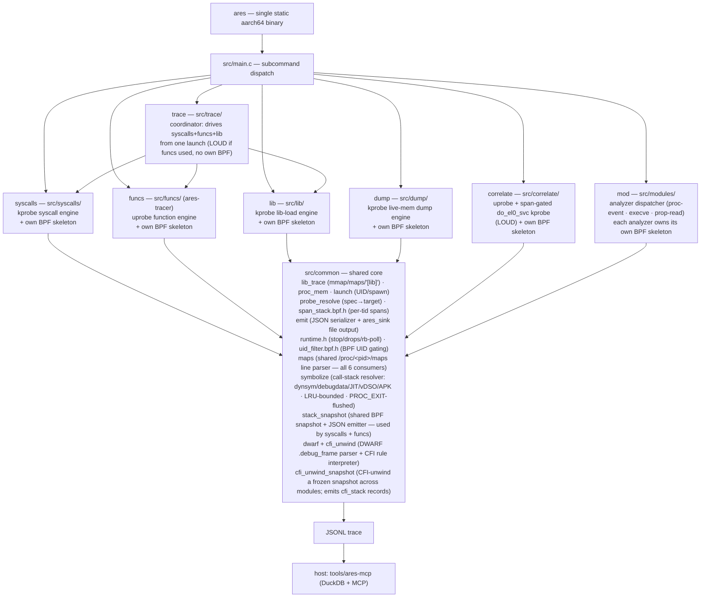

# ares — technical documentation

Maintainer-facing notes on how ares is put together, how each engine works, the
trace schema, the MCP server, and the roadmap for consolidating duplicated code.
For user-facing build/usage instructions see [README.md](README.md).

ares is the merger of two previously separate tools — a kprobe syscall tracer
(formerly *heimdall*) and a uprobe function tracer (formerly *ares-tracer*) — into
one binary with a shared build, a type-discriminated trace schema, and one MCP
server. The syscalls engine now uses `ARES_*` naming and `syscalls.*` source files
(rename completed).

---

## 1. Architecture



- **One binary, seven subcommands, selected by `argv[1]`.** `main()` calls the
  matching entry (`cmd_syscalls` / `cmd_funcs` / `cmd_lib` / `cmd_dump` /
  `cmd_correlate` / `cmd_trace` / `cmd_mod`), passing the remaining argv so each
  keeps its own argument parser unchanged. Five are single-BPF engines (each owns
  one BPF object); `mod` dispatches to per-analyzer BPF objects (each analyzer owns
  its own skeleton — see §6.6); `trace` owns no BPF object — it is a coordinator
  that drives the `syscalls` and `funcs` engines together from one app launch
  (see §6.5).
- **Each engine loads only its own BPF object.** The stealthy syscall engine can
  run without the detectable uprobe engine ever touching the target. The engines
  are *not* fused into a single always-on pass (see §9).
- **The kernel-side UID filter is shared, not duplicated.** `src/common/uid_filter.bpf.h`
  defines the `target_uids` BPF HASH-set map and the `uid_matches()` inline, and is
  `#include`d into all five BPF objects. Each loader inserts the target app's UID
  before launch (`key=uid, value=1`). The HASH-set shape accommodates multi-UID
  gating (needed by `funcs`, which can trace several PIDs with distinct UIDs) at no
  extra cost for single-UID callers; the detectability firewall (§9) is preserved
  because each engine still compiles its own BPF object.
- **Library-load tracing is shared, not duplicated.** The mmap/munmap capture,
  `/proc/<pid>/maps` full-path resolution, and the `[lib]` text/JSONL emitter live
  once in `src/common/lib_trace.*` and are used by all five engines. The BPF probe
  is *source*-shared (`#include`d into each engine's own skeleton, preserving the
  per-engine-BPF firewall); the userspace half is linked once as `common.part.o`,
  exporting only its `ares_libtrace_*` API. See §9.
- **Engine-runtime plumbing is shared, not duplicated.** `src/common/runtime.{c,h}`
  provides `ares_install_stop_handler` (2-stage SIGINT/SIGTERM → flag/`_exit(130)`),
  `ares_drops_report` (unified teardown tally), `ares_round_pow2` (BPF ring sizing),
  and the BPF-dependent inline helpers `ares_libbpf_quiet` / `ares_drops_read` /
  `ares_rb_poll_until` / `ares_rb_poll_until_cb` (all gated on `__LIBBPF_LIBBPF_H` so
  the header is host-testable without libbpf). `ares_rb_poll_until_cb` is the shared
  ring-buffer poll loop used by all five engines: it accepts an optional per-iteration
  tick callback for periodic work (e.g. the `syscalls` drops report) and returns the
  final poll error. `ares_rb_poll_until` is the no-callback wrapper used by the three
  simple engines (`lib`/`dump`/`correlate`).
- **The decoupled drain queue is shared, not duplicated.** `src/common/evqueue.{c,h}`
  provides `struct ares_evq` — a SPSC byte ring with `[4-byte len][payload]` framing,
  cond-var handoff, and a `dropped` counter. Both the `syscalls` and `funcs` engines
  use it to decouple the ring-buffer drain thread from the heavy per-event work
  (symbolization, JSON emit). The kernel ring stays empty; bursts are absorbed in RAM.
- **The call-stack symbolizer is shared, not duplicated.** `src/common/symbolize.{c,h}`
  implements `sym_resolve(pid, addr, out, sz)` and `sym_flush_pid(pid)`, used by
  both `syscalls` (backtrace JSON) and `funcs` (console stack frames). Resolution
  sources: `.dynsym` / `.symtab` / `.gnu_debugdata` (LZMA mini-debug-info, covers
  most Android system libraries and `dex2oat`-compiled app code); ART/JIT method
  names via `__jit_debug_descriptor` over `/proc/<pid>/mem`; vDSO `.dynsym`; and
  APK-embedded stored `.so` display names (ZIP central-dir parse). Per-pid
  Per-pid `/proc/<pid>/maps` snapshots are cached with binary search and a throttled
  refresh; the cache is **bounded** at `PM_MAX_PIDS=128` entries with LRU eviction
  (prevents unbounded growth on fork-heavy traces); the LRU bound is the always-on
  eviction backstop. For prompt per-exit flushing via `sym_flush_pid`, run
  `ares mod proc-event` alongside. The symbol result hash
  is bounded at `SC_MAX_CAP=256k` entries (clears and rebuilds at the ceiling).
  The line parser is shared: `src/common/maps.{c,h}` exposes `ares_parse_maps_line`
  and is used by all six `/proc/<pid>/maps` consumers across the codebase.
  `funcs` previously had a simpler local resolver (`lookup_caller`) that only
  produced module+offset with no symbol names; the merge gives `funcs` real function
  names, JIT/vDSO resolution, and `.gnu_debugdata` for free, while `syscalls` gains
  APK-embedded `.so` naming.
- **The argument-parsing contract is shared, not duplicated.** All six engines use
  GNU argp (auto `--help`/`--usage`/`--version`). `src/common/engine_args.h` provides
  `struct common_args`, `COMMON_ARGS_INIT`, `COMMON_ARGP_OPTIONS`, and
  `parse_common_arg()`. `syscalls` and `funcs` embed `struct common_args` and use the
  full six-flag contract (`-o -v -q -J -b -Q`). `lib`, `dump`, and `correlate` use
  argp directly but advertise only the flags they have behavior for — the dead-flag
  trap is intentionally avoided (see BACKLOG "Won't do"). `syscalls` and `funcs`
  pre-fill the package name from `rc->pkg` before calling `argp_parse`, so the
  coordinator never injects `-P` into either engine's argv section. The other engines
  take `-P` directly.
- **The device/launch layer is shared, not duplicated.** `sh_exec` (run an Android
  shell command), `resolve_uid` (app UID from its data dir), `resolve_component`
  (launchable activity), and `ares_launch_app` (the canonical clean relaunch:
  force-stop → wait-for-stop → `am start -S -n <component>`; optionally writes
  the launched PID into a `pid_t *out_pid` out-param) live once in
  `src/common/launch.*` as `ares_*` and are used by all five engines. They are
  linked once into `common.part.o`, exporting only the `ares_*` API (see
  `COMMON_API` in the Makefile).
- **All five tracing engines are split into setup/run/teardown phases.**
  Each engine's `cmd_<engine>` entry is a thin wrapper over
  `<engine>_setup(argc, argv, rc)` (parse + open/load/attach + arm UID, stopping
  *before* the app launch), `<engine>_run(stop)` (the ring-buffer poll loop, exits
  when the shared `volatile sig_atomic_t *stop` is set), and
  `<engine>_teardown()`. The launch is owned by the caller (the wrapper standalone,
  or a combined runner) via `ares_launch_app`, and `struct ares_run_ctx`
  (`src/common/launch.h`) carries a pre-resolved UID + package name into each
  `*_setup`. Standalone behavior is unchanged; the split exists so engines can be
  armed, launched once, and polled together. The `trace` runner drives
  `syscalls` + `funcs` + `lib` concurrently from one launch. `dump` and `correlate`
  have the lifecycle contract but are not yet wired into `trace` — see
  [BACKLOG.md](BACKLOG.md) (GA2 deferred items). Exception: `correlate_setup` owns its launch internally (uprobe attach requires
  the child PID, only known post-launch) and ignores `rc`; it now routes through
  `ares_launch_app` with the new `out_pid` param (GA6-keystone done). Wiring
  `correlate` into `trace` remains deferred — see BACKLOG.md GA2 deferred items.
- **The firewall-aware capability registry is the single audit point.** `src/common/capabilities.*`
  holds the static table of every BPF object and whether it writes into the target's
  userspace memory (the detectability firewall bit). Uprobe-bearing capabilities set
  `writes_target_memory = true`: `funcs`, `correlate`, and `mod:prop-read` (libc
  uprobes); all kprobe/tracepoint capabilities (`syscalls`, `lib`, `dump`,
  `mod:proc-event`, `mod:execve`) are `false`.
  Advisory by design: each subcommand loads exactly one object of known, documented
  loudness, so there is no implicit composition layer for a loud object to leak
  through. The registry is the single audit point + regression guard. Enforcement
  would only add value under a future intent-based preset/composition layer. See §9.

### Why partial-link + symbol localization

The two engines were independent programs that each assumed they owned the global
namespace (e.g. both define `verbose`; the funcs engine exposes
bare globals like `skel`, `out_print`). Naively linking their
objects together fails with `multiple definition` errors.

The Makefile solves this without rewriting either engine: it compiles each
engine's objects, **partial-links** them into one relocatable object
(`ld -r`), then **localizes every symbol except the single `cmd_*` entry point**
with `objcopy --keep-global-symbol=cmd_<engine>`. After that, each engine's
internals are file-local and cannot collide; only `cmd_syscalls` / `cmd_funcs`
remain visible to `main()`. The only source change required was renaming each
former `main()` to its `cmd_*` name.

### Build pipeline (Makefile)

1. **libbpf** — vendored at `third_party/libbpf`, cross-built static.
2. **BPF objects + skeletons** — built with host clang (BPF is arch-neutral; CO-RE
   relocates against the device kernel at load). One skeleton per engine (five):
   - `build/syscalls.skel.h` (name `syscalls`)
   - `build/lib.skel.h` (name `ares_lib`)
   - `build/correlate.skel.h` (name `ares_correlate`)
   - `build/dump.skel.h` (name `ares_dump`)
   - `src/funcs/ares-tracer.skel.h` (name `ares_tracer_bpf`) — the only one not in
     `build/`: it lives next to its source because `ares-tracer.c` and `modules/*.c`
     include it via `"ares-tracer.skel.h"` / `"../ares-tracer.skel.h"`.
     (`ares-tracer.bpf.c` `#include`s the module `.bpf.c` files, so it is a single
     BPF compilation unit.)
3. **syscall name table** — `build/syscalls_gen.h`, generated by preprocessing
   `<sys/syscall.h>` with the cross compiler (arm64 generic ABI).
4. **userspace objects → per-engine partial-link + localize → final static link**
   with `-lelf -lz -lzstd -llzma` (superset across all engines; lzma decodes
   `.gnu_debugdata` mini-debug-info in the symbolizer).

`vmlinux.h` (committed, with `vmlinux.btf` for `make regen-vmlinux`) is shared by
all five BPF objects. The container build (`misc/Dockerfile` + `scripts/build.sh`) just
runs this same Makefile inside a pinned image, so there is a single source of
build truth.

### Testing tiers

A test pyramid mirroring the cost of each check; the cheap tiers gate the
expensive one:

1. **Host unit tests** (`tests/`, `make test`) — pure, host-compilable logic with
   no device and no cross-toolchain. `tests/test_probe_spec.c` links the real
   `src/common/probe_resolve.c` (host `cc` + `-lelf`) and asserts the custom
   probe-spec grammar (`MOD!FUNC(S,V,F)>V`, `@offset` (a file offset, not a readelf/nm vaddr), lowercase types, return-only
   vs paired, arg clamp, and rejection of malformed input). Milliseconds; the first
   thing to extend when adding pure logic (escaping, decoders, maps parsing).
2. **CI** (`.github/workflows/ci.yml`) — two jobs on every PR/push: `make test`, and
   the containerized `scripts/build.sh` cross-build so the binary can't silently
   stop compiling. The device tier is deliberately *not* in CI (no physical device).
3. **Device acceptance** (`scripts/device-test.sh`, `make device-test`) — the only
   tier that exercises real attach + CO-RE relocation against the live kernel.
   Pushes the fresh binary (md5-skip when the on-device copy matches, so a flaky
   adb link doesn't stall the run) and per capability asserts it attaches and emits
   real output: `lib` → `[lib]` lines including bionic `libc.so`; `syscalls` → the
   attach banner or live `==>`/`<==` events. Knobs: `ARES_TEST_PKG`,
   `ARES_TEST_TIMEOUT`. Three non-obvious device facts are baked in (and documented
   in the `testing-ares-on-device` skill): run ares in its **own** `su -c` (chaining
   `am force-stop; ares` drops it into a reduced context → BPF `-EPERM`); ares handles
   both **SIGINT and SIGTERM** via the shared 2-stage stop handler (`runtime.c`);
   `device-test.sh` sends `-s INT` to match the interactive Ctrl-C path (`-k 3` keeps
   the SIGKILL backstop); and grep the captured output with here-strings (an `echo |
   grep -q` pipe SIGPIPEs under `pipefail` on large output).

---

## 2. The `syscalls` engine (kprobe, injectionless)

- Hooks the arm64 syscall dispatcher (`kprobe/do_el0_svc`) for entry, curated
  per-function `kretprobe/__arm64_sys_*` for return values, and mmap/munmap
  uprobes to track library load ranges.
- **In-kernel stack-origin filter:** gates on the app UID (installed *before*
  launch, so every thread is traced from its first syscall), then — unless in
  capture-all mode — cheaply rejects a syscall if the target library isn't mapped,
  otherwise walks the user stack and keeps the event only if a frame lands inside
  the target library's executable range.
- Output: structured per-event JSONL (see §7).
- **`--snapshot` captures a frozen user-stack window.** The BPF program captures up to
  `ARES_SNAP_MAX` bytes from `sp` upward, plus the **full GP register file** (x0..x30,
  `regs[31]`), pc/sp/fp/lr (legacy mirror), and a `truncated` flag (1 = fell back to
  `ARES_SNAP_SMALL`). These are emitted as a sidecar `{"type":"stack",...}` record
  (see §7). The register file is the CFI initial state for the DWARF-based software
  unwinder (`src/common/dwarf.c` + `cfi_unwind.c`). The snapshot struct and BPF
  helpers live in `src/common/stack_snapshot.{h,bpf.h}` and are shared with the
  `funcs` engine.

### §2.1 CFI-unwind layer (`cfi_unwind_snapshot`)

Immediately after writing the raw `{"type":"stack"}` sidecar record, `json_emit_stack`
calls `emit_cfi_backtrace`, which CFI-unwinds the frozen snapshot and emits a companion
`{"type":"cfi_stack"}` record to the same sidecar file. The two records are correlated
by `stack_id`.

```mermaid
flowchart LR
    snap["struct ares_stack_snapshot\n(regs + snap[] window)"]
    unwind["cfi_unwind_snapshot(pid, snap)\nsrc/common/symbolize.c"]
    step["cfi_step(sec, module_pc, regs, &sp, &pc,\n  snap->snap, snap->sp, snap->snap_len)\ncfi_unwind.c — reads only the frozen window"]
    sym["sym_resolve(pid, pc, sym)\nsymbolize.c"]
    emit["emit_cfi_backtrace\nsyscalls.c"]
    out["{\"type\":\"cfi_stack\",\n\"cfi_backtrace\":[{frame,addr,symbol,kind},...]}"]

    snap --> unwind
    unwind --> step
    step -->|"caller pc"| unwind
    unwind -->|"out_pcs[]"| emit
    emit --> sym
    sym --> out
```

**Algorithm (`cfi_unwind_snapshot`):**
1. `unwind_regs_from_snapshot(snap, &r)` — seed `regs[0..30]`, `sp`, `pc` from the frozen register file.
2. Per iteration (cap 256): record `pc` → `out_pcs[n++]`; look up the mapping via `pm_get` + `find_mapping`; compute `load_base` via `module_base`; call `cfi_get(path, elf_off, load_base, ...)` to get the cached `cfi_section`; call `cfi_step` with the **frozen `snap->snap` window** (bounds-checked, never live target memory); stop when `cfi_step` returns 0 (no FDE, RA undefined, pc==0, or OOB stack).
3. The `cfi_get` pointer is **consumed by `cfi_step` in the same iteration** before the next call — it points into a realloc'able cache and must not be held across iterations.

**Frame classification (`kind` field):**
- `"native"` — default; a C/C++ frame in any native `.so`.
- `"jni-trampoline"` — symbol contains `art_jni_trampoline`; the ART bridge from native into managed code.
- `"managed"` — symbol comes from a `.oat`, `.odex`, or `.vdex` file (ahead-of-time compiled Java).
- `"interp"` — symbol is an ART interpreter entrypoint (see `is_interp_frame`); the managed method lives in a ShadowFrame and cannot be named by CFI.

**Firewall:** `cfi_step` reads stack bytes exclusively from the `snap->snap[]` window captured in-kernel at trap time. It never calls `proc_mem_read` or touches live target memory. No uprobe is added. The firewall is clean.

**Limits:**
- Works only for **compiled-JNI** paths where the Java method was compiled to native (`.oat`/`.odex`/`.vdex`) and its frame appears in the CFI-unwound chain.
- Interpreter frames (`ShadowFrame`) are detected by `is_interp_frame` and tagged `"kind":"interp"` but the managed method name is not recovered (no ART internal stack walk).
- Inlining defeats CFI attribution: an inlined callee has no FDE and cannot be named.
- Cross-thread offloaded syscalls are not attributed (CFI is per-tid).
- All capture behavior is flag-driven via GNU argp (`-P`/`-l`/`-A`/`-a`/`-q`/`-v`/`-J`/`-o`/`-b`/`-Q`/`--snapshot`);
  option ordering does not matter; `--help` is auto-generated; `--version` prints
  `ares syscalls`. The library selector is `-l <selector>` (was a positional argument).
  The sole runtime env var is `ARES_DEBUG=1`, which surfaces libbpf's verbose
  load/relocation logging (otherwise suppressed) — the first thing to check on a BPF
  load `-EPERM` or CO-RE/relocation error.

## 3. The `funcs` engine (uprobe, spec-driven)

- Attaches uprobes/uretprobes to functions selected by **probe specs**
  (`specs/*.spec`, format `MODULE!FUNC[(ARGTYPES)]>[RETTYPE]`) or by
  module+function regex. Captures typed arguments (string/value/fd), return
  values, call→return timing, and a call stack.
- **Configurable ring buffer size** (`-b/--bufsize MB`): sets the BPF ring buffer
  (`events_rb`) to `MB` MiB (rounded up to the next power of two). Default: 4 MiB.
  The ring holds raw kernel events before userspace drains them; a larger ring
  absorbs bursts without dropping events at the BPF side.
- **Decoupled drain:** MAP/UNMAP/module events are handled inline on the poll
  thread (they attach uprobes and must race the just-mmap'd library). CALL and
  RETURN events are pushed into a configurable `struct ares_evq` userspace queue
  (default 256 MiB, `-Q MB`) and
  processed on a dedicated worker thread, so the kernel ring stays drained
  regardless of symbolization/JSON latency. Synchronized with three mutexes:
  `g_targets_lock` guards `probe_targets[]` between the MAP attach path and the
  worker's `find_target_by_entry_addr` lookup; `g_out_lock` serializes stdout/stderr
  lines between the two threads; `g_sink_lock` serializes `g_sink` writes between
  the drain thread (lib/unlib records) and the worker thread (call/return records).
- Output: human-readable text to stdout (unless `-o FILE` or `-q` is given, both of
  which suppress console output). When `-o FILE` is passed, structured records for CALL
  and RETURN events are written via the shared `ares_sink` (see §3.1 and §7) and
  console output is suppressed (`-o` implies `-q`, consistent with all other engines).
  `-J`/`--jsonl` forces JSONL framing (one record per line, no enclosing `[...]`);
  without `-J` and when the filename doesn't end in `.jsonl`, the sink writes
  array-framed output.
- **Quiet mode** (`-q`): suppresses all per-event console output in
  `process_call_return` (the `ts_print`/`out_print` CALL/RETURN/stack blocks).
- **Stack snapshot** (`--snapshot`, requires `-o`): mirrors the `syscalls` `--snapshot`
  feature. At each CALL entry the BPF program captures the full GP register file
  (x0..x30) and a frozen stack window (up to `ARES_SNAP_MAX` bytes), deduped by an
  FNV-1a hash of `call_stack[]`. Deduplicated `{"type":"stack",...}` records are written
  to `<output>.stacks` (a sidecar JSONL file, identical schema to `syscalls` — see §7).
  Each CALL record in the main `.jsonl` carries `"stack_id"` linking it to the sidecar.
  The sidecar is written by the drain thread only (no lock needed).

### 3.1 Structured JSONL output (`-o`)

`-o FILE` opens a shared `ares_sink` (8 MB buffered, JSONL) and emits one
structured record per CALL or RETURN event. Human-readable stdout text is
unchanged; no legacy `{ts,stream,tag,message}` wrapper is written to the file.

Record shapes (from `src/funcs/funcs_emit.c`, built on the shared `emit.h` +
`trace_schema.h`):

```json
{"type":"call",   "pid":N,"tid":N,"module":"libc.so","symbol":"open",
                  "entry_addr":"0xABCDEF","args":["0x1","0x2","0x0","0x0","0x0","0x0","0x0","0x0"],
                  "backtrace":[{"frame":0,"addr":"0x..."},{"frame":1,"addr":"0x..."}]}

{"type":"return", "pid":N,"tid":N,"module":"libc.so","symbol":"open",
                  "retval":7,"elapsed_ns":4096}
```

`backtrace` is always present on CALL records (as long as `bpf_get_stack` returned frames),
built from `e->call_stack`/`e->stack_depth` at entry — orthogonal to `--snapshot`.
Addresses only (no inline symbols) to keep `funcs_emit.c` pure and host-testable without
the symbolizer. Cross-reference with the console output for resolved names, or run
`sym_resolve` offline. RETURN records carry no backtrace (same stack as entry; stack_depth
was captured there).

The `module` field is the library basename (no path). `args` always has `NUM_ARGS`
(8) elements in hex. `elapsed_ns` is 0 if the uretprobe was not attached. These
records share the same `type` discriminator as `ares syscalls` / `ares lib` output
(see §7), making them directly compatible with downstream ares-mcp ingest.

**Implementation notes:**
- Builders live in `src/funcs/funcs_emit.c` (pure file, no libbpf/skeleton deps)
  so the host unit test (`tests/test_funcs_emit.c`) can link them without
  cross-toolchain.
- Builders are declared in `src/funcs/ares-tracer-priv.h` and called from
  `process_call_return` in `src/funcs/ares-tracer.c`, which runs on the worker
  thread. Emit builds directly into `g_sink.jb` then calls `ares_sink_emit`.
  `g_sink` is multi-writer: the drain thread emits lib/unlib records and the worker
  thread emits call/return records; all writes are serialized by `g_sink_lock`.
  MAP/UNLIB records (library load/unload) are **done** — emitted as
  `{"type":"lib",...}` / `{"type":"unlib",...}` via `ares_libtrace_emit_lib/unlib`.
  SPAWN/PROC_EXIT/EXECVE/PROP structured records are a follow-on.

## 4. The `lib` engine (kprobe, library-load only)

- Launches the target package fresh under a UID filter installed *before* launch
  via `ares_launch_app` (force-stop → wait-for-stop → `am start -S`), so every
  executable, file-backed mapping is seen from the process's first thread, including
  forked app processes.
- The thinnest engine: it adds only a ring buffer, the target-UID map, and
  `uid_matches()`; the mmap/munmap capture, `/proc/<pid>/maps` full-path resolution,
  and the emitter are the shared `src/common/lib_trace` module (§1). No syscall hook
  and no uprobes — nothing is written into the target, so it sits on the stealthy
  side of the detectability firewall (§9).
- **CLI:** `ares lib [-P PACKAGE | PACKAGE] [-A ACTIVITY | ACTIVITY] [-o FILE] [-v] [-q]`.
  Package and activity can be given as `-P`/`-A` flags (consistent with other engines)
  or as positional arguments (back-compat). `--help`, `--usage`, and `--version`
  (`ares lib`) are auto-generated by argp.
- Output: the unified `[lib] pid <N> <fullpath> [start,end) off=.. inode=.. ppid=..`
  line, plus optional structured JSONL via `-o`
  (`{"type":"lib",...}` / `{"type":"unlib",...}`; see §7). `[unlib]` unmap lines are
  suppressed on stdout unless `-v` is passed; the JSONL (`-o`) always records both.

## 5. The `dump` engine (kprobe, live-memory dump)

- **Stealthy fresh launch**, same approach as `ares lib`: installs a UID filter
  *before* launch, then calls `ares_launch_app` (force-stop → wait-for-stop →
  `am start -S`), using the shared `src/common/lib_trace` probe (mmap/munmap capture +
  `/proc/<pid>/maps` resolver) to track every library mapping. No uprobes — nothing
  written into the target.
- **CLI:** `ares dump [-P PACKAGE | PACKAGE] [-A ACTIVITY | ACTIVITY] PATTERN [-d DIR] [--on-map] [--raw] [-q]`.
  Package and activity accept `-P`/`-A` flags or positional arguments (back-compat).
  `--help`, `--usage`, and `--version` (`ares dump`) are auto-generated by argp.
- **Two dump triggers:**
  - Default (on-exit): after the app terminates, rescans `/proc/<pid>/maps` for all
    mappings that match the user-supplied glob and dumps each one.
  - `--on-map`: dumps a library the instant it maps, using `(pid, start)` dedup to
    avoid re-dumping the same mapping. Useful for randomized-name or early-unmap
    libraries.
- **Rebuild pipeline** (`src/dump/rebuild.c`): reads the raw in-memory image via
  `/proc/<pid>/mem`, fixes program-header `p_offset` fields, captures inter-segment
  gaps, un-applies `DT_RELR` and `RELATIVE` relocations, de-rebases `.dynamic`
  (restores load-time-added base address), and reconstructs a full section-header
  table. `--raw` skips the rebuild and writes the phdr-fixed image directly.
  **aarch64/ELF64 only.** Output filename: `<name>.<pid>.<base>.so`.
- **Shared `/proc/<pid>/mem` reader** (`src/common/proc_mem.c`, exported in
  `COMMON_API`): the generic `proc_mem_open` / `proc_mem_read` helpers used by both
  the dump engine's rebuild pipeline and the syscalls engine's stack symbolizer
  (which walks ART's in-process JIT debug descriptor).

### 2.1 Stack symbolizer — shared (`common/symbolize.c`)

Both `syscalls` and `funcs` resolve backtrace addresses using the shared
`sym_resolve` call. For each frame address the symbolizer:

1. Looks up the mapping in the tracked library table (`/proc/<pid>/maps` snapshot).
2. If the mapping has a file path and the file opens as a valid ELF, resolves via
   the ELF symbol table (`.dynsym` / `.symtab`, with `.gnu_debugdata` mini-debug-info
   if present).
3. **JIT fallback — fires for *any* executable mapping with no openable ELF**, whether
   the mapping is anonymous (empty name) or carries a kernel-assigned bracket name
   such as `[anon_shmem:dalvik-jit-code-cache]`. In both cases the symbolizer calls
   `jit_resolve`, which walks ART's in-process `__jit_debug_descriptor` linked list
   via `/proc/<pid>/mem` to find a JIT-compiled method covering the frame address.
   A successful lookup emits the frame as `[JIT]!<method>+0x<offset>`.
4. **JIT miss on an executable bracket-name region is intentionally left uncached.**
   If `jit_resolve` finds no entry (ART has not yet published the method), the frame
   is emitted as `<mapping>+0x<offset>` without caching the negative result. This
   allows the frame to resolve correctly on a subsequent event once ART registers the
   compiled method — the descriptor is re-walked each time rather than locking in a
   miss.

AOT-compiled frames backed by OAT/ODEX/VDEX files (e.g. `base.vdex+0x..`, app
`.odex`) are shown as `file+offset`; managed-method resolution for those formats
is deferred (see [BACKLOG.md](BACKLOG.md)).

#### vDSO frames

`[vdso]` frames are named from the vDSO's `.dynsym`, read out of the target's
live memory (the vDSO is a complete, immutable ELF the kernel maps with no
backing file). A frame renders as `[vdso]!__kernel_clock_gettime+0x..`. The
parse reuses the on-disk symbol machinery (`ingest_fd_section` → `add_symbols`
→ `sym_lookup`) via `pread` on `/proc/<pid>/mem`; it writes nothing into the
target (firewall-clean) and is built once per pid.

#### Backtrace frame classification (what resolves, what does not)

| Region | What it is | Resolution |
|---|---|---|
| `<lib>.so!sym+off` | on-disk ELF | `.dynsym` / `.symtab` / `.gnu_debugdata` |
| `base.odex!Class.method+off` | AOT-compiled app code | **already named** via `.gnu_debugdata` mini-debug-info embedded by `dex2oat` |
| `[JIT]!method+off` | ART JIT code cache | GDB JIT descriptor walk (live memory) |
| `[vdso]!__kernel_*+off` | kernel vDSO | vDSO `.dynsym` (live memory) |
| `<lib>.so+off` (no `!`) | stripped / past-symbol-end native | no symbol exists — bare offset is the ceiling |
| `[anon:dalvik-main space]+off` | GC object heap | **not a method** — a return address here is frame-pointer-unwind noise |
| `[anon:dalvik-DEX data]+off` | dex bytecode (nterp) | **deferred** — needs the dex method resolver (Phase 2) |
| `base.vdex+off` | interpreter / quickened dex | **deferred** — dex resolver + PC-meaning research (Phase 2) |

#### DEX offset→method resolver (`src/common/dex`, Phase 2a — parser only)

The version-stable core both deferred rows above bottom out in: a pure parser
that maps a byte offset into a standard DEX image (`dex\n0NN`) to the Java method
whose `code_item.insns` covers it, returning `pkg.Class.method`. Interface:
`dex_map_build(img, len)` → `dex_map_lookup(map, off, out, outsz)` →
`dex_map_free(map)`. The map retains a private copy of the image (it never aliases
the caller's bytes) plus a sorted array of method bytecode ranges; lookup
binary-searches the ranges, then resolves names through the
`method_ids`/`type_ids`/`string_ids` tables. The DEX is target-controlled, so
every read is bounds-checked and every table index validated — a malformed entry
is skipped, a malformed header (or an allocation failure mid-build) fails the
build (`NULL`), overlapping method ranges from a crafted DEX are pruned so the
binary search stays deterministic, and no input can fault.
It has **no libbpf / `/proc` / ELF dependency and no detectability surface** (pure
parsing of bytes the caller already holds), and is host-tested against a committed
`.dex` fixture (`tests/test_dex.c`, `tests/fixtures/sample.dex`).

**Not yet wired into any capability** — the resolver has no caller, so it is
compiled only by `make test` and is absent from `build/ares`. The
vdex-container locate, anonymous-region wiring, and `symbolize.c` integration
(emitting `base.vdex!pkg.Class.method+0x..`) land in Phases 2c/2d; CompactDex
(`cdex001`) is deferred to the code-item-decode seam. See
[BACKLOG.md](BACKLOG.md).

## 6. The `correlate` engine (uprobe + span-gated kprobe, loud)

Function→syscall correlation on a live run. One BPF object
(`src/correlate/correlate.bpf.c`) carries **both** an entry uprobe and a syscall
kprobe, sharing the per-tid span stack from `src/common/span_stack.bpf.h`:

- **Entry uprobe** (attached by the loader at each spec'd function offset via the
  shared `src/common/probe_resolve` resolver): pushes a frame onto the per-tid span
  stack, assigns a monotonic `span_id`, records `parent_span` (the enclosing open
  frame), and emits a `func` event.
- **SP-based span close** (no uretprobe in v1): on each later event the stack is
  reconciled by user stack pointer (`current_sp > entry_sp` ⇒ the frame returned).
  No stack tampering — as quiet as a bare entry uprobe.
- **Span-gated `kprobe/do_el0_svc`**: reads the innermost open `span_id` for the
  tid (`span_stack_top_id`); drops the syscall if none, else emits it tagged with
  that span (number + raw `args[0..5]`, name resolved host-side from the arm64
  syscall table).
- **Loader** (`src/correlate/correlate.c`): reuses `src/common/launch` and
  `src/common/probe_resolve`; installs the target UID(s), attaches the entry uprobe
  per resolved `(path,offset)` plus the one shared kprobe, then drains the ring.
  Uses GNU argp (`--help`/`--usage`/`--version` — prints `ares correlate`); flags:
  `-p PID[,…]`, `-P PACKAGE`, `-e SPEC`, `-F FILE`, `-o FILE`, `-q`.
- **Output**: flat, type-discriminated JSONL via the shared serializer
  (`src/correlate/corr_emit.c`, mirrors `funcs_emit.c`). `-o FILE` opens the shared
  `ares_sink` (8 MB buffered, periodic flush, `wrote N event(s)` report at teardown),
  matching `syscalls`/`funcs` — no per-event `fflush`. `func` records:
  `{"type":"func","span":N,"parent_span":M,"pid":...,"tid":...,"entry_addr":"0x...","args":["0x...",...]}`
  — args as hex strings. `syscall` records additionally carry a parallel
  `"decoded"` array: each element is the human-readable flag expansion (from
  `flags_decode_arg`) where a decoder applied, or `""` otherwise. One row per
  event, joinable on `span`; syscalls are never nested inside a func record.
- **Robustness**: each entry-uprobe `bpf_link` is tracked and `bpf_link__destroy`'d
  on teardown (not leaked to process exit). The fixed input caps — `-p` (64 PIDs),
  `-e`/`-F` (64 specs), per-pid attach dedup (256) — now emit a warning when hit
  instead of silently truncating, so a wide package or large `-F` file is not quietly
  under-instrumented.
- **Detectability**: this object carries the uprobe, so it is the **loud** path; the
  quiet engines never load it (see §9). Correlation is per-tid & synchronous
  (cross-thread offloaded syscalls aren't attributed); CFF-resistant; defeated by
  inlining and VM/virtualization.
- **v1 scope**: custom specs (`-e`/`-F`) + `-p` (full) / `-P` (best-effort
  post-launch); SP-based close (no return values). Syscall args: hex + parallel
  flag-decoded `decoded[]` array (fd/sockaddr/string capture requires BPF event-struct
  changes — deferred).
  `--returns`, arg/sockaddr decoding, and regex (`-I/-i`) targeting are planned
  (see [BACKLOG.md](BACKLOG.md)).

## 6.5 The `trace` runner (combined kprobe + uprobe, loud)

`ares trace` runs the `syscalls` (kprobe) and `funcs` (uprobe) engines together
from a **single app launch**, emitting both engines' full output as two
independent streams (no correlation — that is `correlate`'s job). It owns no BPF
object: it is a thin coordinator (`src/trace/trace.c`) over the engines'
setup/run/teardown phases (§1).

- **Why a coordinator (not a fused probe):** each real engine keeps all its
  features (return values, typed args, modules, sockaddr/fd decode, stack-origin
  filter, snapshots). The blocker to running them as two processes was the launch
  race — both force-stop + relaunch the app and arm their UID filter before
  launch. `trace` resolves the UID once, calls `syscalls_setup` then `funcs_setup`
  (both arm their probes/UID but **do not** launch), then `ares_launch_app` **once**,
  then drains both ring buffers on two pthreads against a shared
  `volatile sig_atomic_t` stop flag, and tears both down.
- **Coordinator mode plumbing:** `struct ares_run_ctx` (`src/common/launch.h`)
  carries the pre-resolved UID + package into each `*_setup`; the engines pre-fill
  their package name from `rc->pkg` before calling `argp_parse`, so no `-P` flag
  appears in either engine's argv section. The driver symbols (`syscalls_setup`/`_run`/`_teardown`,
  `funcs_*`) are kept global through the partial-link so `trace.part.o` can call
  them (see the `--keep-global-symbol` lists in the Makefile).
- **CLI:** `ares trace -P <pkg> [-o <prefix>] [--syscalls <args…>] [--funcs <args…>]`.
  With `-o`, each engine writes its own file (`<prefix>.syscalls.jsonl` /
  `<prefix>.funcs.jsonl`) — no shared `FILE*`, and both are ingestable by the
  unified MCP today. Each `--…` section is that engine's normal options; the package
  is not repeated (`rc->pkg` supplies it).
- **Operational notes:** without `-o`, both engines print to stdout from two
  threads and the text interleaves — `trace` warns and `-o` is recommended. A
  first Ctrl-C stops cleanly; a second force-quits (`_exit`), matching the
  standalone engines. The `syscalls` ring drain bails on the coordinator's stop
  flag (`g_stopp`), so shutdown is prompt even under a syscall flood.
- **Detectability:** loud by construction — it loads the `funcs` uprobe (entry
  `BRK`) alongside the `syscalls` kprobe, so it never sits on the stealthy side of
  the firewall (§9). `capabilities.c` marks `trace` as writing target memory.

## 6.6 The `mod` analyzers (`ares mod`)

`ares mod <name>` runs a lightweight standalone analyzer that owns its own BPF
object — no shared skeleton with `funcs`. Available analyzers:

- **`proc-event`** — fork/exit tracepoints (stealthy: zero uprobes). Wires
  `sym_flush_pid` on `ARES_EVENT_PROC_EXIT` for prompt per-pid symbol-cache eviction.
- **`execve`** — execve kprobes (stealthy: zero uprobes). Captures exec events for
  child-process correlation.
- **`prop-read`** — Android `__system_property_*` libc uprobes (**loud**: writes a
  `BRK` into the target's libc pages).

**Structured output** (`-o FILE`) comes for free — each analyzer feeds `ares_sink_t`
via `mod_emit_*` in `src/modules/mod_emit.c`, using the same shared emit path as the
other engines (see §7).

**Per-analyzer loudness** is single-sourced in `capabilities.c` via the `mod:<name>`
key (see §9). `proc-event` and `execve` are kprobe/tracepoint — stealthy;
`prop-read` is a libc uprobe — loud.

**Usage:** `ares mod <name> -P <pkg>` (optionally `-o <file>` for structured JSONL
output).

## 7. Unified trace schema

Every record carries a **`type` discriminator** so one consumer can ingest a mixed
stream:

- `ares syscalls` emits **structured** records:
  `{"type":"syscall","id":..,"pid":..,"tid":..,"syscall":..,"args":[..],
  "string_args":{..},"fd_args":{..},"decoded_args":{..},"sock_addr":..,
  "backtrace":[{frame,addr,symbol}..]}`, plus `{"type":"stack",...}` sidecar
  snapshots emitted by `--snapshot`. Stack snapshot schema:
  `{"type":"stack","stack_id":..,"pc":"0x..","sp":"0x..","fp":"0x..","lr":"0x..",
  "regs":["0x..",…],"snap_len":N,"truncated":0,"snapshot":"<base64>"}`.
  `regs` is a 31-element array of hex strings (x0..x30) representing the full GP
  register file at the trap point — the CFI initial state. `truncated` is 1 if the
  stack window fell back to `ARES_SNAP_SMALL` (raw bytes still valid, but shorter than
  `ARES_SNAP_MAX`). This schema is **shared** between `syscalls` (sidecar
  `<output>.stacks`) and `funcs` (`--snapshot`, sidecar `<output>.stacks`); the same
  `cfi_step` runtime driver can consume either.
- `ares funcs` emits **structured** records into the `-o` sink:
  `{"type":"call","pid":..,"tid":..,"module":..,"symbol":..,"entry_addr":..,
  "args":[..],"backtrace":[{"frame":0,"addr":"0x.."},..]}` and
  `{"type":"return","pid":..,"tid":..,"module":..,"symbol":..,
  "retval":..,"elapsed_ns":..}` (see §3.1). CALL records always carry a `backtrace`
  array of raw addresses (addr-only, no inline symbols — see §3.1). The `-o` file receives structured records
  only; human-readable console output is suppressed when `-o` is active (implied `-q`).
  `-J`/`--jsonl` forces JSONL framing (line-delimited records without a `[…]`
  wrapper); the default is array framing unless the output filename ends in `.jsonl`.
  MAP/UNLIB records are emitted as `{"type":"lib",...}` / `{"type":"unlib",...}` (see §3.1).
  SPAWN/PROC_EXIT/EXECVE/PROP structured records are a follow-on.
- `ares lib` and `ares dump` both emit **structured** library-load records via `-o`
  (from the shared emitter):
  `{"type":"lib","pid":..,"tid":..,"ppid":..,"library":..,"start":..,"end":..,
  "pgoff":..,"inode":..}` and `{"type":"unlib","pid":..,"tid":..,"start":..,
  "end":..}`.

**Shared output sink (`src/common/emit.h` — `struct ares_sink`):** all file
output for `syscalls` and `funcs` is now routed through `ares_sink_open` /
`ares_sink_emit` / `ares_sink_close` / `ares_sink_report`. The sink owns the
`FILE*`, an 8 MB `_IOFBF` write buffer, the reused `jbuf`, the record count, the
JSONL/array framing, periodic flush, and the "wrote N records to PATH" report.
On any write/flush/close failure the first error is latched in `s->werr`;
`ares_sink_report` prints `WARNING: write error on … output is incomplete` at
teardown if set (GA3).
`syscalls` is single-writer (drain thread only). `funcs` is multi-writer (drain
thread: lib/unlib; worker thread: call/return) — all `g_sink` access serialized by
`g_sink_lock`. SPAWN/PROC_EXIT/EXECVE/PROP structured records and unified MCP
ingest remain; see [BACKLOG.md](BACKLOG.md).

## 8. MCP server (`tools/ares-mcp`, host-side Python)

- `trace_store.py` — loads a trace (JSON array or JSONL) into in-memory **DuckDB**
  and exposes bounded, pre-aggregated queries. Reads only the explicit syscall
  column set, so the new `type` field is ignored and non-syscall records (no `id`)
  are dropped — i.e. it is forward-compatible with the discriminated schema today
  and analyzes `type:"syscall"` records.
- `server.py` — FastMCP tools: `overview`, `hot_loops`, `syscall_histogram`,
  `files`, `threads`, `sockets`, `errors`, `distinct_backtraces`, `query`,
  `get_event`, `search`, `wx_scan`, `diff_traces`, plus on-device
  `list_libraries` (via `ares lib`) / `dump_library` (via `ares dump`).
- `device.py` — drives on-device `ares` subcommands over adb (`ARES_ADB`,
  `ARES_BIN`, `ARES_SHELL_PREFIX`, `ARES_SERIAL`); `list_libraries` → `ares lib`,
  `dump_library` → `ares dump`.

**Long-term:** a single unified `ares-mcp` that treats `ares funcs` structured
output as a first-class trace source alongside syscalls. See [BACKLOG.md](BACKLOG.md).

---

## 9. Detectability analysis

- **Combining engines into one on-disk binary does not increase detectability of
  the stealthy path.** The binary lives at `/data/local/tmp`, not in the target's
  address space.
- Detectability is **per-mechanism, not per-binary**: `syscalls` (kprobe) is
  invisible to in-process RASP (no `TracerPid`, no target-memory modification,
  kernel-side filtering); `funcs` and `correlate` (uprobe) write a `BRK` into the
  target's executable pages and are detectable by prologue/code-integrity checks.
- **`trace` is loud — it deliberately runs both mechanisms at once.** Because it
  loads the `funcs` uprobe alongside the `syscalls` kprobe, the `BRK` is present, so
  its syscall stream is no longer stealthy. Use `trace` only when you want both
  layers in one run and the target is not RASP-sensitive; use bare `syscalls` for a
  clean (uprobe-free) syscall trace.
- **`correlate` is a loud engine by construction.** Its single BPF object carries
  the entry uprobe, so the whole engine is on the detectable side; the quiet
  engines never load it. Its default SP-based span close writes nothing extra to
  the target (only the entry `BRK`); a future `--returns` mode would add a
  uretprobe trampoline on the stack — a *second* detection surface — which is why
  it stays opt-in.
- **The real risk is running the loud (uprobe) engine alongside the quiet (kprobe)
  one.** A RASP that spots the `BRK` knows it is being analyzed and can change
  behavior — poisoning the syscall engine's highest-value use (clean-vs-rooted
  diffing). Hence the subcommand split and the "load only one engine's BPF object"
  rule.
- Secondary tells: both engines need eBPF load privileges (often SELinux
  permissive); a single binary has a distinct on-disk fingerprint/size/process
  name (trivially mitigated by renaming).

---

## 10. Future work

Deferred architecture work, the `src/common/` consolidation roadmap, and known
tech debt now live in [BACKLOG.md](BACKLOG.md).
