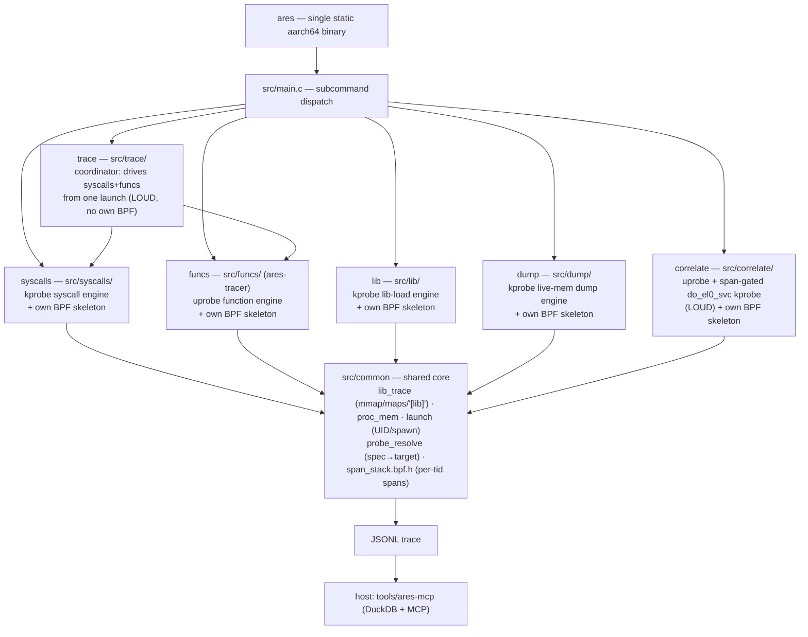

# ares — technical documentation

Maintainer-facing notes on how ares is put together, how each engine works, the
trace schema, the MCP server, and the roadmap for consolidating duplicated code.
For user-facing build/usage instructions see [README.md](README.md).

ares is the merger of two previously separate tools — a kprobe syscall tracer
(formerly *heimdall*) and a uprobe function tracer (formerly *ares-tracer*) — into
one binary with a shared build, a type-discriminated trace schema, and one MCP
server. The syscalls engine now uses `ARES_*` runtime env vars and `syscalls.*`
source files (rename completed).

---

## 1. Architecture



- **One binary, six subcommands, selected by `argv[1]`.** `main()` calls the
  matching entry (`cmd_syscalls` / `cmd_funcs` / `cmd_lib` / `cmd_dump` /
  `cmd_correlate` / `cmd_trace`), passing the remaining argv so each keeps its own
  argument parser unchanged. Five are BPF engines (each owns one BPF object); the
  sixth, `trace`, owns no BPF object — it is a coordinator that drives the
  `syscalls` and `funcs` engines together from one app launch (see §6.5).
- **Each engine loads only its own BPF object.** The stealthy syscall engine can
  run without the detectable uprobe engine ever touching the target. The engines
  are *not* fused into a single always-on pass (see §9).
- **Library-load tracing is shared, not duplicated.** The mmap/munmap capture,
  `/proc/<pid>/maps` full-path resolution, and the `[lib]` text/JSONL emitter live
  once in `src/common/lib_trace.*` and are used by all five engines. The BPF probe
  is *source*-shared (`#include`d into each engine's own skeleton, preserving the
  per-engine-BPF firewall); the userspace half is linked once as `common.part.o`,
  exporting only its `ares_libtrace_*` API. See §9.
- **The device/launch layer is shared, not duplicated.** `sh_exec` (run an Android
  shell command), `resolve_uid` (app UID from its data dir), `resolve_component`
  (launchable activity), and `ares_launch_app` (the canonical clean relaunch:
  force-stop → wait-for-stop → `am start -S -n <component>`) live once in
  `src/common/launch.*` as `ares_*` and are used by all five engines. They are
  linked once into `common.part.o`, exporting only the `ares_*` API (see
  `COMMON_API` in the Makefile).
- **The `syscalls` and `funcs` engines are split into setup/run/teardown phases.**
  Each engine's `cmd_<engine>` entry is a thin wrapper over
  `<engine>_setup(argc, argv, rc)` (parse + open/load/attach + arm UID, stopping
  *before* the app launch), `<engine>_run(stop)` (the ring-buffer poll loop, exits
  when the shared `volatile sig_atomic_t *stop` is set), and
  `<engine>_teardown()`. The launch is owned by the caller (the wrapper standalone,
  or a combined runner) via `ares_launch_app`, and `struct ares_run_ctx`
  (`src/common/launch.h`) carries a pre-resolved UID + an `external_launch` flag.
  Standalone behavior is unchanged; the split exists so both engines can be armed,
  launched once, and polled together (the planned `trace` runner). See
  [BACKLOG.md](BACKLOG.md).
- **The firewall-aware capability registry is the single audit point.** `src/common/capabilities.*`
  holds the static table of every BPF object and whether it writes into the target's
  userspace memory (the detectability firewall bit). Only uprobe-bearing capabilities
  (`funcs`, `correlate`) set `writes_target_memory = true`; all others are `false`.
  This is advisory today (no quiet-mode flag consumes it yet) and exists as the
  single audit point + regression guard. The future thin-presets work will use it
  to refuse a loud object in a quiet preset. See §9.

### Why partial-link + symbol localization

The two engines were independent programs that each assumed they owned the global
namespace (e.g. both define `verbose`; the funcs engine exposes
bare globals like `skel`, `out_print`, `lookup_caller`). Naively linking their
objects together fails with `multiple definition` errors.

The Makefile solves this without rewriting either engine: it compiles each
engine's objects, **partial-links** them into one relocatable object
(`ld -r`), then **localizes every symbol except the single `cmd_*` entry point**
with `objcopy --keep-global-symbol=cmd_<engine>`. After that, each engine's
internals are file-local and cannot collide; only `cmd_syscalls` / `cmd_funcs`
remain visible to `main()`. The only source change required was renaming each
former `main()` to its `cmd_*` name.

### Build pipeline (Makefile)

1. **libbpf** — vendored at `third_party/libbpf`, cross-built static.
2. **BPF objects + skeletons** — built with host clang (BPF is arch-neutral; CO-RE
   relocates against the device kernel at load). One skeleton per engine (five):
   - `build/syscalls.skel.h` (name `syscalls`)
   - `build/lib.skel.h` (name `ares_lib`)
   - `build/correlate.skel.h` (name `ares_correlate`)
   - `build/dump.skel.h` (name `ares_dump`)
   - `src/funcs/ares-tracer.skel.h` (name `ares_tracer_bpf`) — the only one not in
     `build/`: it lives next to its source because `ares-tracer.c` and `modules/*.c`
     include it via `"ares-tracer.skel.h"` / `"../ares-tracer.skel.h"`.
     (`ares-tracer.bpf.c` `#include`s the module `.bpf.c` files, so it is a single
     BPF compilation unit.)
3. **syscall name table** — `build/syscalls_gen.h`, generated by preprocessing
   `<sys/syscall.h>` with the cross compiler (arm64 generic ABI).
4. **userspace objects → per-engine partial-link + localize → final static link**
   with `-lelf -lz -lzstd -llzma` (superset across all engines; lzma decodes
   `.gnu_debugdata` mini-debug-info in the symbolizer).

`vmlinux.h` (committed, with `vmlinux.btf` for `make regen-vmlinux`) is shared by
all five BPF objects. The container build (`misc/Dockerfile` + `scripts/build.sh`) just
runs this same Makefile inside a pinned image, so there is a single source of
build truth.

### Testing tiers

A test pyramid mirroring the cost of each check; the cheap tiers gate the
expensive one:

1. **Host unit tests** (`tests/`, `make test`) — pure, host-compilable logic with
   no device and no cross-toolchain. `tests/test_probe_spec.c` links the real
   `src/common/probe_resolve.c` (host `cc` + `-lelf`) and asserts the custom
   probe-spec grammar (`MOD!FUNC(S,V,F)>V`, `@offset`, lowercase types, return-only
   vs paired, arg clamp, and rejection of malformed input). Milliseconds; the first
   thing to extend when adding pure logic (escaping, decoders, maps parsing).
2. **CI** (`.github/workflows/ci.yml`) — two jobs on every PR/push: `make test`, and
   the containerized `scripts/build.sh` cross-build so the binary can't silently
   stop compiling. The device tier is deliberately *not* in CI (no physical device).
3. **Device acceptance** (`scripts/device-test.sh`, `make device-test`) — the only
   tier that exercises real attach + CO-RE relocation against the live kernel.
   Pushes the fresh binary (md5-skip when the on-device copy matches, so a flaky
   adb link doesn't stall the run) and per capability asserts it attaches and emits
   real output: `lib` → `[lib]` lines including bionic `libc.so`; `syscalls` → the
   attach banner or live `==>`/`<==` events. Knobs: `ARES_TEST_PKG`,
   `ARES_TEST_TIMEOUT`. Three non-obvious device facts are baked in (and documented
   in the `testing-ares-on-device` skill): run ares in its **own** `su -c` (chaining
   `am force-stop; ares` drops it into a reduced context → BPF `-EPERM`); ares stops
   on **SIGINT**, not SIGTERM, so `timeout -s INT -k 3` is required; and grep the
   captured output with here-strings (an `echo | grep -q` pipe SIGPIPEs under
   `pipefail` on large output).

---

## 2. The `syscalls` engine (kprobe, injectionless)

- Hooks the arm64 syscall dispatcher (`kprobe/do_el0_svc`) for entry, curated
  per-function `kretprobe/__arm64_sys_*` for return values, and mmap/munmap
  uprobes to track library load ranges.
- **In-kernel stack-origin filter:** gates on the app UID (installed *before*
  launch, so every thread is traced from its first syscall), then — unless in
  capture-all mode — cheaply rejects a syscall if the target library isn't mapped,
  otherwise walks the user stack and keeps the event only if a frame lands inside
  the target library's executable range.
- Output: structured per-event JSONL (see §7).

## 3. The `funcs` engine (uprobe, spec-driven)

- Attaches uprobes/uretprobes to functions selected by **probe specs**
  (`specs/*.spec`, format `MODULE!FUNC[(ARGTYPES)]>[RETTYPE]`) or by
  module+function regex. Captures typed arguments (string/value/fd), return
  values, call→return timing, and a call stack.
- **Module plugin system** (`src/funcs/modules/module.h`): each module implements
  `pre_attach`/`attach`/`detach`/`print_summary`/`handle_event`. Built-in modules:
  `proc-event` (fork/exit tracepoints), `execve` (execve kprobes), `prop_read`
  (Android `__system_property_*` hooks).
- Output: human-readable text wrapped as log-line JSONL/CSV (see §7), plus an
  opt-in **structured JSONL mode** (`-J` / `--structured`) for CALL and RETURN
  events (see §7 and §3.1).

### 3.1 Structured JSONL mode (`-J`)

When `-J` is passed together with a JSONL sink (`-o <file>.jsonl`), the funcs
engine emits one structured record per CALL or RETURN event into that file,
interleaved with the existing text-wrapper records. This is opt-in and additive
— the text output and the legacy `{ts,stream,tag,message}` wrapper are unchanged.

Record shapes (from `src/funcs/funcs_emit.c`, built on the shared `emit.h` +
`trace_schema.h`):

```json
{"type":"call",   "pid":N,"tid":N,"module":"libc.so","symbol":"open",
                  "entry_addr":"0xABCDEF","args":["0x1","0x2","0x0","0x0","0x0","0x0","0x0","0x0"]}

{"type":"return", "pid":N,"tid":N,"module":"libc.so","symbol":"open",
                  "retval":7,"elapsed_ns":4096}
```

The `module` field is the library basename (no path). `args` always has `NUM_ARGS`
(8) elements in hex. `elapsed_ns` is 0 if the uretprobe was not attached. These
records share the same `type` discriminator as `ares syscalls` / `ares lib` output
(see §7), making them compatible with downstream ares-mcp ingest.

**Implementation notes:**
- Builders live in `src/funcs/funcs_emit.c` (pure file, no libbpf/skeleton deps)
  so the host unit test (`tests/test_funcs_emit.c`) can link them without
  cross-toolchain.
- Builders are declared in `src/funcs/ares-tracer-priv.h` and called from the
  `handle_event` SEAM in `src/funcs/ares-tracer.c` at the CALL and RETURN cases,
  reusing the already-computed `bname`/`func_name` strings (no extra symbol lookup).
- Static `struct jbuf` per branch, reset `len=0` before each call, flushed with
  `fwrite` + `fputc('\n', g_jsonl)`.
- MAP/UNMAP/SPAWN/PROC_EXIT/EXECVE/PROP structured records are a follow-on; the
  hook point is already in `handle_event` at the SEAM.

## 4. The `lib` engine (kprobe, library-load only)

- Launches the target package fresh under a UID filter installed *before* launch
  (resolve app-UID → `am force-stop` + `am start`), so every executable, file-backed
  mapping is seen from the process's first thread, including forked app processes.
- The thinnest engine: it adds only a ring buffer, the target-UID map, and
  `uid_matches()`; the mmap/munmap capture, `/proc/<pid>/maps` full-path resolution,
  and the emitter are the shared `src/common/lib_trace` module (§1). No syscall hook
  and no uprobes — nothing is written into the target, so it sits on the stealthy
  side of the detectability firewall (§9).
- Output: the unified `[lib] pid <N> <fullpath> [start,end) off=.. inode=.. ppid=..`
  line, plus optional structured JSONL via `-o`
  (`{"type":"lib",...}` / `{"type":"unlib",...}`; see §7). `[unlib]` unmap lines are
  suppressed on stdout unless `-v` is passed; the JSONL (`-o`) always records both.

## 5. The `dump` engine (kprobe, live-memory dump)

- **Stealthy fresh launch**, same approach as `ares lib`: installs a UID filter
  *before* launch, runs `am force-stop` + `am start`, and uses the shared
  `src/common/lib_trace` probe (mmap/munmap capture + `/proc/<pid>/maps` resolver)
  to track every library mapping. No uprobes — nothing written into the target.
- **Two dump triggers:**
  - Default (on-exit): after the app terminates, rescans `/proc/<pid>/maps` for all
    mappings that match the user-supplied glob and dumps each one.
  - `--on-map`: dumps a library the instant it maps, using `(pid, start)` dedup to
    avoid re-dumping the same mapping. Useful for randomized-name or early-unmap
    libraries.
- **Rebuild pipeline** (`src/dump/rebuild.c`): reads the raw in-memory image via
  `/proc/<pid>/mem`, fixes program-header `p_offset` fields, captures inter-segment
  gaps, un-applies `DT_RELR` and `RELATIVE` relocations, de-rebases `.dynamic`
  (restores load-time-added base address), and reconstructs a full section-header
  table. `--raw` skips the rebuild and writes the phdr-fixed image directly.
  **aarch64/ELF64 only.** Output filename: `<name>.<pid>.<base>.so`.
- **Shared `/proc/<pid>/mem` reader** (`src/common/proc_mem.c`, exported in
  `COMMON_API`): the generic `proc_mem_open` / `proc_mem_read` helpers used by both
  the dump engine's rebuild pipeline and the syscalls engine's stack symbolizer
  (which walks ART's in-process JIT debug descriptor).

## 6. The `correlate` engine (uprobe + span-gated kprobe, loud)

Function→syscall correlation on a live run. One BPF object
(`src/correlate/correlate.bpf.c`) carries **both** an entry uprobe and a syscall
kprobe, sharing the per-tid span stack from `src/common/span_stack.bpf.h`:

- **Entry uprobe** (attached by the loader at each spec'd function offset via the
  shared `src/common/probe_resolve` resolver): pushes a frame onto the per-tid span
  stack, assigns a monotonic `span_id`, records `parent_span` (the enclosing open
  frame), and emits a `func` event.
- **SP-based span close** (no uretprobe in v1): on each later event the stack is
  reconciled by user stack pointer (`current_sp > entry_sp` ⇒ the frame returned).
  No stack tampering — as quiet as a bare entry uprobe.
- **Span-gated `kprobe/do_el0_svc`**: reads the innermost open `span_id` for the
  tid (`span_stack_top_id`); drops the syscall if none, else emits it tagged with
  that span (number + raw `args[0..5]`, name resolved host-side from the arm64
  syscall table).
- **Loader** (`src/correlate/correlate.c`): reuses `src/common/launch` and
  `src/common/probe_resolve`; installs the target UID(s), attaches the entry uprobe
  per resolved `(path,offset)` plus the one shared kprobe, then drains the ring.
- **Output**: flat, type-discriminated JSONL via the shared serializer
  (`src/correlate/corr_emit.c`, mirrors `funcs_emit.c`). `func` records:
  `{"type":"func","span":N,"parent_span":M,"pid":...,"tid":...,"entry_addr":"0x...","args":["0x...",...]}`
  — args as hex strings. `syscall` records additionally carry a parallel
  `"decoded"` array: each element is the human-readable flag expansion (from
  `flags_decode_arg`) where a decoder applied, or `""` otherwise. One row per
  event, joinable on `span`; syscalls are never nested inside a func record.
- **Detectability**: this object carries the uprobe, so it is the **loud** path; the
  quiet engines never load it (see §9). Correlation is per-tid & synchronous
  (cross-thread offloaded syscalls aren't attributed); CFF-resistant; defeated by
  inlining and VM/virtualization.
- **v1 scope**: custom specs (`-e`/`-F`) + `-p` (full) / `-P` (best-effort
  post-launch); SP-based close (no return values). Syscall args: hex + parallel
  flag-decoded `decoded[]` array (fd/sockaddr/string capture requires BPF event-struct
  changes — deferred).
  `--returns`, arg/sockaddr decoding, and regex (`-I/-i`) targeting are planned
  (see [BACKLOG.md](BACKLOG.md)).

## 6.5 The `trace` runner (combined kprobe + uprobe, loud)

`ares trace` runs the `syscalls` (kprobe) and `funcs` (uprobe) engines together
from a **single app launch**, emitting both engines' full output as two
independent streams (no correlation — that is `correlate`'s job). It owns no BPF
object: it is a thin coordinator (`src/trace/trace.c`) over the engines'
setup/run/teardown phases (§1).

- **Why a coordinator (not a fused probe):** each real engine keeps all its
  features (return values, typed args, modules, sockaddr/fd decode, stack-origin
  filter, snapshots). The blocker to running them as two processes was the launch
  race — both force-stop + relaunch the app and arm their UID filter before
  launch. `trace` resolves the UID once, calls `syscalls_setup` then `funcs_setup`
  (both arm their probes/UID but **do not** launch), then `ares_launch_app` **once**,
  then drains both ring buffers on two pthreads against a shared
  `volatile sig_atomic_t` stop flag, and tears both down.
- **Coordinator mode plumbing:** `struct ares_run_ctx` (`src/common/launch.h`)
  carries the pre-resolved UID + package into each `*_setup`; the engines take the
  package from `rc->pkg` so the per-engine arg slices carry only engine-specific
  options. The driver symbols (`syscalls_setup`/`_run`/`_teardown`,
  `funcs_*`) are kept global through the partial-link so `trace.part.o` can call
  them (see the `--keep-global-symbol` lists in the Makefile).
- **CLI:** `ares trace -P <pkg> [-o <prefix>] [--syscalls <args…>] [--funcs <args…>]`.
  With `-o`, each engine writes its own file (`<prefix>.syscalls.jsonl` /
  `<prefix>.funcs.jsonl`) — no shared `FILE*`, and both are ingestable by the
  unified MCP today. Each `--…` section is that engine's normal options minus the
  package.
- **Operational notes:** without `-o`, both engines print to stdout from two
  threads and the text interleaves — `trace` warns and `-o` is recommended. A
  first Ctrl-C stops cleanly; a second force-quits (`_exit`), matching the
  standalone engines. The `syscalls` ring drain bails on the coordinator's stop
  flag (`g_stopp`), so shutdown is prompt even under a syscall flood.
- **Detectability:** loud by construction — it loads the `funcs` uprobe (entry
  `BRK`) alongside the `syscalls` kprobe, so it never sits on the stealthy side of
  the firewall (§9). `capabilities.c` marks `trace` as writing target memory.

## 7. Unified trace schema

Every record carries a **`type` discriminator** so one consumer can ingest a mixed
stream:

- `ares syscalls` emits **structured** records:
  `{"type":"syscall","id":..,"pid":..,"tid":..,"syscall":..,"args":[..],
  "string_args":{..},"fd_args":{..},"decoded_args":{..},"sock_addr":..,
  "backtrace":[{frame,addr,symbol}..]}`, plus `{"type":"stack",...}` snapshots.
- `ares funcs` emits **log-line** records by default:
  `{"ts":..,"stream":"out|err","tag":"event|map|...","message":".."}` — the
  rendered human-readable output. With `-J` (`--structured`), it also emits
  **structured** per-event records for CALL and RETURN events (see §3.1):
  `{"type":"call","pid":..,"tid":..,"module":..,"symbol":..,"entry_addr":..,
  "args":[..]}` and `{"type":"return","pid":..,"tid":..,"module":..,"symbol":..,
  "retval":..,"elapsed_ns":..}`. MAP/UNMAP/SPAWN/PROC_EXIT/EXECVE/PROP structured
  records are a follow-on.
- `ares lib` and `ares dump` both emit **structured** library-load records via `-o`
  (from the shared emitter):
  `{"type":"lib","pid":..,"tid":..,"ppid":..,"library":..,"start":..,"end":..,
  "pgoff":..,"inode":..}` and `{"type":"unlib","pid":..,"tid":..,"start":..,
  "end":..}`.

**Shipped (Task 4):** opt-in structured emitter for `funcs` CALL/RETURN events
via `-J`/`--structured` (see §3.1). MAP/UNMAP/SPAWN/PROC_EXIT/EXECVE/PROP records
and unified MCP ingest remain; see [BACKLOG.md](BACKLOG.md).

## 8. MCP server (`tools/ares-mcp`, host-side Python)

- `trace_store.py` — loads a trace (JSON array or JSONL) into in-memory **DuckDB**
  and exposes bounded, pre-aggregated queries. Reads only the explicit syscall
  column set, so the new `type` field is ignored and non-syscall records (no `id`)
  are dropped — i.e. it is forward-compatible with the discriminated schema today
  and analyzes `type:"syscall"` records.
- `server.py` — FastMCP tools: `overview`, `hot_loops`, `syscall_histogram`,
  `files`, `threads`, `sockets`, `errors`, `distinct_backtraces`, `query`,
  `get_event`, `search`, `wx_scan`, `diff_traces`, plus on-device
  `list_libraries` (via `ares lib`) / `dump_library` (via `ares dump`).
- `device.py` — drives on-device `ares` subcommands over adb (`ARES_ADB`,
  `ARES_BIN`, `ARES_SHELL_PREFIX`, `ARES_SERIAL`); `list_libraries` → `ares lib`,
  `dump_library` → `ares dump`.

**Long-term:** a single unified `ares-mcp` that treats `ares funcs` structured
output as a first-class trace source alongside syscalls. See [BACKLOG.md](BACKLOG.md).

---

## 9. Detectability analysis

- **Combining engines into one on-disk binary does not increase detectability of
  the stealthy path.** The binary lives at `/data/local/tmp`, not in the target's
  address space.
- Detectability is **per-mechanism, not per-binary**: `syscalls` (kprobe) is
  invisible to in-process RASP (no `TracerPid`, no target-memory modification,
  kernel-side filtering); `funcs` and `correlate` (uprobe) write a `BRK` into the
  target's executable pages and are detectable by prologue/code-integrity checks.
- **`trace` is loud — it deliberately runs both mechanisms at once.** Because it
  loads the `funcs` uprobe alongside the `syscalls` kprobe, the `BRK` is present, so
  its syscall stream is no longer stealthy. Use `trace` only when you want both
  layers in one run and the target is not RASP-sensitive; use bare `syscalls` for a
  clean (uprobe-free) syscall trace.
- **`correlate` is a loud engine by construction.** Its single BPF object carries
  the entry uprobe, so the whole engine is on the detectable side; the quiet
  engines never load it. Its default SP-based span close writes nothing extra to
  the target (only the entry `BRK`); a future `--returns` mode would add a
  uretprobe trampoline on the stack — a *second* detection surface — which is why
  it stays opt-in.
- **The real risk is running the loud (uprobe) engine alongside the quiet (kprobe)
  one.** A RASP that spots the `BRK` knows it is being analyzed and can change
  behavior — poisoning the syscall engine's highest-value use (clean-vs-rooted
  diffing). Hence the subcommand split and the "load only one engine's BPF object"
  rule.
- Secondary tells: both engines need eBPF load privileges (often SELinux
  permissive); a single binary has a distinct on-disk fingerprint/size/process
  name (trivially mitigated by renaming).

---

## 10. Future work

Deferred architecture work, the `src/common/` consolidation roadmap, and known
tech debt now live in [BACKLOG.md](BACKLOG.md).
