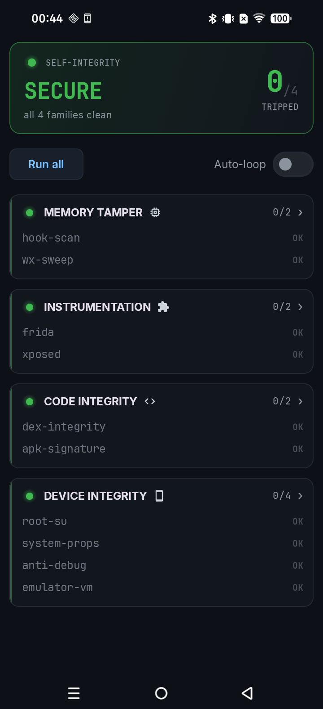
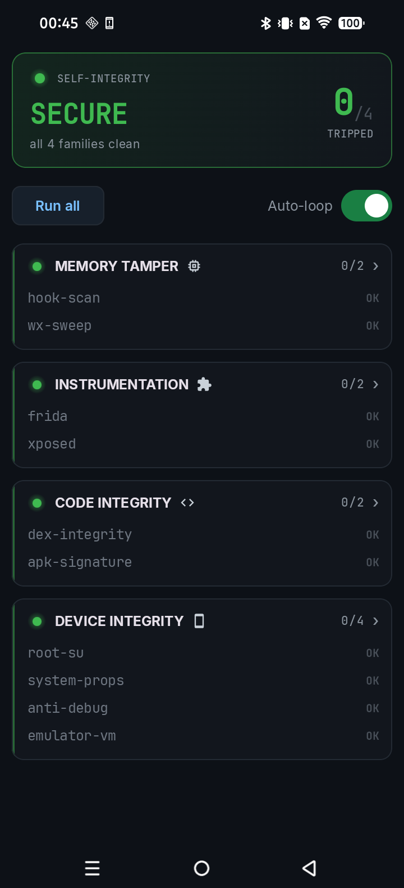
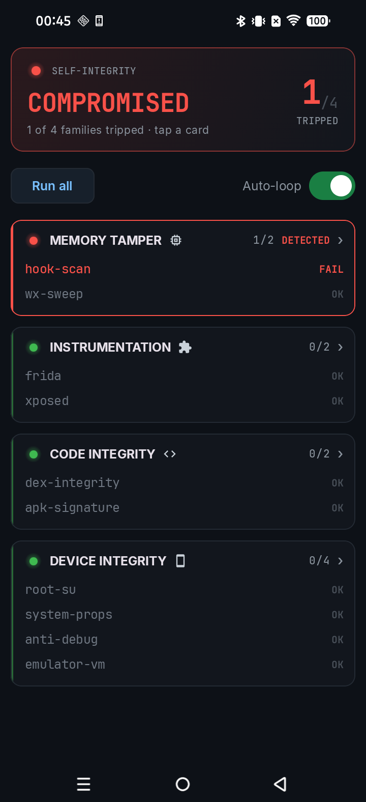

# Anubee: All-Seeing Eye for Android Apps

---

  
  
  
  

---

**Ever wanted to know exactly what an app is really doing?**

Anubee sees what an app is doing, no matter how hidden it is. It watches from the kernel, most of the time without leaving a trace. No repackaging, no injected gadget, nothing the app can find.

---

## Demo

Coming soon. Until then, here's what makes Anubee worth pointing at an app:

---

## Why Anubee?

- **Invisible when it counts.** Most of what Anubee does never writes a byte into the app.
  It watches from the kernel, so anti-tamper and RASP checks come back clean.
- **Unpacks what packers hide.** It rebuilds encrypted or packed native code straight out
  of live memory, after the app decrypts itself. You get a clean, loadable file for your disassembler.
- **Behavior with a cause.** Every syscall comes decoded and tied to the exact function
  that triggered it, so even obfuscated code has nowhere to hide.
- **Malware detection, out of the box.** It catches ransomware-style mass deletion, data
  exfiltration, accessibility abuse, and screen-capture spying, with no setup.

---

## Quick Start

**Recommended:** [ARES-Desktop](https://github.com/michaelaurelio/ARES-Desktop) takes the raw output nobody wants to read by hand and turns it into something you can actually follow. It drives `anubee` for you while it's at it. [Click here](https://github.com/michaelaurelio/ARES-Desktop) and follow its own README for setup.

**Full capability:** need more than what Desktop gives you? The binary puts every subcommand and flag directly in your hands. Full walkthrough, prerequisites included: [`docs/getting-started.md`](docs/getting-started.md).

---

## Run It Past a Tool Built to Catch It

You don't have to take the stealth on faith. We ran Anubee against a tool built to catch it.

[ARES-Detector](https://github.com/michaelaurelio/ARES-Detector) is a purpose-built tripwire for exactly this kind of tool. It loops real anti-tamper checks and flips its screen red the instant something starts watching.

<table>
<tr>
<td align="center" width="25%"> Baseline. Green "SECURE", 0/4 tripped, every check passing.</td>
<td align="center" width="25%"> Auto-loop on, re-checking itself every second. Still green, still 0/4.</td>
<td align="center" width="25%"> Seconds after <code>anubee mod prop-read</code> attaches, the next check flips red "COMPROMISED" and names the exact address. The detector works.</td>
<td align="center" width="25%"> <code>anubee syscalls</code> attached and capturing. Still green, still 0/4. It never saw it.</td>
</tr>
</table>

First, proof the detector isn't for show: Anubee's one loud capability trips it right away.

Then the quiet side runs against the same app. The detector keeps checking, and always coming back clean.

That's what "invisible when it counts" means.

---

**Curious how any of this actually works under the hood?** 

Full architecture, engine internals, the trace schema, detectability analysis, and known limitations live in [DOCUMENTATION.md](DOCUMENTATION.md).

---

## License

See [LICENSE](LICENSE).

---

## Authors

- [michaelaurelio](https://github.com/michaelaurelio)
- [chronopad](https://github.com/chronopad)
- [Ringoshiroku](https://github.com/Ringoshiroku)
