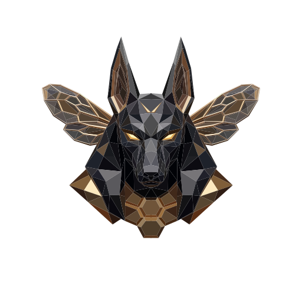

# Anubee: X-Ray Vision for Android Apps, Tracing Deeper with Every Sting

---

  
  
  
  

---

**Ever wanted to know exactly what an app is really doing?**

Anubee sees what an app is doing, no matter how hidden it is. It watches from the kernel, most of the time without leaving a trace. No repackaging, no injected gadget, nothing the app can find.

---

## Demo

Coming soon. Until then, here's what makes Anubee worth pointing at an app:

---

## Why Anubee?

- **Mostly invisible while it works.** Anubee watches an app from a distance instead of
  living inside it, so most of what it does never trips the app's own security checks.
- **Reveals code the app tries to hide.** Some apps scramble their own code and only
  unlock it while running, hoping nobody's watching at that exact moment. Anubee catches
  that code the instant it's unlocked, so you get to see what was actually hidden.
- **Explains actions, not just logs them.** Every action an app takes gets traced back to
  the exact piece of code responsible, so even code deliberately written to be hard to
  follow still can't hide what it's really doing.
- **Comes with Android malware analysis built in.** Anubee already catches files being
  deleted in bulk, data being quietly leaked out, permissions being abused, and the
  screen being secretly recorded.

---

## Quick Start

**Get started:** one static `anubee` binary, nothing else to install. Grab it and run your first trace. Full walkthrough, prerequisites included: [`docs/getting-started.md`](docs/getting-started.md).

**Full capability:** [ANUBEE-Desktop](https://github.com/michaelaurelio/ANUBEE-Desktop) drives `anubee` for you and turns its raw output into something you can actually read. [Grab it here](https://github.com/michaelaurelio/ANUBEE-Desktop) and follow its README.

---

## Run It Past a Tool Built to Catch It

Rather than just claim Anubee is stealthy, we tested it against a tool built to catch exactly this kind of tracer.

[ANUBEE-Detector](https://github.com/michaelaurelio/ANUBEE-Detector) is a dedicated tripwire for exactly this kind of tool. It loops real security checks and flips its screen red the instant it senses it's being watched.

<table>
<tr>
<td align="center" width="33%"> Clean baseline. SECURE, 0/4 tripped.</td>
<td align="center" width="33%"> Auto-loop on, re-checking continuously. Still SECURE, 0/4.</td>
<td align="center" width="33%"> Run one that does: 1/4 tripped, banner turns COMPROMISED.</td>
</tr>
</table>

Anubee's quiet capabilities never leave a footprint. That's why they never tripped the detector.

Then we ran one that does leave a footprint. The detector caught it immediately.

That's what "mostly invisible while it works" actually looks like. [Go try it yourself](https://github.com/michaelaurelio/ANUBEE-Detector). The detector's open source too.

---

**Curious how any of this actually works under the hood?** 

Full architecture, engine internals, the trace schema, detectability analysis, and known limitations live in [DOCUMENTATION.md](DOCUMENTATION.md).

---

## License

See [LICENSE](LICENSE).

---

## Authors

- [michaelaurelio](https://github.com/michaelaurelio)
- [chronopad](https://github.com/chronopad)
- [Ringoshiroku](https://github.com/Ringoshiroku)
