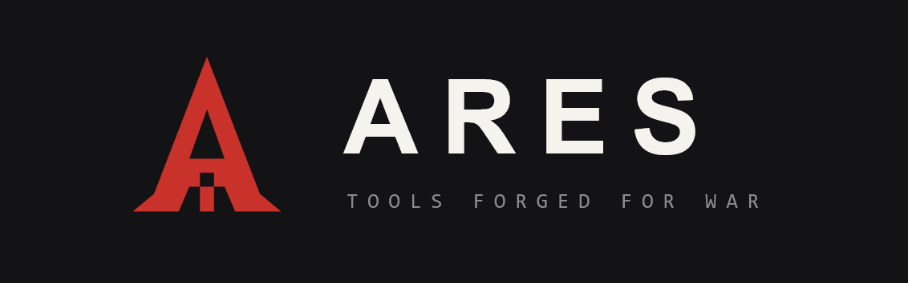

# Anubee: All-Seeing Eye for Android Apps

<p align="center" width="100">



</p>

---

<p align="center">
  <a href="LICENSE"></a>
  <a href="#"></a>
  <a href="#"></a>
  <a href="#"></a>
</p>

---

**Anubee watches everything an Android app actually does — Java and native, down to the syscalls — including the parts it built specifically to stay hidden. And it never tips the app off.**

Some of that is ordinary obfuscation. Some is malware that goes quiet the moment it senses a debugger. Some is a RASP layer built specifically to stop tools like this one. Anubee doesn't care which.

**Built for reverse engineers and malware analysts.** If you've ever hit an app that fights back the moment you start looking, you're in the right place.

Most tracing tools force a choice: hook deep and risk getting caught, or stay hidden and see less. Anubee refuses that trade. It's one static binary packing multiple tracing engines, kept as separate subcommands — so going stealthy or going deep is a decision you make per run, not a limitation of the tool.

---

## Table of Contents

- [Anubee: All-Seeing Eye for Android Apps](#anubee-all-seeing-eye-for-android-apps)
  - [Table of Contents](#table-of-contents)
  - [Why Anubee?](#why-anubee)
  - [Quick start](#quick-start)
  - [Capabilities](#capabilities)
  - [Demo](#demo)
  - [Designed to Pair With Anubee](#designed-to-pair-with-anubee)
  - [Documentation](#documentation)
  - [Detectability](#detectability)
  - [Testing](#testing)
  - [Limitations](#limitations)
  - [License](#license)
  - [Authors](#authors)

---

## Why Anubee?

- **Sees both layers.** Java and native (C/C++) behavior, captured from one static binary, using eBPF.
- **Zero-instrumentation option.** The `syscalls` engine hooks the kernel dispatcher only — nothing is ever written into the target process.
- **Pulls code out of hiding.** Live memory dump grabs a decrypted or packed native library straight out of a running process and rebuilds it into a loadable ELF.
- **Ships with ready-made detections.** Built-in `mod` analyzers catch common malicious behavior out of the box — fileless code execution, screen-capture abuse, unauthorized system-property reads.
- **Proves its own stealth.** Every quiet engine is checked at compile time (`make check-firewall`) to guarantee it loads zero instrumentation into the target — not a promise, a build gate.
- **Never fails silently.** Every engine reports its own known coverage gaps at teardown, so a partial trace is never mistaken for a complete one.
- **Speaks LLM.** An optional MCP server lets Claude Code or Claude Desktop query a captured trace directly.

---

## Quick start

Needs a rooted arm64/aarch64 Android device with an eBPF + BTF kernel.
Native build and first-trace walkthrough:
[`docs/getting-started.md`](docs/getting-started.md).

```sh
# Grab the prebuilt binary from Releases, or build it (container, no host setup):
git clone --recurse-submodules <repo-url> anubee
cd anubee
./scripts/build.sh            # -> build/anubee

./scripts/deploy.sh           # adb push build/anubee + specs to /data/local/tmp

# First trace: every syscall com.example.app's librasp.so makes
adb shell "su -c '/data/local/tmp/anubee syscalls -P com.example.app -l librasp.so \
                   -o /data/local/tmp/trace.jsonl'"
```

The [Releases](../../releases) page has the prebuilt static binary. Most
users never need to build.

---

## Capabilities

Here's exactly what each subcommand sees, and what it costs you to use it:

| Subcommand | What it sees | Footprint |
|---|---|---|
| `anubee syscalls` | Every syscall a target library makes, decoded args + backtraces | Injectionless (nothing written into the target, `TracerPid` stays 0) |
| `anubee funcs` | Individual function calls: typed args, return values, timing | Detectable (inserts a `BRK` into the target's code) |
| `anubee correlate` | Which syscalls a probed function triggers, tagged with that function's span | Detectable (entry uprobe `BRK`), loud by design |
| `anubee lib` | Every native library (`.so`) an app loads | Injectionless (kprobe only) |
| `anubee dump` | A rebuilt loadable ELF of a live (possibly decrypted/packed) library | Injectionless (kprobe only) |
| `anubee trace` | `syscalls` + `funcs`/`lib` together from one launch (`correlate`/`dump` are standalone-only) | Loud only if `funcs` is enabled |
| `anubee mod` | A packaged detection built for one behavior (mass-deletion, exfil, accessibility abuse, ...) | Depends on analyzer |

> **Pick the right engine for the job.** `syscalls` is stealthy and ideal for
> RASP triage (e.g. clean-vs-rooted diffing). `funcs` is more granular, but
> detectable.

---

## Demo

Coming soon.

---

## Designed to Pair With Anubee

Anubee gives you the trace. What you do with a few million lines of syscalls and bare hex addresses next is a different problem entirely — one Anubee was never built to solve alone. Two companion projects exist because of exactly that gap.

**[ARES-Desktop](https://github.com/michaelaurelio/ARES-Desktop)** — a trace is worthless if you can't read it back. Once you have one, you're staring down millions of syscalls and raw addresses, cross-referencing every meaningful hit in a disassembler by hand. ARES-Desktop closes that loop: load the trace, and follow the whole chain — from Java method call, to native function, to the exact address you'd open in a disassembler. It can drive `anubee` directly against a connected device too, so it stays the one place you actually work from.

**[ARES-Detector](https://github.com/michaelaurelio/ARES-Detector)** — "detectability firewall" is a nice claim, but a claim isn't proof. So how do you know the quiet engines are actually as quiet as we say? Don't take our word for it — check it yourself. ARES-Detector is a genuine reference RASP: real anti-tamper checks, a UI that turns red the instant any tool writes into its memory, including Anubee's own loud engines. Point a quiet capability at it and watch the screen stay clean. That absence is the proof.

---

## Documentation

- [`docs/getting-started.md`](docs/getting-started.md): prerequisites, build, deploy
- [`docs/engines.md`](docs/engines.md): which subcommand to pick, full flag reference
- [`docs/probe-specs.md`](docs/probe-specs.md): the probe-spec grammar shared by every engine
- [`docs/analyzers.md`](docs/analyzers.md): `anubee mod`'s built-in analyzers
- [`docs/reading-traces.md`](docs/reading-traces.md): output formats, the coverage record
- [`docs/mcp.md`](docs/mcp.md): querying a trace (or driving a live device) from Claude
- [`DOCUMENTATION.md`](DOCUMENTATION.md): architecture and internals

---

## Detectability

Anubee keeps its stealthy and detectable engines as separate subcommands
deliberately:

- `syscalls` is injectionless: it hooks the kernel syscall dispatcher,
  writes nothing into the target, and leaves `TracerPid` at 0, invisible to
  in-process RASP integrity checks.
- `funcs`/`correlate` write a `BRK` into the target's executable pages
  (how uprobes work). A RASP that checksums its own code or inspects function
  prologues can detect this.

Putting every engine in one on-disk binary does not make `syscalls` any more
detectable: the binary sits at `/data/local/tmp`, not inside the target. The
risk is *behavioral*. Running `funcs` or `correlate` against a RASP-protected
app can tip it off, which would poison a stealthy `syscalls` capture running
alongside it. Run a detectable engine only when you accept that exposure.
Every engine also needs eBPF loading privileges (often SELinux permissive),
itself a RASP tell.

---

## Testing

Two automated tiers, each runnable on its own, plus a manual third:

```sh
make test           # host unit tests: pure logic, no device, no cross-toolchain
make device-test     # on-device smoke: pushes the binary, asserts each capability
                     #   attaches and emits real output (needs the rooted device)
```

- `make test` compiles and runs `tests/` on the host (`cc` + `libelf`). It
  checks the custom probe-spec grammar parser. CI (`.github/workflows/ci.yml`)
  runs this plus the containerized cross-build on every PR.
- `make device-test` runs `scripts/device-test.sh [lib|syscalls|all]`. Override
  the target app with `ANUBEE_TEST_PKG=<package>` and the per-capability window
  with `ANUBEE_TEST_TIMEOUT=<secs>` (default 10). It needs a rooted device with
  kernel BTF.
- `scripts/massdeleteapp/build.sh install` (manual, not wired into `make`) builds a
  minimal real app for verifying `mod massdelete-detect` against genuine
  app-UID file activity instead of a synthetic PID. Full two-terminal
  procedure: [`docs/analyzers.md`](docs/analyzers.md).

---

## Limitations

- arm64 / ELF64 only, no x86 targets. `syscalls` has a best-effort exception
  for 32-bit/AArch32 app code.
- Rooted device required. Needs eBPF + BTF and (usually) SELinux permissive.
- `syscalls` attribution is an "issued by" heuristic, not full-stack
  presence, with a few known blind spots: vDSO calls, and a brief pre-arm
  window right after a library maps.
- `funcs` and `correlate` write into the target and are detectable by
  design. `dump`'s trigger modes and module-selection flags have some sharp
  edges around already-running processes and APK-embedded libraries.
- Trace coverage isn't always complete. Known gaps include snapshot
  truncation, an unrecognized ART build, and blind CFI-unwind stops.

---

## License

See [LICENSE](LICENSE).

---

## Authors

- [michaelaurelio](https://github.com/michaelaurelio)
- [chronopad](https://github.com/chronopad)
- [Ringoshiroku](https://github.com/Ringoshiroku)
