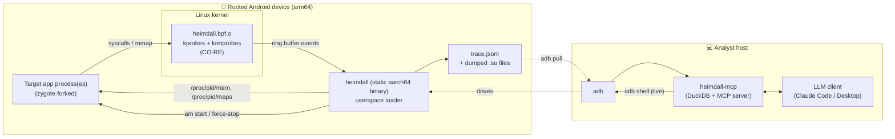
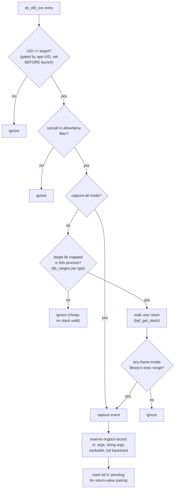
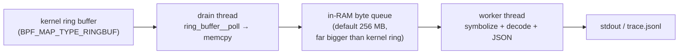
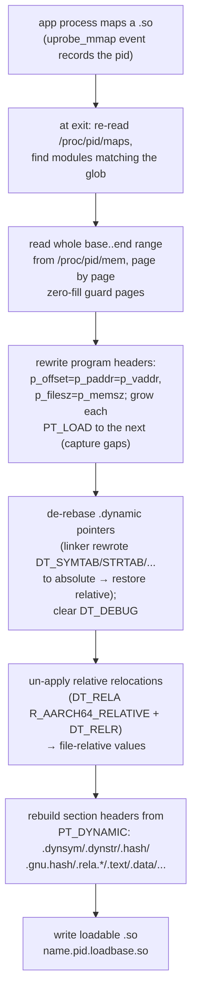
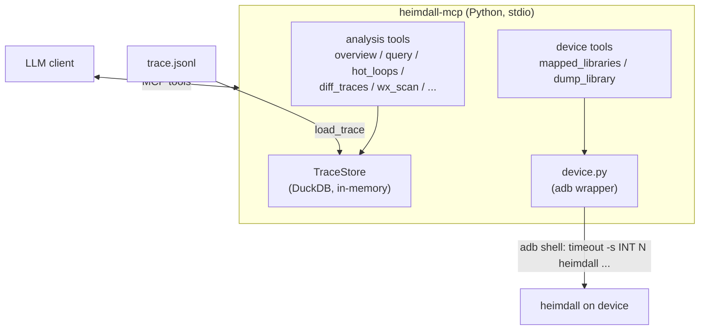
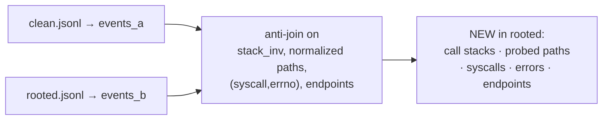
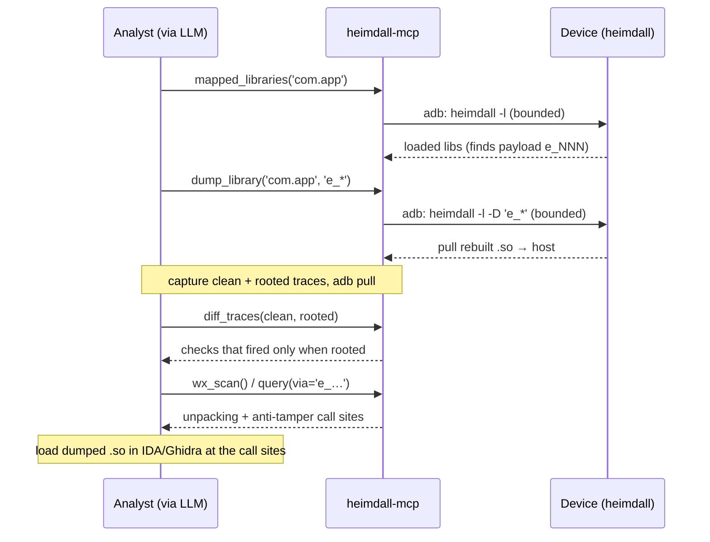

# Heimdall — Technical Documentation & Progress Tracker

> An eBPF/CO-RE syscall tracer for Android that filters by **native-library call
> origin**, dumps **decrypted libraries from live memory**, and feeds an
> **LLM-driven analysis layer** — built for reverse-engineering RASP / anti-tamper
> protected apps.

This document explains every feature: **what it does** and **how it actually
works under the hood**. For usage instructions, see [README.md](README.md).

---

## Project Summary & Progress

### What is Heimdall

An eBPF/CO-RE syscall tracer for a single Android app, **filtered by native-library call origin** — a syscall is reported only when the issuing thread's user backtrace passes through a chosen `.so` (e.g. a RASP / anti-tamper library) — but with `-a` it captures **all** of the app's syscalls. Inspired by frida-strace's in-kernel stack-filter design, but standalone and on-device.

The project consists of two halves:
1. **On-device tracer** (C + eBPF) — captures syscalls with decoded arguments, return values, and symbolized backtraces; dumps decrypted libraries from live memory
2. **Host analysis layer** (Python MCP) — lets an LLM query multi-million-event traces by retrieval, diff runs, and drive live captures/dumps over `adb`

### Feature Completion Timeline

| Capability | Commit | Status |
|---|---|---|
| Initial project structure | 3ad13a9 | ✅ |
| Syscall-ID, string-arg / symbol resolution | d254a17 | ✅ |
| Syscall retval, fd resolve, non-lib memory recognizer | 553fe73 | ✅ |
| Syscall whitelist/blacklist filter, capture-all mode | 1e8d077 | ✅ |
| Temporary syscall-output post-processing | 7f58db6 | ✅ |
| Ring-buffer drain hardening, dropped-event counts | 2e7ede2 | ✅ |
| JSON Lines output | dbd60a1 | ✅ |
| sockaddr decoding (`connect`/`bind`/`sendto`) | a0b1498 | ✅ |
| Userspace library loading detection (`-l` mode) | 370b03f | ✅ |
| Memory dumping + ELF file reconstruction (`-D` flag) | b5bc782 | ✅ |
| Regex-based library args for syscall tracing | dff0178 | ✅ |
| **Heimdall MCP** — DuckDB analysis layer | 9dbbe03 | ✅ |
| `wx_scan` + `diff_traces` (RASP memory & cross-trace analysis) | e04ca2b | ✅ |
| `.symtab` stacktrace symbols resolving | 06f6cea | ✅ |
| eBPF stack snapshots + stack-ID dedup for off-device unwinding | 0cd6797 | ✅ |
| On-device JIT/OAT Java-frame symbolization | 26fc76c | ✅ |

### Planned / In Progress

- Reaction pivot (event-triggered actions)
- Module rebase tracking + offset-relative symbol resolution
- Timestamps / timeline views
- Smarter file-access analysis
- Event-triggered dump-on-W→X (write-then-execute detection)

---

## 1. The Problem

Modern Android apps ship native protections (RASP / anti-tamper / packers) that:

- detect root, emulators, debuggers, and hooking frameworks;
- decrypt or unpack their real code **only in memory** at runtime;
- bail out, corrupt themselves, or lie if they sense analysis.

Classic tooling struggles here:

| Tool | Problem for RASP analysis |
|---|---|
| `strace` | system-wide noise; misses the *startup* window; no "which library issued this call"; trivially detected via `TracerPid`. |
| **frida** | injects an agent **into** the target (extra thread, `frida-agent` maps, ports) → highly detectable; many RASPs kill frida on sight. |
| static RE | the on-disk `.so` is encrypted/packed — the real code only exists in memory. |

**Heimdall's thesis:** observe from the *kernel* (eBPF), attribute every syscall to
the **native library it came from**, attach **before the app launches** (so nothing
is missed), and read decrypted code straight out of `/proc/<pid>/mem` — all without
injecting anything into the target.

---

## 2. High-level Architecture



Two halves:

1. **On-device tracer** (C + eBPF) — captures and dumps.
2. **Host analysis layer** (Python MCP) — lets an LLM query multi-million-event
   traces by *retrieval*, diff runs, and drive live captures/dumps over `adb`.

The build is a **host cross-compile**: the BPF object is compiled once (BPF is an
arch-neutral ISA; CO-RE relocates it against the device kernel's BTF at load time),
and the loader is a single **static aarch64 binary** pushed to `/data/local/tmp`.

---

## 3. The eBPF Tracer Core

### 3.1 What It Does

Emits an event for **only** the syscalls whose user-space backtrace passes through
a chosen native library (e.g. `librasp.so`, or a randomized `e_<pid>` payload), with
decoded arguments, return values, and a symbolized backtrace.

### 3.2 Hooks

| Hook | Type | Purpose |
|---|---|---|
| `do_el0_svc` | kprobe | arm64 64-bit syscall dispatcher — **entry** of every syscall (nr in `x8`, args in `x0–x5`). |
| `__arm64_sys_*` (curated list) | kretprobe | **return values**, paired to entries by tid. |
| `uprobe_mmap` | kprobe | fires when an **executable file-backed VMA** is mapped → "a library loaded". |
| `uprobe_munmap` | kprobe | a range was unmapped → invalidate symbol caches. |

**Why `do_el0_svc` and not `raw_syscalls:sys_enter`?** Many Android kernels ship
`CONFIG_FTRACE_SYSCALLS=n`, so the tracepoint isn't available. The dispatcher
kprobe always is. **Why per-function kretprobes instead of one on the dispatcher?**
A single kretprobe on the shared dispatcher exhausts its `maxactive` instance pool
instantly under system-wide traffic and silently drops returns. Per-function kretprobes
keep their instance pools independent.

### 3.3 The In-Kernel Decision (The Clever Part)



**Key design decisions and why:**

- **Gating by UID, not PID.** The loader resolves the package's app-UID and installs
  it into a BPF map **before** (re)launching the app. Android assigns the app UID
  during zygote specialization — *before any app/native code runs* — so every thread
  is traced from its **very first syscall**. This closes the "launch then find the
  PID" startup gap that a naive approach suffers.

- **The library filter is event-driven and race-free.** The module map is built
  entirely from `uprobe_mmap` events — heimdall never parses `/proc/maps` to arm the
  filter. The instant the target library's executable segment is mapped, the loader
  pushes its `[start,end)` range into `lib_ranges[tgid]`. Since a syscall can only
  originate from the library *after* it's mapped, there is no gap.

- **Cheap rejection.** In library-filtered mode, if the library isn't mapped in this
  process yet, the hook returns before doing any stack walk — near-zero overhead on
  unrelated processes/syscalls.

- **Stack origin test, fully unrolled.** `stack_hits()` checks every captured return
  address against the (≤8) library ranges with fully-unrolled loops over fixed bounds,
  so the verifier accepts every `stack[i]`/`range[j]` access as a constant offset.

### 3.4 Argument Capture

At entry, the hook also resolves the *meaning* of arguments, driven by per-syscall
tables the loader installs into BPF maps before launch:

- **String args** (`arg_types` map): for path-taking syscalls, `bpf_probe_read_user_str`
  copies the pointed-to string out of the caller's memory (e.g. the path in `openat`).
  Only args 0–3 are resolved, capped at 256 bytes.

- **sockaddr** (`sock_args` map): for `connect`/`bind`/`sendto`, the raw sockaddr is
  captured and decoded to `ip:port` / `[ip6]:port` / `unix:/path` in userspace.

- **Flag/enum args** (`flags` map): decoded in userspace after event capture (e.g.
  `O_RDONLY|O_CLOEXEC`, `PROT_READ|PROT_WRITE`, `MAP_PRIVATE|MAP_ANONYMOUS`).

---

## 4. Userspace Loader Pipeline

### 4.1 The Decoupled Drain (Keeping Up with a Firehose)

`-a` (capture-all) mode takes a user backtrace on **every** syscall — a firehose.
Symbolization + JSON formatting is far slower than the kernel produces events, so a
naive single-threaded drain would fill the kernel ring and drop events.



The ring-buffer callback does **only** a `memcpy` into a large userspace queue, so the
kernel ring stays empty regardless of how slow downstream processing is. The worker
thread does the heavy per-event work. Bursts are absorbed in ordinary RAM. **Dropped
events** (kernel ring **and** queue) are counted per-CPU and reported live (`warning: N
event(s) dropped`) and at exit — so "no message" never silently means "incomplete trace".

### 4.2 Symbolization (`symbolize.c`)

Turns a raw return address into `libfoo.so!symbol+0xNN`. Under the hood:

- reads `/proc/<pid>/maps` (lazily, cached, re-read on miss) for module ranges + paths;
- finds a module's **load base** by walking back the contiguous run of same-path
  mappings (handles libraries mapped directly out of an APK at a non-zero offset);
- parses each ELF's `.dynsym`/`.dynstr` once (cached per `(path, elf-offset)`);
- recovers **deleted** libraries (a common anti-analysis trick — the `.so` shows as
  `… (deleted)`) by reaching the still-mapped inode via `/proc/<pid>/map_files/`;
- labels anonymous/JIT/packer regions explicitly (`[anon]+0x…`, `[anon:...]`, `jit-cache+0x…`,
  `0x.. [unmapped]`) instead of guessing;
- handles **JIT/ART frames** with module names (`ART`, frame type markers);
- supports **off-device symbolization** via stack-ID dedup (eBPF snaps raw `pc` values,
  userspace dedupes, allows offline symbol resolution);
- **caches the resolved string per `(pid, addr)`** — backtraces are extremely repetitive,
  so this amortizes nearly all the work and is what lets the JSON drain keep up.

**Note:** Only `.dynsym` (exported/dynamic symbols) is read. `static` functions and
libraries stripped of section headers fall back to `lib+0xvaddr`. A symbol is only
attributed if the address lies within `[st_value, +st_size)`; otherwise the frame
shows `lib+0xvaddr` rather than mislabelling it with the nearest exported symbol.

### 4.3 Argument Decoding (`flags.c`) & fd Resolution

- **Flag/enum decode**: `open` flags, `mmap`/`mprotect` `PROT_*`, `mmap` flags (
  `MAP_PRIVATE|MAP_ANONYMOUS`), `PR_*` prctl args, signal numbers (`SIGKILL`),
  address family (`AF_INET`), etc. → human-readable, surfaced in a `decoded_args` field.

- **fd → path**: file-descriptor args are resolved to their target via
  `/proc/<pid>/fd/<n>` (cached, invalidated on `close`). `AT_FDCWD` is shown by name.
  Covers the common fd/`*at`-dirfd syscalls. **Best-effort:** a descriptor closed by
  then shows as `fd=<n>` without a path.

- **Errno decode**: return values are decoded when negative (e.g. `-2` → `No such file or directory`).

---

## 5. Library-Load Detection (`-l`)

**What:** log every native library as it loads into the app, and nothing else.

**How:** only the `uprobe_mmap` hook runs — the syscall dispatcher hook is never
attached, so it has effectively **zero** syscall overhead. Each executable file-backed
mapping is reported with basename, range, file offset, and inode:

```
[lib] pid 17267  librasp.so   [0x7b004a000, 0x7b0061000)  off=0x0  inode=8814
```

This is the lightweight way to discover what's loaded — including the **randomized
per-run name** of a protector payload (e.g. `e_17267`, where the suffix is the PID).

Output can be JSON / JSONL (`-o file.json` / `-J`) with records carrying
`library`, `pid`, `start`, `end`, `pgoff`, `inode`.

---

## 6. Memory Dump + ELF Reconstruction (`-D`)

### 6.1 What It Does

Reconstructs a **loadable `.so` from a library's live process memory**, capturing
in-memory decryption/unpacking. This is the same job as
[SoFixer](https://github.com/F8LEFT/SoFixer), done **live against `/proc`** instead of
a pre-made dump — and a **superset** of it.

`-D <glob>` selects libraries by basename (`'e_*'`, `'e_[0-9]*'`, or `libfoo.so`); the
dump fires at exit (Ctrl-C), once the app has run long enough to decrypt.

### 6.2 The Rebuild Pipeline



### 6.3 Why Each Step Exists (Under the Hood)

- **Whole-range capture** (not segment-by-segment): packers stash data in the gaps
  *between* `PT_LOAD` segments; reading the full range page-by-page captures it, while
  zero-filling unreadable `PROT_NONE` guard pages instead of aborting.

- **Program-header fixup**: in memory, file offset ≠ virtual address; rewriting
  `p_offset = p_vaddr` makes the file's layout mirror memory so it loads correctly.

- **`.dynamic` de-rebasing**: the runtime linker rewrites `.dynamic` pointer entries
  (`DT_SYMTAB`, `DT_STRTAB`, `DT_HASH`, …) to *absolute* addresses in memory. A file
  needs them *relative* — otherwise a disassembler can't find the dynamic symbol table.
  (SoFixer assumes they're still relative — true on bionic, but heimdall also handles a
  glibc-style rebased section.)

- **Relocation un-applying**: the loader applied relative relocations (added the base)
  to `.data`/GOT in memory; restoring the file-relative values makes the dump behave
  like a fresh on-disk `.so`. **Includes `DT_RELR`** (modern Android packed relatives),
  which SoFixer does not handle.

- **Section-header reconstruction**: regenerates a full section table from the dynamic
  segment so tools that read section headers (incl. older IDA) see named sections and
  the dynamic symbols.

### 6.4 Reading via `/proc/<pid>/mem` — The Methodology

`/proc/<pid>/mem` reads as root pass the kernel's `ptrace_may_access` check **without
ptrace-attaching** — so the target is never stopped, gets no signal, `TracerPid` stays
0, and the read is **invisible to the target** on a stock kernel. It's also immune to
self-ptrace anti-debug, and (because the kernel reads with `FOLL_FORCE`) can read
**execute-only** code.

Robustness extras:
- `--dump-raw` fallback (phdr-fixed image only) for exotic packers whose dynamic section
  differs from the standard
- **Containment dedup** so a non-contiguously-mapped module isn't falsely reported as
  a second module
- Output filenames are `<basename>.<pid>.<loadbase>.so`

**Honest limits:**
- a single snapshot can't beat aggressive page-level re-encryption; dump timing matters
- fully-anonymous (no `vm_file`) decrypted blobs have no name to match
- **Not handled:** Android APS2 packed relocations (`DT_ANDROID_REL[A]`) are not un-applied
  (neither does SoFixer), and 32-bit (ELF32/ARM) modules — heimdall is aarch64-only

---

## 7. Filtering, Output & Post-Processing

### 7.1 Capture Modes

- **Library-filtered (default):** `heimdall <package> <lib>` — only syscalls
  originating from that library. Cheap: the in-kernel hook skips the stack walk
  entirely until the library is mapped, and drops any syscall whose backtrace
  misses it. `<lib>` is a substring of the mapped name, **or a glob** (`* ? []`)
  over it — use `'e_*'` / `'e_[0-9]*'` to target a protector payload loaded under
  a randomized per-run name.

- **Capture-all:** `heimdall -a <package>` — every syscall of the app's UID, from
  its first one. A firehose (a user backtrace is taken on *every* syscall), so
  expect high event volume; pair it with `-o trace.json`. If the ring buffer
  fills, dropped events are counted and reported at exit
  (`warning: N event(s) dropped …`) so you know whether the trace is complete.

- **Libraries-only:** `heimdall -l <package>` — log each native library (`.so`) as
  it is loaded into the app's userspace memory, and nothing else. The syscall
  dispatcher hook is **never attached** in this mode, so it has effectively zero
  syscall overhead; only the `uprobe_mmap` hook runs.

### 7.2 Syscall Allow/Deny Filtering

- `-s, --syscall <list>` — only these syscalls (comma-separated names, e.g. `openat,read`)
- `-x, --exclude <list>` — all syscalls except these

Applied in-kernel (cheap), so excluded syscalls are nearly free — handy to tame the
capture-all firehose.

### 7.3 Randomized-Name Matching

Both the `<lib>` selector and `-D` accept **globs** (`* ? []`) matched against the
mapped basename — `'e_[0-9]*'` targets a payload whose name rotates every run. Same
matcher used for tracing and dumping.

### 7.4 Output Formats

**Default (`-o`):** writes a single JSON array (only valid after a clean exit). For
long/firehose captures prefer **JSON Lines** (`-J`, or just name the file `.jsonl`):
one record per line, flushed ~once a second, so a hard-kill / reboot / second-Ctrl+C
leaves a file that's still valid up to the last second — you lose at most a few
records, not the whole trace. Same per-event cost as the array form (both stream to
a block-buffered file).

**Console output:** Each syscall gets a monotonic **id**. The entry line (`==>`) prints
only the syscall's **real arguments** (per a built-in arm64 arg-count table — no trailing
register garbage), with string (path) args and fd args resolved inline; a `<== line
prints the **return value** when the call completes (paired by id). Frames resolve
across **all** libraries (target + libc + linker + …) to `lib!function+0xdelta`.

### 7.5 Loop Folding (`tools/heimdall-fold.py`)

A standalone post-processor that detects **loops in the syscall sequence** and
folds them, so a 500-iteration scan reads as one entry. It runs **per thread**
(the live stream interleaves threads), tokenizes each syscall by **name + call
stack**, and folds maximal *tandem runs* (a block repeated `k>=2` consecutive
times) smallest-period-first, to a fixpoint — which also discovers **nested**
loops. Original event ids are kept on every loop, so nothing is lost.

```sh
tools/heimdall-fold.py trace.json                 # text summary (hot loops + folded timeline)
tools/heimdall-fold.py trace.json --json folded.json
# tunables: --min-reps K  --max-period N  --callsite-frames N  --no-nesting
```

Output JSON: a `loops` registry (`{id, period, body, occurrences, iterations_total}`,
where a nested body item is `{loop, iterations}`) plus a per-thread `timeline`
that replaces each run with `{ "loop": "L4", "iterations": 2, "event_ids": [...] }`.

---

## 8. The MCP Analysis Layer (`tools/heimdall-mcp`)

### 8.1 What It Does & Why

A multi-million-event trace can't be pasted into an LLM context window. The MCP server
exposes the trace as **queryable tools** so the model analyzes by *retrieval* — pulling
small, pre-aggregated slices on demand — and can **diff** two runs and **drive live**
captures/dumps over `adb`.

### 8.2 Architecture



**Why DuckDB:** the workload is analytical (histograms, group-by on
syscall/path/origin, deduped backtraces). DuckDB is columnar (aggregations are
milliseconds over millions of rows), reads JSON/JSONL natively, and handles the nested
`string_args`/`backtrace` fields with `MAP`/`STRUCT` types — embedded, zero-server.

### 8.3 Trace Enrichment

On load, each event is enriched with derived columns:
- `paths` — extracted from `string_args`
- decoded `flags` — human-readable decoded args
- `stacksig` — joined frame symbols (the full call stack as one string)
- **`stack_inv`** — the *ASLR-invariant* stack signature (resolved `module+offset`
  frames only; raw `0x… [unmapped]` addresses dropped) used for cross-run comparison

### 8.4 Tool Catalog

| Tool | What it returns |
|---|---|
| `load_trace(path)` | Load a JSON/JSONL trace; returns an overview + load report (rows / malformed-skipped). |
| `overview()` | Counts, threads, top syscalls, files, socket calls, top errors. |
| `hot_loops(...)` | Folded repeated syscall sequences (biggest reducer). |
| `syscall_histogram / files / threads / sockets / errors` | Targeted aggregations. |
| `distinct_backtraces(syscall,via,top)` | Deduped call stacks + counts. |
| `query(...)` | Filtered event list (by syscall/tid/path/`via`/errors/retval/id range; capped, with true match count). |
| `get_event(id)` | Full detail of one event incl. backtrace. |
| `search(text)` | Events whose paths/args/symbols contain `text`. |
| **`diff_traces(baseline,compare)`** | What fired **only** in `compare` (clean vs rooted/hooked run). |
| **`wx_scan()`** | Self-modifying / anti-tamper memory ops. |
| **`mapped_libraries(package)`** | Live: launch via `heimdall -l`, list loaded `.so`s. |
| **`dump_library(package,pattern)`** | Live: dump matching libs from memory, pull to host. |

### 8.5 `diff_traces` — The Highest-Leverage RASP View

**What:** run the app on a clean device and on a rooted/hooked/emulator device; report
which probes, branches, paths, syscalls, errors, and endpoints fired **only** in the
suspect run — i.e. *which checks activated*.

**How:** loads both traces into one DuckDB connection (`events_a`/`events_b`), then
anti-joins on **ASLR-invariant** dimensions: `stack_inv` (resolved frames only — so
differing raw addresses don't fake up "new" stacks) and paths with volatile numeric
segments normalized (`/proc/1234/maps` → `/proc/#/maps`). This is what makes the diff
*signal* rather than relocation noise.



*Real result (vello sample):* surfaced block-device enumeration (`/dev/block/dm-*`,
`loop*`) + `execve` of `mount`/`getprop` only in the emulator-flagged run — revealing
that **KernelSU's mount/loop footprint tripped the protector's emulator heuristic on a
physical phone**.

### 8.6 `wx_scan` — Self-Modifying / Anti-Tamper Detector

**What:** the decrypt-then-execute + integrity-check signature, grouped by call site:

- `rwx_maps` — `mmap`/`mprotect` making memory **W+X at once**;
- `w_then_x` — regions made executable **after** being writable (in-place unpacking);
- `self_inspection` — `process_vm_readv`/`process_vm_writev`/`ptrace` targeting the
  app's **own** pid (integrity self-checks / anti-debug).

**How:** replays `mmap`/`mprotect` in id order, tracking an "ever-writable" interval set
per process; an X-setting event overlapping that set is a W→X transition. `process_vm_*`/
`ptrace` are flagged when the target pid argument equals the event's own pid. Grouped on
`stack_inv`.

*Real result (vello sample):* `rwx=0`, `w_then_x=1`, **`process_vm_readv` ×2016 self-reads**
— i.e. the protector is W^X-clean and its dominant anti-tamper mechanism is *continuous
self-memory integrity scanning* (confirmed: 1-byte reads, ~50% returning EFAULT — a
fault-tolerant range probe).

### 8.7 Live Device Tools

`mapped_libraries` and `dump_library` run heimdall on the device over `adb`, wrapped in
`timeout -s INT <seconds>` — so it traces for a bounded window and then receives the
SIGINT that triggers its exit-time dump. `dump_library` then `adb pull`s the rebuilt
`.so`(s) to the host with an ELF sanity check. Configurable via `HEIMDALL_ADB` /
`HEIMDALL_BIN` / `HEIMDALL_SHELL_PREFIX` (`su -c`) / `HEIMDALL_SERIAL`.

---

## 9. How Syscalls Are Identified & Resolved

### 9.1 Syscall Numbers

The syscall name comes from the **syscall number** in `x8`, mapped through a table
generated from the kernel's `asm-generic` syscall ABI (the same table arm64 uses).
**It is not symbol resolution** — see the note in *Limitations* below.

Syscall numbers beyond the built-in table print as `sys_<nr>`.

### 9.2 String-Arg Resolution

String arguments are read from the caller's memory at entry with `bpf_probe_read_user_str`,
for the args a built-in per-syscall table marks as `const char *` (paths: `openat`,
`readlinkat`, `newfstatat`, `execve`, `renameat2`, `mount`, …). **Only args 0–3 are
resolved**, capped at 256 bytes.

### 9.3 Frame Pointer Requirements

`bpf_get_stack` unwinds via frame pointers on arm64; if the target lib or the path
to the syscall omits them, matching frames may be missed (false negatives).

---

## 10. End-to-End RASP Triage Workflow



---

## 11. Requirements & Limitations

### 11.1 Requirements

- **Root**, and a kernel with BTF (`CONFIG_DEBUG_INFO_BTF=y` — GKI mandates it),
  kprobes, and uprobes. Verify the hook symbols exist:
  `adb shell su -c 'grep -wE "do_el0_svc|uprobe_mmap|uprobe_munmap" /proc/kallsyms'`.

- **Frame pointers required.** `bpf_get_stack` unwinds via frame pointers on arm64;
  if the target lib or the path to the syscall omits them, matching frames may be
  missed (false negatives).

- **SELinux permissive mode** for testing (eBPF on Android usually needs it during testing).

### 11.2 Limitations

- **Syscall identity is by number, not libc function.** arm64 uses the generic
  ABI, which has only the `*at` variants — there is no `open`/`stat`/`access`
  number, so a libc `open()` shows as `openat`, `access()` as `faccessat`, etc.
  The table is fixed at build time; a number beyond it prints as `sys_<nr>`.

- **String args:** only args 0–3, capped at 256 bytes, and only for syscalls in
  the built-in `const char *` table. Non-path string/buffer args (e.g. `write`
  buffers) are shown as raw pointers.

- **sockaddr decode:** `connect`/`bind`/`sendto` resolve the peer to
  `ip:port` / `[ip6]:port` / `unix:/path` / `unix:@abstract`. `recvfrom`/`accept`
  fill the address at *return*, so those aren't captured (entry-only).

- **Return values** are paired to entries by tid (syscalls are serialized per
  thread) and only for syscalls in the curated kretprobe list; others print without
  a `<==`. The JSON record is emitted when the return arrives, so a syscall still
  blocked when you stop tracing — or one not in the list — is flushed with `"retval": null`.
  Heavily-blocking calls (futex/poll/epoll/nanosleep) are omitted to avoid dropped returns.

- **fd resolution** is best-effort via `readlink(/proc/<pid>/fd/<n>)` at print
  time; a descriptor closed by then shows as `fd=<n>` without a path. `AT_FDCWD`
  is shown by name. Covers the common fd/`*at`-dirfd syscalls.

- **64-bit only.** Compat (32-bit) syscalls go through `do_el0_svc_compat`, not hooked.

- **Symbolization reads `/proc/<pid>/maps`** (lazily, cached, display-only) plus
  each ELF's `.dynsym` — this is how zygote-inherited libraries (libc, libart, the
  linker) get resolved, since no mmap event ever fired for them. The in-kernel
  *filter* stays purely event-driven. Notes:
  - Only `.dynsym` (exported/dynamic symbols) is read. `static` functions and
    libraries stripped of section headers fall back to `lib+0xvaddr`.
  - Libraries mapped directly out of an APK (`base.apk` with a file offset) are
    grouped by contiguous run; oddly-laid-out APKs may mis-base. Plain `.so`
    files are exact.
  - A library the target **deleted from disk after mapping** (`... (deleted)`,
    a common anti-analysis trick) is recovered through
    `/proc/<pid>/map_files/<start>-<end>`, so its `.dynsym` still resolves.
  - A symbol is only attributed if the address lies within `[st_value, +st_size)`;
    otherwise the frame shows `lib+0xvaddr` rather than mislabelling it with the
    nearest exported symbol. Unexported/`static` functions therefore show `+off`.

- **Per-UID.** All processes of the app's UID are traced (main + `:child`), keyed
  by tgid so ranges don't collide.

- **Single-snapshot dumps** can't beat aggressive page-level re-encryption; dump timing matters.

- **`wx_scan`'s W→X detection** is same-address only (misses dual-mapping/`memfd` unpacking).

- **The eBPF tracer adds per-syscall overhead** a determined RASP could time.

- **Not handled:** Android APS2 packed relocations (`DT_ANDROID_REL[A]`), 32-bit ELF32/ARM modules,
  and fully-anonymous (no `vm_file`) decrypted blobs with no name to match.

---

## 12. Build & Run Quick Reference

See [README.md](README.md) for full build and run instructions.

```sh
# Build (host cross-compile) → build/heimdall (static aarch64), then push
make && make push

# On the rooted device (SELinux permissive for testing):
heimdall com.example.app librasp.so          # library-filtered trace
heimdall com.example.app 'e_[0-9]*'           # randomized-name payload
heimdall -a -q -J -o trace.jsonl com.example.app   # capture-all → JSONL
heimdall -l com.example.app                   # list loaded libraries
heimdall -l -D 'e_*' --dump-dir /data/local/tmp com.example.app   # dump from memory

# Host analysis:
cd tools/heimdall-mcp && python3 -m venv .venv && . .venv/bin/activate && pip install -e .
# register with the LLM client; then: load_trace / diff_traces / wx_scan / dump_library
```

---

## Implementation Notes

### Key Files

- `src/main.c` — userspace loader, CLI parsing, ring-buffer drain
- `src/heimdall.bpf.c` — eBPF program (kprobes, kretprobes, BPF maps, decision logic)
- `src/symbolize.c` — ELF symbol resolution, `/proc/maps` parsing, caching
- `src/flags.c` — flag/enum decoding, fd resolution
- `src/dump.c` — memory dump, ELF reconstruction pipeline
- `tools/heimdall-fold.py` — loop detection and folding post-processor
- `tools/heimdall-mcp/` — Python MCP server, DuckDB analysis, device wrappers

### Building & Dependencies

- Host: `clang`, `llvm`, `bpftool`, `gcc-aarch64-linux-gnu` (cross-compile)
- Device: kernel with BTF, kprobes, uprobes
- `vmlinux.h` is generated from device BTF and committed; update with `make regen-vmlinux` after kernel changes

### Cross-Compilation Notes

The BPF object is compiled once (arch-neutral bytecode, CO-RE relocates against device BTF at load).
The loader is statically linked aarch64 binary. Dependencies are minimal (`libc` + `libbpf`).

---

## Glossary

- **BTF** — BPF Type Format; provides type information for CO-RE relocation
- **CO-RE** — Compile Once, Run Everywhere; relocates eBPF against target kernel's BTF
- **eBPF** — extended Berkeley Packet Filter; in-kernel VM for tracing/filtering
- **kprobe** — kernel breakpoint at function entry
- **kretprobe** — kernel breakpoint at function return
- **uprobe_mmap/munmap** — uprobes on mmap/munmap syscalls, tracks library loading
- **ring buffer** — BPF_MAP_TYPE_RINGBUF; lock-free kernel-to-userspace event queue
- **ASLR** — Address Space Layout Randomization; makes absolute addresses unreliable for comparison
- **ASLR-invariant** — addresses relative to a module's load base; survive across runs with different base addresses
- **stack_inv** — ASLR-invariant call stack signature (resolved symbols, no raw addresses)
- **dynsym** — dynamic symbol table; exported/public symbols in an ELF file
- **DT_RELA/DT_RELR** — relocation tables; record changes loader applies to `.data`/GOT
- **Packer/Protector** — code that encrypts/packs a binary on disk, decrypts in memory
- **RASP** — Runtime Application Self-Protection; app-embedded security checks
- **anti-tamper** — mechanisms that detect/prevent tampering (rooting, debugging, hooking)

---

## Resources

- [Linux eBPF documentation](https://www.kernel.org/doc/html/latest/bpf/)
- [libbpf](https://github.com/libbpf/libbpf) — C library for eBPF programs
- [DuckDB](https://duckdb.org/) — in-process SQL database for analytical queries
- [Android kernel (GKI)](https://android.googlesource.com/kernel/common/)
